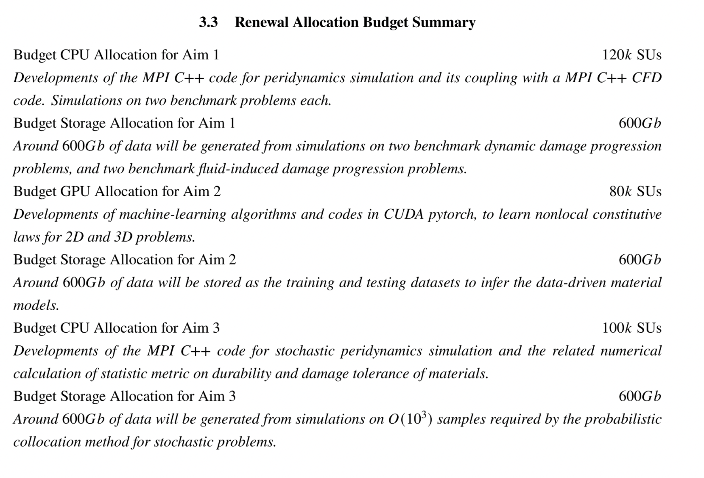
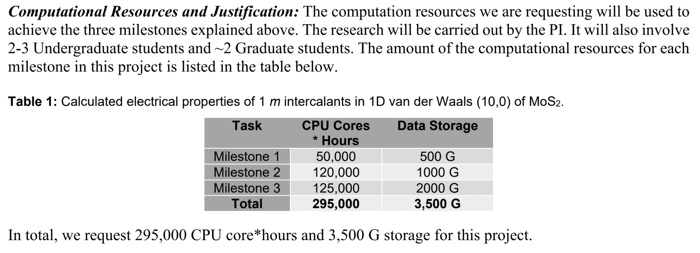

class: myback

```{r setup, include=FALSE}
options(htmltools.dir.version = FALSE)
library(tidyverse)
library(knitr)
```

# Outline

.center2[
* Overview of Research Computing Resources
* Allocation Types
* Guidelines for requesting Allocations
* Review Criteria
]


---

# Sol: Lehigh&#39;s Shared HPC Cluster

```{r echo=FALSE}
sol <- tribble(~"Nodes",~"Intel Xeon CPU Type",~"CPU Speed (GHz)",~"CPUs",~"GPUs",~"CPU Memory (GB)",~"GPU Memory (GB)",~"CPU TFLOPS",~"GPU TFLOPs",~"SUs",
               9, "E5-2650 v3", "2.3", 180, 10, 8*128, 80, 5.76, 2.57,180*8760,
               33, "E5-2670 v3", "2.3", 792, 62, 33*128, 496, 25.344, 15.934,792*8760,
               14, "E5-2650 v4", "2.2", 336, 0, 14*64, 0, 9.6768, 0,336*8760,
               1, "E5-2640 v3", "2.6", 16, 0, 512, 0, 0.5632, 0,16*8760,
               24, "Gold 6140", "2.3", 864, 48, 24*192, 528, 41.472, 18.392,864*8760,
               6, "Gold 6240", "2.6", 216, 0, 6*192, 0, 10.368, 0,216*8760,
               2, "Gold 6230R", "2.1", 104, 0, 2*384, 0, 4.3264, 0, 104*8760
               )
sollts <- tribble(~"Nodes",~"Intel Xeon CPU Type",~"CPU Speed (GHz)",~"CPUs",~"GPUs",~"CPU Memory (GB)",~"GPU Memory (GB)",~"CPU TFLOPS",~"GPU TFLOPs",~"SUs",
               8, "E5-2650 v3", "2.3", 160, 0, 8*128, 0, 736*8/1000, 0,160*8760
               )

totalsol <- sol %>% summarise_if(is.numeric, sum) %>% 
  mutate("Intel Xeon CPU Type"="","CPU Speed (GHz)"="") %>% 
  select(Nodes,"Intel Xeon CPU Type","CPU Speed (GHz)",CPUs:SUs)
```


```{r echo=FALSE}
knitr::kable(rbind(sol,totalsol), format = 'html')
```
- built by investments from Provost<sup>a</sup> and Faculty.
- 87 nodes interconnected by 2:1 oversubscribed Infiniband EDR (100Gb/s) fabric.
- Only `r sprintf("%4.2fM",sollts$SUs/1e6)` SUs from Provost investment available to Lehigh researchers.

.footnote[
a: 8 Intel Xeon E5-2650 v3 nodes invested by Provost.
]


---

# Condo Investments

* Sustainable model for High Performance Computing at Lehigh.
* Faculty (Condo Investor) purchase compute nodes from grants to increase overall capacity of Sol.
* LTS will provide for four years or length of hardware warranty purchased,
   * System Administration, Power and Cooling, User Support for Condo Investments.
* Condo Investor
   * receives annual allocation equivalent to their investment for the length of
     investment,
   * can utilize allocations on all available nodes, including nodes from other Condo Investors,
   * allows idle cycles on investment to be used by other Sol users,
   * unused allocation will not rollover to the next allocation cycle,
* Annual Allocation cycle is Oct. 1 - Sep. 30.

---

# Condo Investors

* Dimitrios Vavylonis, Physics (1 node)
* Wonpil Im, Biological Sciences (37 nodes, 102 GPUs)
* Anand Jagota, Chemical Engineering (1 node)
* Brian Chen, Computer Science & Engineering (3 nodes)
* Ed Webb & Alp Oztekin, Mechanical Engineering (6 nodes)
* Jeetain Mittal & Srinivas Rangarajan, Chemical Engineering (13 nodes, 18 GPUs)
* Seth Richards-Shubik, Economics (1 node)
* Ganesh Balasubramanian, Mechanical Engineering (7 nodes)
* Department of Industrial & Systems Engineering (2 nodes)
* Paolo Bocchini, Civil and Structural Engineering (1 node)
* Lisa Fredin, Chemistry (6 nodes)
* Hannah Dailey, Mechanical Engineering (1 node)
* College of Health (2 nodes)
- Condo Investments: `r sum(sol$Nodes)-sollts$Nodes` nodes, `r sum(sol$CPUs)-sollts$CPUs` CPUs, `r sum(sol$GPUs)-sollts$GPUs` GPUs, `r sprintf("%5.2fM",(sum(sol$SUs)-sollts$SUs)/1e6)` SUs
- Lehigh Investments: `r sollts$Nodes` nodes, `r sollts$CPUs` CPUs, `r sprintf("%5.2fM",sollts$SUs/1e6)`  SUs

---

# Ceph Storage

* LTS provides various storage options for research and teaching.
* Some are cloud based and subject to Lehigh&#39;s Cloud Policy.
* Research Computing provides a 1223TB (3465TB) storage system called [Ceph](https://go.lehigh.edu/ceph).
* Including Hawk's storage, a combined 2019TB (572TB usable) Ceph storage system is available to Lehigh researchers..
* Ceph 
    * based on the Ceph software,
    * in-house, built, operated and administered by Research Computing Staff,
        * located in the EWFM Data Center.
    * provides storage for Research Computing resources,
    * can be mounted as a network drive on Windows or CIFS on Mac and Linux.
        * [See Ceph FAQ](http://lts.lehigh.edu/services/faq/ceph-faq) for more details.
* Research groups can 
    * purchase a sharable project space @ &#36;375/TB for 5 years, OR
    * annually request up to 5TB sharable project space in a proposal style request.
    * share project space with anyone with a Lehigh ID.


---
# Hawk

* Funded by [NSF Campus Cyberinfrastructure award 2019035](https://www.nsf.gov/awardsearch/showAward?AWD_ID=2019035&HistoricalAwards=false).
   - PI: Ed Webb (MEM).
   - co-PIs: Balasubramanian (MEM), Fredin (Chemistry), Pacheco (LTS), and Rangarajan (ChemE).
   - Sr. Personnel: Anthony (LTS), Reed (Physics), Rickman (MSE), and Tak&#225;&#269; (ISE). 
* Compute
  - 26 nodes, dual 26-core Intel Xeon Gold 6230R, 2.1GHz, 384GB RAM.
  - 4 nodes, dual 26-core Intel Xeon Gold 6230R, 1536GB RAM.
  - 4 nodes, dual 24-core Intel Xeon Gold 5220R, 192GB RAM, 8 nVIDIA Tesla T4.
* Storage: 798TB (225TB usable)
  - 7 nodes, single 16-core AMD EPYC 7302P, 3.0GHz, 128GB RAM, two 240GB SSDs (for OS).
  - Per node
      - 3x 1.9TB SATA SSD (for CephFS).
      - 9x 12TB SATA HDD (for Ceph).
* Production: **Feb 1, 2021**.


---

```{r hawk_cluster,echo=F, warning=F}
hawk <- tribble(~"Nodes",~"Intel Xeon CPU Type",~"CPU Speed (GHz)",~"CPUs",~"GPUs",~"CPU Memory (GB)",~"GPU Memory (GB)",~"CPU TFLOPS",~"GPU TFLOPs",~"SUs",
               26, "Gold 6230R", "2.1", 26*52, 0, 26*384, 0, 26*52*1.3*32/1000, 0,26*52*8760,
               4, "Gold 6230R", "2.1", 4*52, 0, 4*1536, 0, 4*52*1.3*32/1000, 0,4*52*8760,
               4, "Gold 5220R", "2.2", 4*48, 32, 4*192, 32*16, 4*48*1.4*16/1000, 253.38*32/1000,4*48*8760
               )
totalhawk <- hawk %>% summarise_if(is.numeric, sum) %>% 
  mutate("Intel Xeon CPU Type"="","CPU Speed (GHz)"="") %>% 
  select(Nodes,"Intel Xeon CPU Type","CPU Speed (GHz)",CPUs:SUs)

total <- rbind(sollts,totalhawk) %>% summarise_if(is.numeric, sum) %>% 
  mutate("Intel Xeon CPU Type"="","CPU Speed (GHz)"="") %>% 
  select(Nodes,"Intel Xeon CPU Type","CPU Speed (GHz)",CPUs:SUs)

```

### Hawk

```{r echo=FALSE}
knitr::kable(rbind(hawk,totalhawk), format = 'html')
```

--

### Hawk and Lehigh&#39;s Investment in Sol

```{r echo=FALSE}
rbind(sollts,totalhawk) %>%
  select(Nodes,CPUs:SUs) %>%
  knitr::kable(format = 'html')
```

---

# Network Layout Sol, Hawk &amp; Ceph


---

# Accounts

* Lehigh Faculty, research staff and students can request an account on Sol/Hawk.

* All account requests by staff and students need to be sponsored by a Lehigh Faculty and be associated with an active allocation.

* A Lehigh faculty with no active allocation, can request an account for themselves and members of their group while requesting an allocation. 

* Accounts that do not have an active allocation for 6 months will be disabled.

  - NO BACKUPS. If your account is deleted, all data in your directories is also deleted.

* Sharing of account is strictly prohibited i.e no accounts for a lab or "in" accounts allowed.


---

# Resource Management


<!--
- Do away with charges for computing on Sol and add 1.4M SUs from Sol.
-->

| Investigator | Compute (SU) | Storage (TB)| Sol Compute (SU) | Total Compute (SU) |
|:------------:|:------------:|:-----------:|:----------------:|:------------------:|
| Proposing Team | 7.64M | 80 | | 7.64M |
| OSG | 3.07M | 5 | | 3.07M |
| DDF | 300K | 20 | 500K | 800K |
| StartUp | 380K | 20 | 120K | 500K |
| Research | 3.45M | 40 | 550K | 4M |

- Faculty PIs can request allocation and storage based on their needs:
   - Only Faculty can serve as a PI on an allocation.
   - If you ask your student or postdoc to request allocation, they need to list you as the requestor and all communication will be to you only.
- Allocation Types
   - __Trial__: for researchers who want to try out Sol/Hawk (DDF).
   - __Education__: for EOT purposes (DDF).   
   - __StartUp__: for researchers with small computing needs.
   - __Research__: for researchers with large computing or storage needs.

???

.pull-left[]
.pull-right[]

---

# Director's Discretionary Fund

- The Director's Discretionary Fund enables distributing compute and storage with minimal oversight from the Allocation Committee.
- Total of 800K SUs and 40TB of storage when combined with StartUp storage quota
- Use Cases
  - Each PI receives a 1TB storage quota that is shared among all his/her sponsored users.
  - 200GB per active user is recommended, larger groups can requst additional space.
    - PIs who unneccessarily add inactive users to get a larger storage will have their storage reduced to default 1TB.
    - Such PIs will have their storage request reviewed and approved by allocation committee.
  - Trial Allocations: short term allocations designed for new users.
  - Education Allocations: for courses, workshops and other EOT purposes.


---

# Trial Allocations

  - Why?
    - There are research groups that may benefit from HPC resources.
    - Using HPC resources have a steep learning curve, this allows group to investigate if HPC resources fit their needs before committing to larger scale usage of HPC resources. 
  - Trial Allocations have a maximum of 10K SUs per PI and a 6 month duration.
  - Total Available: 300K SUs, 20TB.
  - Requirement: Short abstract describing proposed work.
  - Optional: What is your eventual goal?
    - <em>This is both short-term computing for completing a project and also a trial to determine how well the resources will meet our future needs.</em>
    - <em>The purpose of this proposal is for my laboratory to evaluate use of HPC resources at Lehigh for the more computationally intensive steps of the workflow, highlighted in the figure below.</em>
  - Progress report will be required for subsequent allocation request.
  - Apply anytime at https://go.lehigh.edu/hpcalloctrial


---

# Education Allocations
  - Developing the next generation workforce is a cornerstone of NSF campus research cyberinfrastructure grants.
  - Use of Hawk for education - course work and workshops, is strongly encouraged.
  - __Courses__: A minimum of 500 SU/student is recommended. 
     - 50K SU max and 1TB Ceph space per course.
     - __Capstone projects__: are considered to be a single course and are eligible for only one allocation.
         - For additional allocations, please request a startup or research allocation
     - Duration: 2 weeks past the end of the semester.
  - __Workshops/Summer Programs__: Faculty, Departments, Institutes or Colleges will be eligible for allocations (max 10K) to support workshops and summer programs centered on scientific computing.
     - Duration: Length of the workshop or 2 weeks.
  - Total Available: 500K SUs
  - Apply at https://go.lehigh.edu/hpcallocedu
  - HPC staff can deliver instruction on using the resources. We prefer educating users rather than simplifying things to obscure how a HPC resource works. 

---

# StartUp Allocations

- Startup Allocations are small allocation requests (<25K) with a 1 year duration. 
- A faculty can be a PI or collaborator on only two active Startup Allocation at any time.
- __Requirements__: Short abstract (min 500 words, 1 page max) with the description of the work and the amount of computing time requested.
- __Amount Requested__: Include a justification for the amount requested (required for renewals)
  - <em>On the redacted cluster 30 grids took up to an average of 4 hours of wall clock time. For 63,676 grids, this would equate to 8,490 SUs. Given 6 experiments, this would total 50940 SU. With full AVX512 instructions enabled, Hawk should be twice as fast as redacted cluster, so that would total 25,470 SUs.  Therefore I am requesting 25K SUs as part of a StartUp allocation.</em>
- Reviewed (last week) & approved (first week of next month) monthly. 
- Renewal requires progress report, publication list, grants/ awards and list of graduated students if any.
- Apply anytime at https://go.lehigh.edu/hpcallocstartup
- For Renewals: we strongly recommend a research allocation.

---

# Research and Storage Allocations

- For requests upto 300K SUs and/or storage up to 5TB.
- Max allocation is 300K and 5TB per PI at any given time.
- Requires a detailed proposal similar to XSEDE. Should contain
  - Abstract, Description of the project and how resources will be used.
  - Justify requested allocations based on benchmarks results.
  - Report of prior work done.
  - List of publications, presentations, awards and students graduated.
- Non HPC PIs requesting storage allocations should also describe:
  - why other forms of storage are not suitable and any plans to backup data stored, and
  - plans to  move/save the data if project is not renewed/approved next year.  
- Reviewed and Approved semi annually by allocation committee.
  - Allocations to begin on Jan 1 and Jul 1 and last a year.
  - Call for proposals will be issued in May and Nov to the HPC mailing list.
  - Submission deadline: June 15 and Dec 15
- Total time allocated is 4M annually or 2M for each semi annual request period.


---

# Steering Committee

| Name | College | 
|:----:|:-------:|
| Wonpil Im (co-chair) | CAS |
| Ed Webb (co-chair) | RCEAS |
| Ganesh Balasubramanian | RCEAS |
| Brian Chen | RCEAS |
| Ben Felzer | CAS |
| Lisa Fredin | CAS |
| Srinivas Rangarajan | RCEAS |
| Rosi Reed | CAS |
| Seth Richards-Shubik | CoB |
| Yue Yu | CAS |
| | CoH |
| | CoE |
| Alex Pacheco | LTS |


---

# Steering Committe Responsibility

| Allocation Type | Max SUs | Max TB | Approval Authority | Request Window | Approval Timeline |
|:-----:|:----:|:----:|:----:|:----:|:----:|
| Trial | 10K | 1 | HPC | Rolling | 2-3 Business days |
| StartUp &amp; Renewals<sup>b</sup> | 25K | 1 | Two RCARC members | Rolling | Monthly |
| Research/Storage | 300K | 5 | RCARC Committee | Every 6 months | Within a month of submission deadline |

.footnote[
b: will be denied if consumed within 6 months.
]

---

# General Proposal Outline

.center2[
* Research Objectives
* Computational methodology (Applications/Codes)
* Application efficiencies
* Computational Research Plan
* Justification for SUs and/or TB requested
]

---

# Research Objectives

* Describe the research activities to be pursued
* Keep it short. 
   * Provide enough details to support the method and computational plan being proposed.
   * Members of the review committee are not experts in your field.
   * The review committee expects you to relate how your research plan meets your computational needs.
   * We will not reject your initial proposal if you cannot make this estimation.
   * BUT we expect you to make an attempt to understand how to make this estimation and provide this information in your renewal proposal.

* The review committee is not judging your research. 
* We want to educate you on how to estimate your computational needs based on the research you are doing and the resources that you plan to use.


---

# Computational Methods (Application and Codes)

* Compute Requests
  * Describe the Applications and Codes you plan to use.
  * Describe the methods/algorithms employed in your research.
  * Home grown codes: describe the code development and features, describe your plan to advance the code i.e. parallelize the code for better scaling. 
  * How do the applications or codes scale with number of cpus or gpus.
  * Provide performance and scaling details.
     * Renewals: you should provide performance and scaling data from past jobs.
* Storage Requests
  * Describe the data to be stored.
  * Describe the amount and expected growth of data to be stored
  * If this is data generated from computational, what % is transient data that can discared after a job is complete/analyzed.
  * Our resources are not backed up. Describe how you plan to backup the data.


---

# Computational Research Plan

* Explicitly describe the problem cases
* __Examples__:
   * This requires estimating phylogenetic trees, representing evolutionary relationships among 200 - 400 mammalian species, from ~20,000 coding sequence alignments; applying custom software to use these trees to test for association between branch length and dietary phenotype; and using at least 500,000 phylogenetic simulations per phenotype analyzed to assess empirical significance.
   * In the benchmark simulation of dynamic crack branching in soda-lime glass, a meshfree peridynamics numerical solver in C++ was employed. The mesh has around _O(10<sup>5</sup>)_ material points (_O(10<sup>6</sup>)_ degrees of freedom) and needs _O(10<sup>5</sup>)_ time steps/iterations to capture the whole crack propagation procedure. Each simulation required around 100 CPU hours, and at least 200 simulations
   * Our computational experiments begin with DFT optimization of our molecules to determine their ground state (GS) electronic structure. We will then perform single excitations via TDDFT to correlate experimentally observed absorption features with calculated electronic transitions.
   

---

# Justification of Resources

* Summarize your requirements based on contents of previous two sections
* __Example 1__: Trial
    * we need to run DFT simulations coupled with ML models to discover regions of negative curvature that ...
* __Example 2__: StartUp 
    * Assuming we have a database with 300 subjects, for each subject preprocessing, 300 cores would be used for 3 hours. Thus, to process several databases and to calculate multiple statistic results, at least 25k SUs are needed.

---

# Justification of Resources


* __Example 3__: Research and Renewals

.center[

]

---

# Justification of Resources


* __Example 4__: Research and Renewals

.center[

]


---

# Progress Report

* Required for Renewals.
* Summarize the research enabled by the previous allocation.
* Describe in details your accomplishments of the computational plan:
   * What did you accomplish and could not accomplish from the previous allocation?
   * Did you over/under estimate your needs and how did this help in estimating future needs?
   * Specify publications, conference reports or presentations enabled by the allocation.
   * Contributions to other research efforts - grants submitted or received, students graduated, etc.


---

# Summary


|  | Trial | StartUp  | Research |
|:---:|:---:|:---:|:---:|
| Abstract | > 500 words | 500 words - 1 page | up to 0.5 page |
| Description of Research  | include in above | include in above | 2 pages |
| Computational Research Plan | include in above | include in above | 4 pages |
| Justification | include in above | up to 0.5 page | include in above |
| Progress Report |  | 1 page | 2 pages |


* No page limit on other information such as references, publications, grants, etc.


---

# Review Criteria

* Appropriateness of Methodology
   * Is computational and data usage describedr?.

* Appopriateness of Research Plan
   * Are research objectives explained and how they will be achieved?
   * Do proposed computations list simulation parameters that are needed to obtain results?

* Efficient Use of Resources
   * Is performance and scaling data presented or a plan on how these will be estimated if they are unknown?
 

---

# XSEDE Research Allocation Request

* Eligibility: faculty members and researchers, including postdoctoral researchers, at a U.S.-based institution.
  * Investigators with support from any funding source, not just NSF, are encouraged to apply.
  * an individual investigator may have only one active Research project at a time. 
  * PIs can request that other users be given accounts to use the allocation.
- Required Components
  * [Main Document](https://portal.xsede.org/allocations/research#requireddocs-main):
     * 10 pages for requests &lt; 10M SUs.
     * 15 pages for requests &ge; 10M SUs.
  * [Progress Report](https://portal.xsede.org/allocations/research#requireddocs-progress): 3 pages.
  * [Code Performance &amp; Resource Costs](https://portal.xsede.org/allocations/research#requireddocs-codeperformance): 5 pages.
  * [Curriculum Vitae (CV)](https://portal.xsede.org/allocations/research#requireddocs-cv): 2 pages.
  * [References](https://portal.xsede.org/allocations/research#requireddocs-refs): No limit.
  * Optional - [Special Requirements](https://portal.xsede.org/allocations/research#requireddocs-reqs): 1 page.
  


---

# Main Document Guidance

  * [Scientific Background and Support](https://portal.xsede.org/allocations/research#maindoc-scientificbackground)
    * succinctly state the scientific objectives that will be facilitated by the allocation(s).
  * [Research Questions](https://portal.xsede.org/allocations/research#maindoc-researchquestions)
    * identify the specific research questions that are covered by the allocation request.
  * [Resource Usage Plan](https://portal.xsede.org/allocations/research#maindoc-resourceusage)
    * The bulk of the Main Document should focus on the resource usage plan and allocation request. 
    * **Inadequate justification for requested resources is the primary reason for most reduced or denied allocations.**
  * [Justifying Allocation Amounts](https://portal.xsede.org/allocations/research#maindoc-allocations)
    * combine quantitative parameters from the resource usage plan with basic resource usage cost information to calculate the allocation needed. 
    * tabulate and calculate the costs for each resource and resource type.
  * [Resource Appropriateness](https://portal.xsede.org/allocations/research#maindoc-resourceappropriateness)
    * briefly detail the rationale for selecting the requested resources.
  * [Disclosure of Access to Other Compute Resources](https://portal.xsede.org/allocations/research#maindoc-accesstoresources)


---

# Useful Links

* Research Computing: https://go.lehigh.edu/hpc

* Accounts & Allocations: https://go.lehigh.edu/hpcusagepolicy

* Research Computing Seminars: https://go.lehigh.edu/hpcseminars

* Research Computing Mailing List: https://lists.lehigh.edu/mailman/listinfo/hpc-l

* My contact info
  * eMail:  alp514@lehigh.edu
  * Tel: (610) 758-6735 
  * Location: Room 296, EWFM Computing Center
  * [Schedule](https://www.google.com/calendar/embed?src=alp514%40lehigh.edu&ctz=America/New_York )


---
class: inverse middle

# Thank You!
# Questions?


