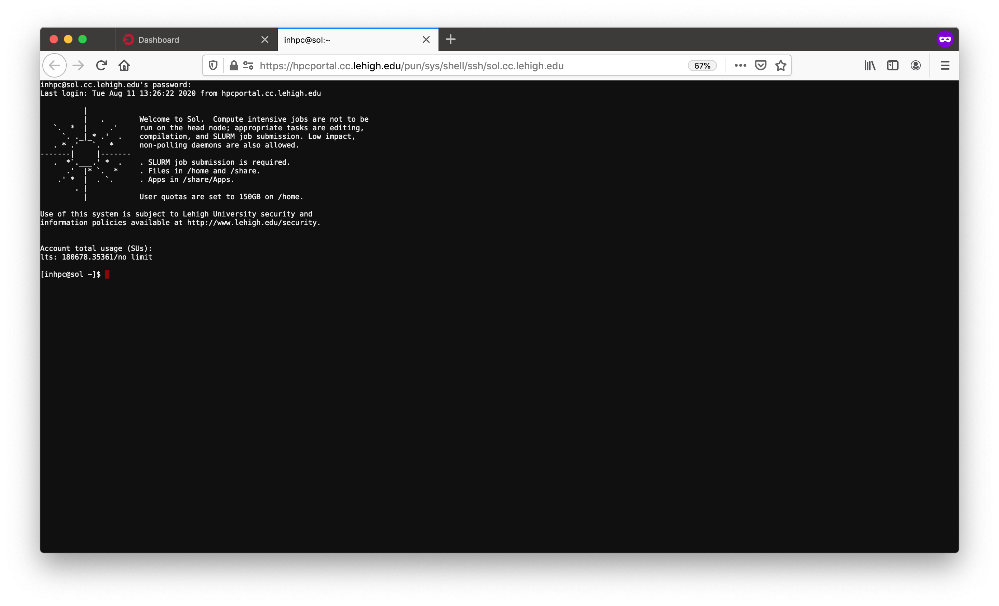

class: inverse, middle

```{r setup, include=FALSE}
options(htmltools.dir.version = FALSE)
library(tidyverse)
library(knitr)
library(kableExtra)
```

# What is HPC? 
# Who uses it?

---

# Why use HPC?

*  HPC may be the only way to achieve computational goals in a given amount of time

     * **Size**: Many problems that are interesting to scientists and engineers cannot fit on a PC usually because they need more than a few GB of RAM, or more than a few hundred GB of disk.

     * **Speed**: Many problems that are interesting to scientists and engineers would take a very long time to run on a PC: months or even years; but a problem that would take a month on a PC might only take a few hours on a supercomputer.

<br />
.center[


]

---

#  Parallel Computing

* many calculations are carried out simultaneously.
- based on principle that large problems can often be divided into smaller ones, which are then solved in parallel.
*  Parallel computers can be roughly classified according to the level at which the hardware supports parallelism.
    * Multicore computing
    * Symmetric multiprocessing
    * Distributed computing
    * Grid computing
    * General-purpose computing on graphics processing units (GPGPU)

---

# What does HPC do?


.pull-left[
* Simulation of Physical Phenomena
     * Storm Surge Prediction
     *  Black Holes Colliding
     *  Molecular Dynamics
- Data analysis and Mining
     -  Bioinformatics
     -  Signal Processing
     -  Fraud detection
* Visualization
.center[

]
]

.pull-right[
* Design
     *  Supersonic ballute
     *  Boeing 787 design
     *  Drug Discovery
     *  Oil Exploration and Production
     *  Automotive Design
     *  Art and Entertainment
.center[

]
]


---

# HPC by Disciplines

* Traditional Disciplines
    * Science: Physics, Chemistry, Biology, Material Science
    * Engineering: Mechanical, Structural, Civil, Environmental, Chemical

- Non Traditional Disciplines
    - Finance
        - Preditive Analytics
        - Trading
    - Humanities
         - Culturomics or cultural analytics: study human behavior and cultural trends through quantitative analysis of digitized texts, images and videos.


---
class: inverse, middle

# Research Computing Resources


---

# Sol: Lehigh&#39;s Shared HPC Cluster

```{r echo=FALSE}
sol <- tribble(~"Nodes",~"Intel Xeon CPU Type",~"CPU Speed (GHz)",~"CPUs",~"GPUs",~"CPU Memory (GB)",~"GPU Memory (GB)",~"CPU TFLOPS",~"GPU TFLOPs",~"SUs",
               9, "E5-2650 v3", "2.3", 180, 10, 8*128, 80, 5.76, 2.57,180*8760,
               33, "E5-2670 v3", "2.3", 792, 62, 33*128, 496, 25.344, 15.934,792*8760,
               14, "E5-2650 v4", "2.2", 336, 0, 14*64, 0, 9.6768, 0,336*8760,
               1, "E5-2640 v3", "2.6", 16, 0, 512, 0, 0.5632, 0,16*8760,
               24, "Gold 6140", "2.3", 864, 48, 24*192, 528, 41.472, 18.392,864*8760,
               6, "Gold 6240", "2.6", 216, 0, 6*192, 0, 10.368, 0,216*8760,
               2, "Gold 6230R", "2.1", 104, 0, 2*384, 0, 4.3264, 0, 104*8760
               )
sollts <- tribble(~"Nodes",~"Intel Xeon CPU Type",~"CPU Speed (GHz)",~"CPUs",~"GPUs",~"CPU Memory (GB)",~"GPU Memory (GB)",~"CPU TFLOPS",~"GPU TFLOPs",~"SUs",
               8, "E5-2650 v3", "2.3", 160, 0, 8*128, 0, 736*8/1000, 0,160*8760
               )

totalsol <- sol %>% summarise_if(is.numeric, sum) %>% 
  mutate("Intel Xeon CPU Type"="","CPU Speed (GHz)"="") %>% 
  select(Nodes,"Intel Xeon CPU Type","CPU Speed (GHz)",CPUs:SUs)
```


```{r echo=FALSE}
knitr::kable(rbind(sol,totalsol), format = 'html') %>%
  row_spec(8, bold = T, color = "white", background = "#643700")
```
- built by investments from Provost<sup>a</sup> and Faculty.
- 87 nodes interconnected by 2:1 oversubscribed Infiniband EDR (100Gb/s) fabric.
- Only `r sprintf("%4.2fM",sollts$SUs/1e6)` SUs from Provost investment available to Lehigh researchers.

.footnote[
a: 8 Intel Xeon E5-2650 v3 nodes invested by Provost.
]


---
# Hawk

* Funded by [NSF Campus Cyberinfrastructure award 2019035](https://www.nsf.gov/awardsearch/showAward?AWD_ID=2019035&HistoricalAwards=false).
   - PI: Ed Webb (MEM).
   - co-PIs: Balasubramanian (MEM), Fredin (Chemistry), Pacheco (LTS), and Rangarajan (ChemE).
   - Sr. Personnel: Anthony (LTS), Reed (Physics), Rickman (MSE), and Tak&#225;&#269; (ISE). 
* Compute
  - 26 nodes, dual 26-core Intel Xeon Gold 6230R, 2.1GHz, 384GB RAM.
  - 4 nodes, dual 26-core Intel Xeon Gold 6230R, 1536GB RAM.
  - 4 nodes, dual 24-core Intel Xeon Gold 5220R, 192GB RAM, 8 nVIDIA Tesla T4.
* Storage: 798TB (225TB usable)
  - 7 nodes, single 16-core AMD EPYC 7302P, 3.0GHz, 128GB RAM, two 240GB SSDs (for OS).
  - Per node
      - 3x 1.9TB SATA SSD (for CephFS).
      - 9x 12TB SATA HDD (for Ceph).
* Production: **Feb 1, 2021**.


---

```{r hawk_cluster,echo=F, warning=F}
hawk <- tribble(~"Nodes",~"Intel Xeon CPU Type",~"CPU Speed (GHz)",~"CPUs",~"GPUs",~"CPU Memory (GB)",~"GPU Memory (GB)",~"CPU TFLOPS",~"GPU TFLOPs",~"SUs",
               26, "Gold 6230R", "2.1", 26*52, 0, 26*384, 0, 26*52*1.3*32/1000, 0,26*52*8760,
               4, "Gold 6230R", "2.1", 4*52, 0, 4*1536, 0, 4*52*1.3*32/1000, 0,4*52*8760,
               4, "Gold 5220R", "2.2", 4*48, 32, 4*192, 32*16, 4*48*1.4*16/1000, 253.38*32/1000,4*48*8760
               )
totalhawk <- hawk %>% summarise_if(is.numeric, sum) %>% 
  mutate("Intel Xeon CPU Type"="","CPU Speed (GHz)"="") %>% 
  select(Nodes,"Intel Xeon CPU Type","CPU Speed (GHz)",CPUs:SUs)

total <- rbind(sollts,totalhawk) %>% summarise_if(is.numeric, sum) %>% 
  mutate("Intel Xeon CPU Type"="","CPU Speed (GHz)"="") %>% 
  select(Nodes,"Intel Xeon CPU Type","CPU Speed (GHz)",CPUs:SUs)

```

### Hawk

```{r echo=FALSE}
knitr::kable(rbind(hawk,totalhawk), format = 'html') %>%
  row_spec(4, bold = T, color = "white", background = "#643700")
```

--

### Hawk and Lehigh&#39;s Investment in Sol

```{r echo=FALSE}
rbind(sollts,totalhawk,total) %>%
  select(Nodes,CPUs:SUs) %>%
  knitr::kable(format = 'html') %>%
  row_spec(3, bold = T, color = "white", background = "#643700")
```

---

# Ceph Storage

* LTS provides various storage options for research and teaching.
* Some are cloud based and subject to Lehigh&#39;s Cloud Policy.
* Research Computing provides a 1223TB (346TB) storage system called [Ceph](https://go.lehigh.edu/ceph).
* Including Hawk's storage, a combined 2019TB (572TB usable) Ceph storage system is available to Lehigh researchers..
* Ceph 
    * based on the Ceph software,
    * in-house, built, operated and administered by Research Computing Staff,
        * located in the EWFM Data Center.
    * provides storage for Research Computing resources,
    * can be mounted as a network drive on Windows or CIFS on Mac and Linux.
        * [See Ceph FAQ](http://lts.lehigh.edu/services/faq/ceph-faq) for more details.


---

# Sol 

.left-column[

]

.right-column[

]


---

# Sol


.pull-left[  ]

.pull-right[]


---

# Sol

.pull-left[]

.pull-right[]

---
class: inverse, middle

# Software


---

# Installed Software

.pull-left[

* [Chemistry/Materials Science](https://confluence.cc.lehigh.edu/x/3KX0BQ)
  - **CRYSTAL17** (Restricted Access)
  - **GAMESS**
  - Gaussian (Restricted Access)
  - **OpenMolcas**
  - **NWCHEM**
  - **Quantum Espresso**
  - **VASP** (Restricted Access)
* [Molecular Dynamics](https://confluence.cc.lehigh.edu/x/6qX0BQ)
  - **ESPResSo**
  - **GROMACS**
  - **LAMMPS**
  - **NAMD**

<span class="tiny strong">__MPI enabled__</span>
]

.pull-right[

* [Computational Fluid Dynamics](https://confluence.cc.lehigh.edu/x/BZFVBw)
  - Abaqus
  - Ansys
  - Comsol
  - **OpenFOAM**
  - OpenSees
* [Math](https://confluence.cc.lehigh.edu/x/1QL5Bg)
  - Artleys Knitro (node restricted)
  - GNU Octave
  - Gurobi
  - Magma
  - Maple
  - Mathematica
  - MATLAB]

---

# More Software

.pull-left[

* *Machine &amp; Deep Learning* 
   - TensorFlow
   - SciKit-Learn
   - SciKit-Image
   - Theano
   - Keras

* *Natural Language Processing (NLP)*
   - Natural Language Toolkit (NLTK)
   - Stanford NLP    


<span class="tiny">_[Python packages](https://go.lehigh.edu/python)_</span>
]

.pull-right[

* [Bioinformatics](https://confluence.cc.lehigh.edu/x/y6X0BQ)
  - BamTools
  - BayeScan
  - bgc
  - BWA
  - FreeBayes
  - SAM Tools
  - tabix
  - trimmomatic
  - Trinity
  - *barcode_splitter*
  - *phyluce* 
  - VCF Tools
  - *VelvetOptimiser*]


---

#More Software

.pull-left[

* Scripting Languages
  - Julia
  - Perl
  - [Python](https://go.lehigh.edu/python)
  - [R](https://confluence.cc.lehigh.edu/x/5aX0BQ)
* [Compilers](https://confluence.cc.lehigh.edu/x/Sab0BQ)
  - GNU
  - Intel
  - JAVA
  - NVIDIA HPC SDK
  - CUDA
* [Parallel Programming](https://confluence.cc.lehigh.edu/x/Sab0BQ#Compilers-MPI)
  - MVAPICH2
  - MPICH
  - OpenMPI
]

.pull-right[

* Libraries
  - ARPACK/BLAS/LAPACK/GSL
  - FFTW/Intel MKL/Intel TBB
  - Boost
  - Global Arrays
  - HDF5
  - HYPRE
  - NetCDF
  - METIS/PARMETIS
  - MUMPS
  - PetSc
  - QHull/QRupdate
  - SuiteSparse
  - SuperLU
  - TCL/TK
]


---

# More Software

.pull-left[

* [Visualization Tools](https://confluence.cc.lehigh.edu/x/qan0BQ)
  - Atomic Simulation Environment 
  - Avogadro
  - Blender
  - Gabedit
  - GaussView
  - GNUPlot
  - GraphViz
  - Paraview
  - POV-RAY
  - PWGui
  - PyMol
  - RDKit
  - VESTA
  - VMD
  - XCrySDen
]

.pull-right[

* Other Tools
  - GNU Make/CMake
  - GDB/DDD
  - GIT
  - Intel Advisor/Inspector/Vtune Amplifier
  - [GNU Parallel](https://confluence.cc.lehigh.edu/x/B6b0BQ)
  - [Jupyter Lab/Notebooks](https://confluence.cc.lehigh.edu/x/G5JVBw)
  - [RStudio Server](https://confluence.cc.lehigh.edu/x/NpBVBw)
  - Scons
  - Singularity
  - SWIG
  - TMUX/GNU Screen
  - Valgrind/QCacheGrind
  - [Virtual Desktops](https://confluence.cc.lehigh.edu/x/g5BVBw)
]

---

# Accessing Resources

* Sol: accessible using ssh while on Lehigh&#39;s network.
 ```{bash eval=F}
 ssh username@sol.cc.lehigh.edu
  ```
   * Windows PC require a SSH client such as [MobaXterm](https://mobaxterm.mobatek.net/) or [Putty](https://putty.org/).
   * Mac and Linux PC&#39;s, ssh is built in to the terminal application. 
* Login to the ssh gateway to get on Lehigh&#39;s network or connect to VPN first 
 ```{bash eval=F}
 ssh username@ssh.cc.lehigh.edu
 ``` 
 and then login to Sol using the above ssh command.
  *  Alternatively, use the following command while off campus.
  ```{bash eval=F}
  ssh -J username@ssh.cc.lehigh.edu username@sol.cc.lehigh.edu
  ```
  * [Configure MobaXterm to use the SSH Gateway](https://confluence.cc.lehigh.edu/x/JhH5Bg).


---

# Open OnDemand

- Open, Interactive HPC via the Web. 
    - Easy to use, plugin-free, web-based access to supercomputers,
    - File Management,
    - Command-line shell access,
    - Job management and monitoring, and 
    - Various Interactive Applications.
* NSF-funded project. 
    * SI2-SSE-1534949 and CSSI-Software-Frameworks-1835725,
    * Developed by [Ohio Supercomputing Center](https://openondemand.org/), 
    * Deployed at dozens of sites (universities, supercomputing centers).
- At Lehigh: https://hpcportal.cc.lehigh.edu.
    - Lehigh IP or VPN required.


---

# Open OnDemand


---

# Open OnDemand



---
class: inverse, middle

# Scheduler Basics


---

# Cluster Environment

* A cluster is a group of computers (nodes) that works together closely.

.pull-left[

* Two types of nodes:
   - Head/Login Node,
   - Compute Node

* Multi-user environment.

* Each user may have multiple jobs running simultaneously.
]

.pull-right[

]


---

# Scheduler &amp; Resource Management

* A software that manages resources (CPU time, memory, etc) and schedules job execution.
- Simple Linux Utility for Resource Management (SLURM)
    - Scheduler
    - Resource Manager
    - Allocation Manager

* A job can be considered as a user’s request to use a certain amount of resources for a certain amount of time.

* The Scheduler or queuing system determines
    -  order jobs are executed, and
    -  which node(s) jobs are executed.


---

# How to run jobs

* All compute intensive jobs are scheduled.
- Write a script to submit jobs to a scheduler.
  - need to have some background in shell scripting (bash/tcsh).
* Have an understanding of 
   * Resources required (which depends on configuration)
       * number of nodes,
       * number of processes per node, and
       * memory required to run your job
   - Amount of time resources are required?
       - have an estimate for how long your job will run.
       - jobs have a max walltime of 2 or 3 days. 
             - can your jobs be restarted from a checkpoint.
   * Which partition to submit jobs?
       * SLURM uses the term _partition_ instead of _queue_.


---

# Available Queues on Sol

| Partition Name | Max Runtime in hours | Max SU consumed node per hour |
|:----------:|:--------------------:|:--------------------:|
| lts/lts-gpu | 72 | 19/20 |
| im1080/im1080-gpu | 48 | 20/24 | 
| eng/eng-gpu | 72 | 22/24 |
| engc | 72 | 24 |
| himem | 72 | 48 |
| enge/engi | 72 | 36 |
| im2080/im2080-gpu | 48 | 28/36 |
| im2080-gpu | 48 | 36 |
| chem/health | 48 | 36 |
| debug | 1 | 16 |
| hawkcpu | 72 | 52 |
| hawkmem | 72 | 52 |
| hawkgpu | 72 | 48 |
| infolab | 72 | 52 |


---

# How much memory?

* The amount of installed memory less the amount that is used by the operating system and other utilities.

* A general rule of thumb on most HPC resources: leave 1-2GB for the OS to run. 

| Partition | Max Memory/core (GB) | Recommended Memory/Core (GB) |
|:---------:|:--------------------:|:----------------------------:|
| lts | 6.4 | 6.3 |
| eng/im1080/enge/engi/im2080/chem/health | 5.3 | 5.2 |
| engc | 2.66 | 2.5 |
| himem | 32 | 31.8 |
| hawkcpu/infolab | 7.38 | 7.3 |
| hawkmem | 29.5 | 29.4 |
| hawkgpu | 4.0 | 3.9 |


*  <code>if you need to run a single core job that requires 10GB memory in the im1080 partition, you need to request 2 cores even though you are only using 1 core.</code>  

???

| Partition | Max Memory/core (GB) | Recommended Memory/Core (GB) |
|:---------:|:--------------------:|:----------------------------:|
| hawk | 7.38 | 7.2 |
| hawk-tb | 29.54 | 29 | 
| hawk-gpu | 3.7 | 3.6 |


---

# Job Types

* Interactive Jobs:
  - Set up an interactive environment on compute nodes for users.
  - Will log you into a compute node and wait for your prompt.
  - Purpose: testing and debugging code. __Do not run jobs on head node!!!__
      * All compute node have a naming convention __sol-[a,b,c,d,e]###__ 
      * head node is __sol__.
* Batch Jobs:
   - Executed using a batch script without user intervention.
       - Advantage: system takes care of running the job.
       - Disadvantage: cannot change sequence of commands after submission.
   - Useful for Production runs.
   - Workflow: write a script -> submit script -> take mini vacation ->
   analyze results.


---

# Job Types: Interactive

- Use `srun` command with SLURM Directives followed by `--pty /bin/bash`.
    * `srun --time=<hh:mm:ss> --nodes=<# of nodes> --ntasks-per-node=<# of core/node> -p <queue name> --pty /bin/bash`
    * If you have `soltools` module loaded, then use `interact` with at least one SLURM Directive.
        * `interact -t 20` [Assumes `-p lts -n 1 -N 1`]
* Run a job interactively replace `--pty /bin/bash --login` with the appropriate command. 
    * For e.g. `srun -t 1 -n 52 -p hawkcpu $(which lmp) -in in.lj -var x 1 -var n 10000`
    * Default values are 3 days, 1 node, 1 task and lts partition.


---

# Job Types: Batch 

* Workflow: write a script -> submit script -> take mini vacation -> analyze
  results.

* Batch scripts are written in bash, tcsh, csh or sh.

* Add SLURM directives after the shebang line but before any shell commands.
<pre>
   #!/bin/bash
   #SBATCH --time=1:00:00
   #SBATCH --nodes=1
   #SBATCH --ntasks-per-node=20
   #SBATCH -p lts
   source /etc/profile.d/zlmod.sh
   cd ${SLURM_SUBMIT_DIR}
</pre>
* Submitting Batch Jobs:
<pre>
   sbatch myjob.slr
</pre>
* `sbatch` can take `#SBATCH DIRECTIVES` as command line arguments.
<pre>
   sbatch --time=1:00:00 --nodes=1 --ntasks-per-node=20 -p lts myjob.slr
</pre>


---

# Submit script for Serial Jobs


<pre>
#!/bin/bash
#SBATCH --partition=lts
#SBATCH --time=1:00:00
#SBATCH --nodes=1
#SBATCH --ntasks-per-node=1
#SBATCH -J myjob

source /etc/profile.d/zlmod.sh
cd ${SLURM_SUBMIT_DIR}
#SBATCH --mail-type=ALL <--- this is a comment not a SLURM DIRECTIVE
./myjob < filename.in > filename.out

# Example
/share/Apps/examples/simple_jobs/laplace_serial << EOF
400
EOF


</pre>


---

# Submit script for OpenMP Job

<pre>
#!/bin/tcsh
#SBATCH --partition=im1080
# Directives can be combined on one line
#SBATCH --time=1:00:00 --nodes=1 --ntasks-per-node=20
#SBATCH --job-name=myjob

source /etc/profile.d/zlmod.csh
cd ${SLURM_SUBMIT_DIR}
# Use either
setenv OMP_NUM_THREADS 20
./myjob < filename.in > filename.out

# OR
OMP_NUM_THREADS=20 ./myjob < filename.in > filename.out

# Example
OMP_NUM_THREADS=4 /share/Apps/examples/simple_jobs/laplace_omp << EOF
400
EOF

exit
</pre>


---

# Submit script for MPI Job

<pre>
#!/bin/bash
#SBATCH --partition=lts
#SBATCH --time=1:00:00
#SBATCH --nodes=2
#SBATCH --ntasks-per-node=2
## For --partition=im1080, 
###  use --ntasks-per-node=20
### and --qos=nogpu
#SBATCH --job-name=myjob

source /etc/profile.d/zlmod.sh
module load mvapich2

cd ${SLURM_SUBMIT_DIR}
srun ./myjob < filename.in > filename.out

# Example
srun -n 4 /share/Apps/examples/simple_jobs/laplace_mpi << EOF
400
EOF

exit
</pre>


---

# Submit script for LAMMPS GPU job

<pre>
#!/bin/bash
#SBATCH --partition=hawkgpu
# Directives can be combined on one line
#SBATCH --time=1:00:00
#SBATCH --nodes=1
# 1 CPU can be be paired with only 1 GPU
# 1 GPU can be paired with all 24 CPUs
#SBATCH --ntasks-per-node=6
#SBATCH --gres=gpu:1
# Need both GPUs, use --gres=gpu:2
#SBATCH --job-name myjob

source /etc/profile.d/zlmod.sh
cd ${SLURM_SUBMIT_DIR}
# Load LAMMPS Module
module load lammps
# Run LAMMPS for input file in.lj
srun $(which lmp) -in in.lj -sf gpu -pk gpu 1 

exit
</pre>


---

# Useful SLURM Directives

| SLURM Directive | Description |
|:---------------:|:-----------:|
|  --partition=queuename | Submit job to the <em>queuename</em> partition | 
|  --time=hh:mm:ss | Request resources to run job for <em>hh</em> hours, <em>mm</em> minutes and <em>ss</em> seconds |
|  --nodes=m | Request resources to run job on <em>m</em> nodes |
|  --ntasks-per-node=n | Request resources to run job on <em>n</em> processors on each node requested |
|  --ntasks=n | Request resources to run job on a total of <em>n</em> processors | 
|  --job-name=jobname | Provide a name, <em>jobname</em> to your job |
|  --output=filename.out | Write SLURM standard output to file filename.out |
|  --error=filename.err | Write SLURM standard error to file filename.err |
|  --mail-type=events | Send an email after job status events is reached. events can be NONE, BEGIN, END, FAIL, REQUEUE, ALL, TIME&#95;LIMIT(&#95;90,80)|
|  --mail-user=address | Address to send email |
|  --account=mypi | charge job to the __mypi__ account |
|  --gres=gpu:# | Specifies number of gpus requested in the gpu partitions, min 1 cpu per gpu | 

---

# Useful SLURM Directives (contd)

* SLURM can also take short hand notation for the directives

| Long Form | Short Form |
|:---------:|:----------:|
| --partition=queuename | -p queuename |
| --time=hh:mm:ss | -t hh:mm:ss |
| --nodes=m | -N m |
| --ntasks=n | -n n |
| --account=mypi | -A mypi |
| --job-name=jobname | -J jobname |
| --output=filename.out | -o filename.out |


---

# SLURM Filename Patterns

* SLURM allows for a filename pattern to contain one or more replacement
  symbols, which are a percent sign "%" followed by a letter (e.g. %j). 

| Pattern | Description |
|:-------:|:-----------:|
| %A |    Job array's master job allocation number |
| %a |    Job array ID (index) number |
| %J |    jobid.stepid of the running job (e.g. "128.0") |
| %j |    jobid of the running job |
| %N |    short hostname. This will create a separate IO file per node |
| %n |    Node identifier relative to current job (e.g. "0" is the first node of the running job) This will create a separate IO file per node |
| %s |    stepid of the running job |
| %t |    task identifier (rank) relative to current job. This will create a separate IO file per task |
| %u |    User name |
| %x |    Job name |


---

# Useful SLURM environmental variables

* SLURM creates environmental variables that can be used in the submit script.

| SLURM Command | Description | 
|:-------------:|:-----------:|
| SLURM_SUBMIT_DIR | Directory where job was submitted |
| SLURM_NTASKS | Total number of cores for job |
| SLURM_JOB_NUM_NODES | Total number of nodes for job |
| SLURM_JOB_NODELIST | List of nodes assigned to your job |
| SLURM_JOB_ID or SLURM_JOBID | Job ID number given to this job |
| SLURM_JOB_PARTITION | Partition job is running on |
| SLURM_JOB_NAME | Name of the job |


---
class: inverse, middle

# Using Interactive Apps on Open OnDemand
### Jupyter Lab & Notebooks
### RStudio
### MATLAB
### Virtual Desktops
### and more


---

# Jupyter Lab & Notebooks

* Launch Jupyter Lab & Notebooks with the anaconda module.

* Use your own conda environment provided you have jupyter notebooks installed in your environment

* By default,
   - 1 node per job

* See https://go.lehigh.edu/python for list of available packages in each anaconda/python module.

* [Demo](https://confluence.cc.lehigh.edu/x/G5JVBw)

* For homeworks: Use Class Apps > JupyterLab Server
   * Max wall time is 2 hours.
   * Not meant for intensive calculations as resources are oversubscribed

---

# Exercise

* Login to Open OnDemand

* Start a terminal: Clusters > Sol Shell Access

* Run the following commands

```{bash eval=F}
cd ~/che396_s2022_proj/$USER
cp -r ../shared/python_seminar .
```

* Start a JupyterLab session: Class Apps > JupyterLab Server > Launch

* When the session starts, navigate to `~/che396_s2022_proj/$USER/python_seminar` and open `datavis.ipynb`

* Run through the notebook to learn about Data Visualization with Matplotlib and Seaborn

---

# Other Applications

* [RStudio](https://confluence.cc.lehigh.edu/x/NpBVBw)

* [Virtual Desktops](https://confluence.cc.lehigh.edu/x/g5BVBw)

* [MATLAB](https://confluence.cc.lehigh.edu/x/5ZBVBw)

* [VMD](https://confluence.cc.lehigh.edu/x/yJRVBw)

* [Visualization Tools](https://confluence.cc.lehigh.edu/x/qan0BQ)

---
class: inverse, middle

# Research Computing Services 


---

# HPC Seminars

* Thursdays, 2:00PM - 4:00PM via Zoom

| Date | Topic |
|:-----|:------|
| Feb. 3 | Research Computing Resources at Lehigh |
| Feb. 10 | Linux: Basic Commands & Environment |
| Feb. 17 | Using SLURM scheduler on Sol |
| Feb. 24 | Python Programming |
| Mar. 3 | R Programming |
| Mar. 10 | Introduction to Open OnDemand |
| Mar. 17 | Data Visualization with Python |
| Mar. 24 | Data Visualization with R |
| Mar. 31 | BYOS: Container on HPC resources |
| Apr. 7 | Object Oriented Programming with Python |
| Apr. 14 | Shiny Apps in R |

* Register at https://go.lehigh.edu/hpcseminars

---

# Workshops

* We provide full day workshops on programming topics.
- [Summer Workshops](https://go.lehigh.edu/hpcworkshops)
  - Modern Fortran Programming (Summer 2015, 2021)
  - C Programming (Summer 2015, 2021)
  - HPC Parallel Programming Workshop (Summer 2017, 2018, 2021)
  - Quantum Chemistry Workshop (Summer 2021)
* We also host full day XSEDE workshops.
  - XSEDE HPC Monthly Workshop: OpenACC (Dec. 2014).
  - XSEDE HPC Summer BootCamp: OpenMP, OpenACC, MPI and Hybrid Programming (Jun.
    2015 - 2019).
  - XSEDE HPC Monthly Workshop: Big Data (Nov. 2015, May 2017).


---

# Getting Help

* Issue with running jobs or need help to get started: 
  * Open a help ticket: <http://lts.lehigh.edu/help>
  * See [guidelines for faster response](https://confluence.cc.lehigh.edu/x/KJVVBw)
- Investing in Sol
  - Contact Alex Pacheco or Steve Anthony
* More Information
  * [Research Computing](https://go.lehigh.edu/hpc)
  * [Research Computing Seminars](https://go.lehigh.edu/hpcseminars)
  * [Condo Program](https://confluence.cc.lehigh.edu/x/EgL5Bg)
  * [Proposal Assistance](https://confluence.cc.lehigh.edu/x/FgL5Bg)
  * [Data Management Plans](http://libraryguides.lehigh.edu/researchdatamanagement)
* Subscribe
     * [Research Computing Mailing List](https://lists.lehigh.edu/mailman/listinfo/hpc-l)
     * [HPC Training Google Groups](mailto:hpctraining-list+subscribe@lehigh.edu)

---
class: inverse middle

# Thank You!
# Questions?


