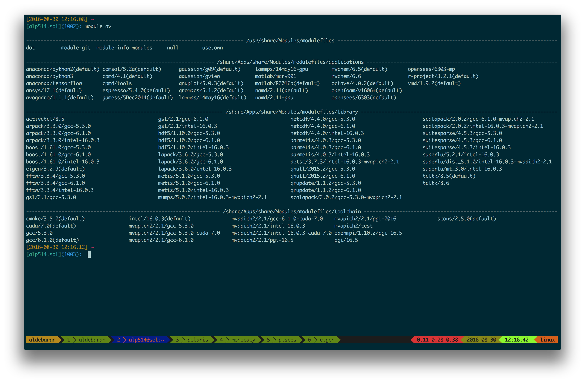

---
title       : Lehigh University Research Computing
subtitle    : Library & Technology Services
author      : https://researchcomputing.lehigh.edu
job         : 
logo        : lu.png
framework   : io2012        # {io2012, html5slides, shower, dzslides, ...}
highlighter : highlight.js      # {highlight.js, prettify, highlight}
hitheme     : tomorrow      # 
widgets     : [mathjax]            # {mathjax, quiz, bootstrap}
mode        : selfcontained # {standalone, draft}
--- .class

## About Us?

* Who?
  - Unit of Lehigh's Library & Technology Services within the Center for Innovation in Teaching & Learning

* Our Mission
  - We enable Lehigh Faculty, Researchers and Scholars achieve their goals by providing various computational resources; hardware, software, and storage; consulting and training.
  
* Research Computing Staff
  - __Alex Pacheco, Manager & XSEDE Campus Champion__
  - Steve Anthony, HPC User Support & System Administrator
  - Dan Brashler, Computing Consultant

--- .class

## What do we do?

* Hardware Support
  - Provide system administration and support for Lehigh's HPC clusters.
     - 2 University owned and 4 Faculty owned 
  - Assist with purchase, installation and administration of servers and clusters.
* Data Storage
  - Provide data management services including storing and sharing data. 
* Software Support
  - Provide technical support for software applications, install software as requested and assist with purchase of software.
* Training & Consulting
  - Provide education and training programs to facilitate use of HPC resources and general scientific computing needs.
  - Provide consultation and support for code development and visualization.


--- .class

## Background and Defintions

* Computational Science and Engineering
    - Gain understanding, mainly through the analysis of mathematical models implemented on computers.
    - Construct mathematical models and quantitative analysis techniques, using computers to analyze and solve scientific problems.
    - Typically, these models require large amount of floating-point calculations not possible on desktops and laptops.
    -  The field's growth drove the need for HPC and benefited from it.
* HPC
    - High Performance Computing (HPC) is computation at the forefront of modern technology, often done on a supercomputer. 
* Supercomputer
    -  A supercomputer is a computer at the frontline of current processing capacity, particularly speed of calculation.


--- .class &twocol

## Why use HPC?

*  HPC may be the only way to achieve computational goals in a given amount of time
     - Size: Many problems that are interesting to scientists and engineers cannot fit on a PC usually because they need more than a few GB of RAM, or more than a few hundred GB of disk.
     - Speed: Many problems that are interesting to scientists and engineers would take a very long time to run on a PC: months or even years; but a problem that would take a month on a PC might only take a few hours on a supercomputer

*** =left


*** =right


--- .class

##  Parallel Computing

* many calculations are carried out simultaneously
*  based on principle that large problems can often be divided into smaller ones, which are then solved in parallel
*  Parallel computers can be roughly classified according to the level at which the hardware supports parallelism.
    - Multicore computing
    -  Symmetric multiprocessing
    -  Distributed computing
    -  Grid computing
    -  General-purpose computing on graphics processing units (GPGPU)


--- .class &twocol_width

## What does HPC do?

*** =left width:45%

* Simulation of Physical Phenomena
     - Storm Surge Prediction
     -  Black Holes Colliding
     -  Molecular Dynamics
* Data analysis and Mining
     -  Bioinformatics
     -  Signal Processing
     -  Fraud detection
* Visualization


*** =right width:45%

* Design
     -  Supersonic ballute
     -  Boeing 787 design
     -  Drug Discovery
     -  Oil Exploration and Production
     -  Automotive Design
     -  Art and Entertainment


--- .class

## HPC by Disciplines

* Traditional Disciplines
    - Science: Physics, Chemistry, Biology, Material Science
    - Engineering: Mechanical, Structural, Civil, Environmental
* Non Traditional Disciplines
    - Finance
        - Preditive Analytics
        - Trading
    - Humanities
         - Culturomics or cultural analytics: study human behavior and cultural trends through quantitative analysis of digitized texts, images and videos.

--- .class

## Research Computing Resources

* <strong> Maia </strong>
  - Free 32-core Symmetric Multiprocessor (SMP) system available to all Lehigh Faculty, Staff and Students
  - dual 16-core AMD Opteron 6380 2.5GHz CPU
  - 128GB RAM and 4TB HDD
  - Theoretical Performance: 640 GFLOPs (640 billion floating point operations per second)
     * Each AMD Opteron 6380 (Piledriver) CPU is capable of 8 FLOPs 
  - Access: Batch Scheduled, no interactive access to Maia

  $$latex
  GFLOPs = cores \times clock \times \frac{FLOPs}{cycle}
  $$

  [FLOPs for various AMD & Intel CPU generation](http://stackoverflow.com/questions/15655835/flops-per-cycle-for-sandy-bridge-and-haswell-sse2-avx-avx2)

--- .class

## Research Computing Resources

* <strong> Sol </strong> (Target production date October 1, 2016)
  - Lehigh's Flagship High Performance Computing Cluster
  - 9 nodes, dual 10-core Intel Xeon E5-2650 v3 2.3GHz CPU, 25MB Cache, 128GB RAM
  - 33 nodes, dual 12-core Intel Xeon E5-2670 v3 2.3Ghz CPU, 30 MB Cache, 128GB RAM
  - 13 nodes, dual 12-core Intel Xeon E5-2650 v4 2.3Ghz CPU, 30 MB Cache, 64GB RAM
  - Two nVIDIA GTX 1080 GPU cards per node (50 GPUs operational)
  - 128 GB RAM and 1TB HDD per node
  - 2:1 oversubscribed Infiniband EDR (100Gb/s) interconnect fabric
  - Theoretical Performance: 46.752 TFLOPs (CPU) + 28.270 TFLOPs (GPU)
  - Access: Batch Scheduled, interactive on login node for compiling, editing only
  

--- .class

## Faculty Owned Resources 

* __Monocacy__: Ben Felzer, Earth & Environmental Sciences
  - Eight nodes, dual 8-core Intel Xeon E5-2650v2, 2.6GHz, 64GB RAM
     * Theoretical Performance: 2.662TFlops
* __Eigen__: Heather Jaeger, Chemistry
  - Twenty nodes, dual 8-core Intel Xeon E5-2650v2, 2.6GHz, 64GB RAM
     * Theoretical Performance: 6.656TFlops
* __Baltrusaitislab__: Jonas Baltrusaitis, Chemical Engineering
  - Three nodes, dual 16-core AMD Opteron 6376, 2.3Ghz, 128GB RAM
     * Theoretical Performance: 1.766TFlops
* __Pisces__: Keith Moored, Mechanical Engineering and Mechanics
  - Six nodes, dual 10-core Intel Xeon E5-2650v3, 2.3GHz, 64GB RAM, nVIDIA Tesla K80
     * Theoretical Performance: 4.416 TFlops (CPU) + 17.46TFlops (GPU)
  - To be merged with Sol in Fall 2017

--- .class

## Total LTS Managed Computational Resources

| Cluster | Cores | CPU Memory | CPU TFLOPs | GPUs | CUDA Cores | GPU Memory | GPU TFLOPS |
|:---:|:---:|:---:|:---:|:---:|:---:|:---:|:---:|
| Maia | 32 | 128 | 0.640 |
| Monocacy | 128 | 512 | 2.662 |
| Eigen | 320 | 1280 | 6.656 | 
| Baltrusaitislab | 96 | 384 | 1.766 |
| Pisces | 120 | 384 | 4.416 | 6 | 29952 | 144 | 17.472 |
| Sol | 1284 | 6208 | 46.752 | 110 | 281600 | 880 | 28.27 |
| Total | 1980 | 8896 | 62.893 | 116 | 311552 | 1024 | 45.742 | 

--- .class

## Apply for an account

* [Apply for an account at the LTS website] (https://idmweb.cc.lehigh.edu/accounts/?page=hpc)
   - Click on Services > Account & Password > Lehigh Computing Account > Request an account
   - Click on the big blue button "Start Special Account Request" > Research Computing Account 
   - Maia
       - Click on "FREE Linux command-line computing"
   - Sol: PIs should contact Alex Pacheco or Steve Anthony, web request is not functional
       - ~~Click on "Fee-based research computing"~~ 
       - Annual charge of \$50/account paid by Lehigh Faculty or Research Staff, and
       - Annual charge for computing time


--- .class

## Allocation Charges

* Cost per core-hour or service unit (SU) is 1&cent;
* SU is defined as 1 hour of computing on 1 core of the Sol base compute node.
   - One base compute node of Sol consumes 20 SU/hour, 480 SU/day and 175,200 SU/year

* PIs can share allocations with their collaborators
   - Minimum Annual Purchase of 50,000 SU - &#36;500/year
   - Additional Increments of 10,000 SU - &#36;100 per 10K increments
   - Fixed Allocation cycle: Oct 1 - Sep 30
   - Unused allocations do not rollover to next allocation cycle
   - <em>Working on implementing a rolling allocation cycle, only for minimum purchase.</em>
   - Total available computing time for purchase annually: 1.4M SUs or 1 year of continous computing on 8 nodes

--- .class

## Example Allocation Request

- PI requires 100K SUs of computing time per year
<ul class="unilist">
  <li><span class="unibull">&#x2776;</span> One Purchase:
     <ul><li> 100K SU for &#36;1000/year</li></ul>
  </li>
  <li><span class="unibull">&#x2777;</span>Multiple Purchases:
     <ul><li> Initial 50K SUs for &#36;500/year.</li>
     <li> Multiple additional purchases of 10K SUs for &#36;100 each as required.</li></ul>
  </li>
</ul>
* All 100K SUs (<span class="txtbull">&#x2776;</span> and <span class="txtbull">&#x2777;</span>) must be used up by Sep. 30 of next year.
     * If rolling allocation cycle is implemented, then all 100K SUs (<span class="txtbull">&#x2776;</span> and <span class="txtbull">&#x2777;</span>) must be used up within 1 year of initial 50K purchase.

* Need more than 175K SU/year or
* BECOME A CONDO INVESTOR
 

--- .class

## Condo Investments

* New sustainable model for High Performance Computing at Lehigh
* Faculty (Condo Investor) purchase compute nodes from grants to increase overall capacity of Sol
* LTS will provide for four years
   - System Administration, Power and Cooling, User Support for Condo Investments
* Condo Investor
   - receives annual allocation equivalent to their investment for four years
   - can utilize allocations on all available nodes, including nodes from other Condo Investors
   - allows idle cycles on investment to be used by other Sol users
   - unused allocation will not rollover to the next allocation cycle.
   - can purchase additional SUs in 10K increments (minimum 50K not required)
       -  and must be consumed in current allocation cycle
* Annual Allocation cycle is Oct. 1 - Sep. 30.

--- .class

## Condo Investors

* Two at initial launch 
   - Dimitrios Vavylonis, Physics
   - Wonpil Im, Biological Sciences
   - Brian Chen, Computer Science & Engineering
   - Ed Webb & Alp Oztekin, Mechanical Engineering
   - Anand Jagota, Jeetain Mittal & Srinivas Rangarajan, Chemical Engineering

* Total SU on Sol after Condo Investments: 11,247,840

--- .class

## Storage resources

* LTS provides various storage options for research and teaching..
* Some are cloud based and subject to Lehigh's Cloud Policy
* For research, LTS provides a 1PB storage system called Ceph
* Ceph is based on the Ceph software
* Research groups can purchase a sharable project space on Ceph @ $200/TB/year
* Ceph is in-house, built, operated and administered by LTS Research Computing Staff.
  - located in Data Center in EWFM with a backup cluster in Packard Lab
* HPC users can write job output directly to their Ceph volume
* Ceph volume can be mounted as a network drive on Windows or CIFS on Mac and Linux
  - [See Ceph FAQ] (http://lts.lehigh.edu/services/faq/ceph-faq) for more details
* Storage quota on
  - Maia: 5GB
  - Sol: 150GB


--- .class

## Accessing Research Computing Resources

* All Research Computing resources are accessible using ssh while on Lehigh's network
* `ssh username@cluster.cc.lehigh.edu`
   * where `cluster` is sol, monocacy, pisces, eigen and baltrusaitislab
* Maia: No direct access to Maia, instead login to the polaris
* Polaris: `ssh username@polaris.cc.lehigh.edu`
  - Polaris is a gateway that also hosts the batch scheduler for Maia.
  - No computing software including compilers is available on Polaris.
  - Login to Polaris and request computing time on Maia including interactive access.
* If you are not on Lehigh's network, login to the ssh gateway to get to Research Computing resources.
  - `ssh username@ssh.cc.lehigh.edu`

--- .class

## Available Software

* Commercial, Free and Open source software is installed on
  - [Maia](https://webapps.lehigh.edu/dokuwiki/sites/researchcomputing/doku.php?id=maia#installed_software): /zhome/Apps
  - [Sol](https://webapps.lehigh.edu/dokuwiki/sites/researchcomputing/doku.php?id=sol#installed_software): /share/Apps
* Software is managed using module environment
  - Why? We may have different versions of same software or software built with different compilers
  - Module environment allows you to dynamically change your *nix environment based on software being used
  - Standard on many University and national High Performance Computing resource since circa 2011


--- .class

## Software on Sol



--- .class

## How does module work?

* If you have access to HPC resources, try some of these commands
* `module avail`: show list of software available on resource
* `module load abc`: add software `abc` to your environment (modify your `PATH`, `LD_LIBRARY_PATH` etc as needed)
* `module unload abc`: remove `abc` from your envionment
* `module swap abc1 abc2`: swap `abc1` with `abc2` in your environment
* `module purge`: remove all modules from your environment
* `module show abc`: display what variables are added or modified in your environment
* `module help abc`: display help message for the module `abc`

--- .class &twocol_width

## Installed Software

*** =left width:45%

* Chemistry/Materials Science
  - CPMD
  - GAMESS
  - Gaussian
  - NWCHEM
  - Quantum Espresso
  - *VASP*
* Molecular Dynamics
  - Desmond
  - GROMACS
  - LAMMPS
  - NAMD

*** =right width:45%

* Computational Fluid Dynamics
  - Abaqus
  - Ansys
  - Comsol
  - OpenFOAM
  - OpenSees
* Math
  - GNU Octave
  - Magma
  - Maple
  - Mathematica
  - Matlab

--- .class  &twocol_width

## More Software

*** =left width:35%

* Scripting Languages
  - R
  - Perl
  - Python
* Compilers
  - GNU
  - Intel
  - PGI
* Parallel Programming
  - MVAPICH2
  - OpenMPI

*** =right width:65%

* Libraries
  - BLAS/LAPACK/GSL/SCALAPACK
  - Boost
  - FFTW
  - Intel MKL
  - HDF5
  - NetCDF
  - METIS/PARMETIS
  - PetSc
  - QHull/QRupdate
  - SuiteSparse
  - SuperLU

--- .class &twocol_width
 
## More Software

*** =left width:30%

* Visualization Tools
  - Avogadro 
  - GaussView
  - GNUPlot
  - PWGui
  - PyMol
  - VMD
  - XCrySDen
* Other Tools
  - CMake
  - Lmod
  - Scons

*** =right width:70%

* You can always install a software in your home directory
* Stay compliant with software licensing
* Modify your .bashrc/.tcshrc to add software to your path, OR
* create a module and dynamically load it so that it doesn't interfere 
 with other software installed on the system
  - e.g. You might want to use openmpi instead of mvapich2 
  - the system admin may not want install it system wide for just one user
* Add the directory where you will install the module files to the variable 
  MODULEPATH in .bashrc/.tcshrc
```{sh eval=FALSE}
# My .bashrc file
export MODULEPATH=${MODULEPATH}:/home/alp514/modulefiles
```

--- .class

## Module File Example


--- .class #id

## How to run jobs

* All compute intensive jobs are batch scheduled
* Write a script to submit jobs to a scheduler
  - need to have some background in shell scripting (bash/tcsh)
* Need to specify
   - Resources required (which depends on configuration)
       - number of nodes
       - number of processes per node
       - memory per node
   - How long do you want the resources
       - have an estimate for how long your job will run
   - Which queue to submit jobs


--- .class #id

## Batch Queuing System

* A software that manages resources (CPU time, memory, etc) and schedules job execution
   - Sol: Simple Linux Utility for Resource Management (SLURM)
   - Others:  Portable Batch System (PBS)
          - Scheduler: Maui
          - Resource Manager: Torque
          - Allocation Manager: Gold

* A job can be considered as a user’s request to use a certain amount of resources for a certain amount of time

* The batch queuing system determines
    - The order jobs are executed
    - On which node(s) jobs are executed


--- .class #id &twocol_width
 
## Job Scheduling

*** =left width:50%

* Map jobs onto the node-time space
    - Assuming CPU time is the only resource

* Need to find a balance between
    - Honoring the order in which jobs are received
    - Maximizing resource utilization


*** =right width:45%


--- .class #id &twocol_width
 
## Backfilling

*** =left width:50%
* A strategy to improve utilization
   - Allow a job to jump ahead of others when there are enough idle nodes
   - Must not affect the estimated start time of the job with the highest priority

*** =right width:45%


--- .class #id &twocol_width
 
## How much time must I request

* Ask for an amount of time that is
    - Long enough for your job to complete
    - As short as possible to increase the chance of backfilling

*** =left width:45%


*** =right width:45%


--- .class #id .small

## Available Queues

* Sol

| Queue Name | Max Runtime in hours | Max SU consumed node per hour |
|:----------:|:--------------------:|:--------------------:|
| _lts_ | 72 | 20 (will change to 18+2)|
| imlab | 48 | 22 | 
| imlab-gpu | 48 | 24 |
| _eng_ | 72 | 24 (will change to 22+2)|
| _engc_ | 72 | 24 (will change to 22+2)|
| all-cpu | 48 |
| all-gpu | 48 |


* Maia

| Queue Name | Max Runtime in hours | Max Simultaneous Core-hours |
|:----------:|:-----------:|:---------------------------:|
| smp-test | 1 | 4 |
| smp | 96 | 384 |


--- .class #id

## How much memory can I use?

* The amount of installed memory less the amount that is used by the operating system and other utilities

* A general rule of thumb on most HPC resources: leave 1-2GB for the OS to run. 

* Sol: Max memory used per node should not exceed 126GB.

| Partition | Max Memory/core (GB) | Recommended Memory/Core (GB) |
|:---------:|:--------------------:|:----------------------------:|
| lts | 6.4 | 6.2 |
| eng/imlab/imlab-gpu | 5.3 | 5.1 |
| engc | 2.66 | 2.4 |

* Maia: Users need to specify memory required in their submit script. Max
memory that should be requested is 126GB.


--- .class #id .small

## Useful SLURM Directives

| SLURM Directive | Description |
|:---------------:|:-----------:|
| #SBATCH --partition=queuename | Submit job to the <em>queuename</em> queue. |
| #SBATCH --time=hh:mm:ss | Request resources to run job for <em>hh</em> hours, <em>mm</em> minutes and <em>ss</em> seconds. |
| #SBATCH --nodes=m | Request resources to run job on <em>m</em> nodes. |
| #SBATCH --ntasks-per-node=n | Request resources to run job on <em>n</em> processors on each node requested. |
| #SBATCH --ntasks=n | Request resources to run job on a total of <em>n</em> processors. |
| #SBATCH --mem=x[M,G,T] | Request <em>x[M,G or T]B</em> per node requested |
| #SBATCH --job-name=jobname | Provide a name, <em>jobname</em> to your job. |
| #SBATCH --output=filename.out | Write SLURM standard output to file filename.out. |
| #SBATCH --error=filename.err | Write SLURM standard error to file filename.err. |
| #SBATCH --mail-type=events | Send an email after job status events is reached. |
| | events can be NONE, BEGIN, END, FAIL, REQUEUE, ALL, TIME_LIMIT(_90,80) |
| #SBATCH --mail-user=address | Address to send email. |
| #SBATCH --account=mypi | charge job to the __mypi__ account |


--- .class #id .small

## Useful SLURM Directives (contd)

| SLURM Directive | Description |
|:---------------:|:-----------:|
| | Request a quality of service (qos)  for the job. |
| #SBATCH --qos=nogpu | `imlab` partition has a qos of nogpu. |
| | Job will remain in queue indefinitely if you do not specify qos |
| | 
| | Specifies a comma delimited list of generic consumable resources
| #SBATCH --gres=gpu:#| To use gpus on `imlab-gpu` partition, you need to request gpus |
| | You can request 1 or 2 gpus with a minimum of 1 core or cpu per gpu | 

* SLURM can also take short hand notation for the directives

| Long Form | Short Form |
|:---------:|:----------:|
| --partition=queuename | -p queuename |
| --time=hh:mm:ss | -t hh:mm:ss |
| --nodes=m | -N m |
| --ntasks-per-node=n | -n n |
| --ntasks=n | -n n |
| --account=mypi | -A mypi |


--- .class #id .small

## Useful PBS Directives

| PBS Directive | Description |
|:-------------:|:------------|
| #PBS -q queuename | Submit job to the <em>queuename</em> queue.|
| #PBS -l walltime=hh:mm:ss| Request resources to run job for <em>hh</em> hours, <em>mm</em> minutes and <em>ss</em> seconds.|
| #PBS -l nodes=m:ppn=n| Request resources to run job on <em>n</em> processors each on <em>m</em> nodes.|
| #PBS -l mem=xGB| Request <em>xGB</em> per node requested, applicable on Maia only|
| #PBS -N jobname| Provide a name, <em>jobname</em> to your job.|
| #PBS -o filename.out| Write PBS standard output to file filename.out.|
| #PBS -e filename.err| Write PBS standard error to file filename.err.|
| #PBS -j oe| Combine PBS standard output and error to the same file.|
| #PBS -M your email address| Address to send email.|
| #PBS -m status| Send an email after job status status is reached.| 
| | status can be a (abort), b (begin) or e (end). The arguments can be combined |
| |  for e.g. abe will send email when job begins and either aborts or ends|


--- .class #id .pbs

## Useful PBS/SLURM environmental variables


| SLURM Command | Description | PBS Command |
|:-------------:|:-----------:|:-----------:|
| SLURM_SUBMIT_DIR | Directory where the <code>qsub</code> command was executed | PBS_O_WORKDIR |
| SLURM_JOB_NODELIST | Name of the file that contains a list of the HOSTS provided for the job | PBS_NODEFILE |
| SLURM_NTASKS | Total number of cores for job | PBS_NP |
| SLURM_JOBID | Job ID number given to this job | PBS_JOBID | 
| SLURM_JOB_PARTITION | Queue job is running in | PBS_QUEUE |
| | Walltime in secs requested | PBS_WALLTIME
| | Name of the job. This can be set using the -N option in the PBS script | PBS_JOBNAME |
| | Indicates job type, PBS_BATCH or PBS_INTERACTIVE | PBS_ENVIRONMENT |
| | value of the SHELL variable in the environment in which qsub was executed | PBS_O_SHELL |
| | Home directory of the user running qsub | PBS_O_HOME |


--- .class #id

## Basic Job Manager Commands

* Submission
* Monitoring
* Manipulating
* Reporting

--- .class #id

## Job Types: Interactive

   - Set up an interactive environment on compute nodes for users
   - Purpose: testing and debugging code. __Do not run jobs on head node!!!__

   - PBS: `qsub -I -V -l walltime=<hh:mm:ss>,nodes=<# of nodes>:ppn=<# of core/node> -q <queue
   name>`

   - SLURM: `srun --time=<hh:mm:ss> --nodes=<# of nodes> --ntasks-per-node=<#
   of core/node> -p <queue name> --pty /bin/bash --login`
   - Run a job interactively replace `--pty /bin/bash --login` with the
     appropriate command. 
       - For e.g. `srun -t 20 -n 1 -p imlab --qos=nogpu $(which lammps) -in in.lj
     -var x 1 -var n 1`
       - Default values are 3 days, 1 node, 20 tasks per node and lts partition

--- .class #id

## Job Types: Batch 

   - Executed using a batch script without user intervention
       - Advantage: system takes care of running the job
       - Disadvantage: cannot change sequence of commands after submission
   - Useful for Production runs


--- .class #id .big

## Minimal submit script for Serial Jobs


```{bash eval=FALSE}
#!/bin/bash
#PBS -q smp
#PBS -l walltime=1:00:00
#PBS -l nodes=1:ppn=1
#PBS -l mem=4GB
#PBS -N myjob

cd ${PBS_O_WORKDIR}
./myjob < filename.in > filename.out

```

```{bash eval=FALSE}
#!/bin/bash
#SBATCH --partition=lts
#SBATCH --time=1:00:00
#SBATCH --nodes=1
#SBATCH --ntasks-per-node=1
#SBATCH --job-name myjob

cd ${SLURM_SUBMIT_DIR}
./myjob < filename.in > filename.out

```

--- .class #id .big

## Minimal submit script for MPI Job

```{bash eval=FALSE}
#!/bin/bash
#SBATCH --partition=lts
#SBATCH --time=1:00:00
#SBATCH --nodes=2
#SBATCH --ntasks-per-node=20
## For --partition=imlab, 
###  use --ntasks-per-node=22
### and --qos=nogpu
#SBATCH --job-name myjob

module load mvapich2

cd ${SLURM_SUBMIT_DIR}
srun ./myjob < filename.in > filename.out

exit
```

--- .class #id .big

## Minimal submit script for OpenMP Job

```{bash eval=FALSE}
#!/bin/tcsh
#SBATCH --partition=imlab
# Directives can be combined on one line
#SBATCH --time=1:00:00 --nodes=1 --ntasks-per-node=22
#SBATCH --qos=nogpu
#SBATCH --job-name myjob

cd ${SLURM_SUBMIT_DIR}
# Use either
setenv OMP_NUM_THREADS 22
./myjob < filename.in > filename.out

# OR
OMP_NUM_THREADS=22 ./myjob < filename.in > filename.out

exit
```

--- .class #id .big

## Minimal submit script for LAMMPS GPU job

```{bash eval=FALSE}
#!/bin/tcsh
#SBATCH --partition=imlab
# Directives can be combined on one line
#SBATCH --time=1:00:00
#SBATCH --nodes=1
# 1 CPU can be be paired with only 1 GPU
# 1 GPU can be paired with all 24 CPUs
#SBATCH --ntasks-per-node=1
#SBATCH --gres=gpu:1
# Need both GPUs, use --gres=gpu:2
#SBATCH --job-name myjob

cd ${SLURM_SUBMIT_DIR}
# Load LAMMPS Module
module load lammps/17nov16-gpu
# Run LAMMPS for input file in.lj
srun $(which lammps) -in in.lj -sf gpu -pk gpu 1 gpuID ${CUDA_VISIBLE_DEVICE}

exit
```

--- .class #id

## Submitting Batch Jobs

* PBS: `qsub filename`
* SLURM: `sbatch filename`

* `qsub` and `sbatch` can take the options for `#PBS` and `#SBATCH` as command line arguments
   * `qsub -l walltime=1:00:00,nodes=1:ppn=16 -q normal filename`
   * `sbatch --time=1:00:00 --nodes=1 --ntasks-per-node=20 -p lts filename` 

--- .class #id

## Monitoring &amp; Manipulating Jobs


| SLURM Command | Description | PBS Command |
|:-----------:|:-----------:|:-------------:|
| squeue | check job status (all jobs) | qstat |
| squeue -u username | check job status of user <em>username</em> | qstat -u username |
| squeue --start | Show <strong>estimated</strong> start time of jobs in queue | showstart jobid |
| scontrol show job jobid | Check status of your job identified by <em>jobid</em> | checkjob jobid |
| scancel jobid | Cancel your job identified by <em>jobid</em> | qdel jobid |
| scontrol hold jobid | Put your job identified by <em>jobid</em> on hold | qhold jobid |
| scontrol release jobid | Release the hold that <strong>you put</strong> on <em>jobid | qrls jobid |

* The following scripts written by RC staff can also be used for monitoring jobs.
   * __checkq__: `squeue` with additional useful option. 
   * __checkload__: `sinfo` with additional options to show load on compute nodes.  

--- .class &twocol

## Training 

* Research Computing group in collaboration with other LTS groups provides various training smeinars in the Fall and Spring semesters

*** =left

  - Research Computing at Lehigh (Sep. 7)
  - Linux: Basic Commands & Environment (Sep. 14)
  - Using SLURM scheduler on Sol (Sep. 21)
  - Shell Scripting (Sep. 28)
  - Using Virtualized Software at Lehigh (Oct. 5)
  - Python Programming (Oct. 12)
  - RefWorks (Oct. 26)
  - Document Creation with LaTeX (Nov. 2) 

*** =right

  - A Brief Introduction to Linux 
  - Storage Options at Lehigh 
  - Research Data Management
  - Version Control with GIT
  - Programming in MATLAB and GNU Octave
  - Enhancing Research Impact
  - Programming in R

--- .class

## Full Day Workshops

* During the summer we provide full day workshops on programming topics
* Summer 2015 Workshops
  - Modern Fortran Programming
  - C Programming
* Summer 2017: HPC Parallel Programming Workshop
  - Programming in MPI, OpenMP and OpenACC
* We also host full day workshops broadcast from other Supercomputing Centers
  - XSEDE HPC Monthly Workshop: OpenACC (Dec. 2014)
  - XSEDE HPC Summer BootCamp: OpenMP, OpenACC, MPI and Hybrid Programming (Jun. 2015, 2016  &amp; 2017)
  - XSEDE HPC Monthly Workshop: Big Data (Nov. 2015, May 2017)


--- .class &twocol_width

## XSEDE

* The E<b>x</b>treme <b>S</b>cience and <b>E</b>ngineering <b>D</b>iscovery <b>E</b>nvironment (<strong>XSEDE</strong>) is the most advanced, powerful, and robust collection of integrated advanced digital resources and services in the world. 

* It is a single virtual system that scientists can use to interactively share computing resources, data, and expertise.

* Scientists and engineers around the world use these resources and services—things like supercomputers, collections of data, and new tools—to make our lives healthier, safer, and better. 

* XSEDE, and the experts who lead the program, will make these resources easier to use and help more people use them.


*** =left width:60%
* The five-year, $121-million project is supported by the National Science Foundation. 

* It replaces and expands on the NSF TeraGrid project.

*** =right width:40%


--- .class 

## XSEDE Resources

* XSEDE is composed of multiple partner institutions known as Service Providers or SPs, each of which contributes one or more allocatable services. 

* Resources include High Performance Computing (HPC) machines, High Throughput Computing (HTC) machines, visualization, data storage, testbeds, and services. 


* Texas Advanced Computing Center (TACC) 
   - Stampede II:  12.8 PFlops 
   - Wrangler: 62 TFlops for Data Analytics
   - Maverick: 59.1 TFlops for Interactive Visualization and Data Analytics
* Louisiana State University
   -  SuperMIC: 925 TFlops 
* National Institute for Computational Sciences (NICS) 
   - Beacon: 210 TFlops

--- .class 

## XSEDE Resources

* San Diego Supercomputing Center (SDSC) 
   - Comet: 2 PFlops

* Indiana University 
   - Jetstream: 516.1 TFlops cloud-based, on-demand system for 24/7 access

* Pittsburgh Supercomputing Center
   - Bridges: 2.6838 PFlops (894.6 for GPU, large memory and regular 128 GB computing)  

* Stanford University
   - XStream: 1 PFlops of 8 x NVIDIA Tesla K80 compute nodes

* Open Science Grid
   - Distributed system with 60000 CPUs providing 50 TFlops of peak performance

<!--

-->

--- .class 

## How do I get started on XSEDE?

* Apply for an account at the [XSEDE Portal](https://portal.xsede.org).
* There is no charge to get an XSEDE portal account.  
* You need a portal account to register for XSEDE Tutorials and Workshops
* To use XSEDE's compute and data resources, you need to have an allocation.
* An allocation on a particular resource activates your account on that allocation.
* Researchers and Educators from US universities and federal research labs can 
serve as Principle Investigators on XSEDE allocation.
* A PI can add students to his/her allocations.
* XSEDE also has a Campus Champion Program
* A XSEDE Campus Champion is a local source of knowledge about high-performance 
and high-throughput computing and other digital services, opportunities and resources. 
* A Campus Champion can request start up allocations on all XSEDE resources to help 
 local users with getting started on XSEDE resources.

--- .class

## Contact Us

* Issue with running jobs or need help to get started: <http://go.lehigh.edu/rchelp>
* More Information
  * [Research Computing] (https://researchcomputing.lehigh.edu)
  * [Research Computing Wiki] (https://go.lehigh.edu/rcwiki)
  * [Research Computing Training] (https://researchcomputing.lehigh.edu/training)
* Subscribe
     * Research Computing Mailing List: <https://lists.lehigh.edu/mailman/listinfo/hpc-l>
     * HPC Training Google Groups: <mailto:hpctraining-list+subscribe@lehigh.edu>
* My contact info
  * eMail:  <alp514@lehigh.edu>
  * Tel: (610) 758-6735 
  * Location: Room 296, EWFM Computing Center
  * [My Schedule] (https://www.google.com/calendar/embed?src=alp514%40lehigh.edu&ctz=America/New_York )


 
