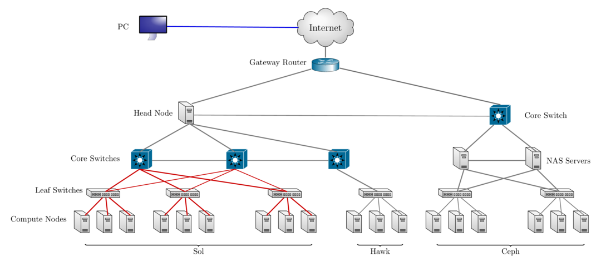

class: myback

```{r setup, include=FALSE}
options(htmltools.dir.version = FALSE)
library(tidyverse)
library(knitr)
```
```{r xaringan-webcam, include = FALSE}
#xaringanExtra::use_webcam()
xaringanExtra::use_xaringan_extra(c("tileview", "webcam"))
```

# About Us?

* Who?
  * Unit of Lehigh&#39;s Library & Technology Services

* Our Mission
  - We enable Lehigh Faculty, Researchers and Scholars achieve their goals by providing various computational resources; hardware, software, and storage; consulting and training.

* Research Computing Staff
  * __Alex Pacheco, Manager &#38; XSEDE Campus Champion__
  * Steve Anthony, System Administrator
  * Dan Brashler, CAS Computing Consultant
  * Sachin Joshi, Data Analyst &amp; Visualization Specialist


---

# What do we do?

* Hardware Support
  * Provide system administration and support for Lehigh&#39;s HPC clusters.
  * Assist with purchase, installation and administration of servers and clusters.
- Data Storage
  - Provide data management services including storing and sharing data. 
* Software Support
  * Provide technical support for software applications, install software as requested and assist with purchase of software.
- Training & Consulting
  - Provide education and training programs to facilitate use of HPC resources and general scientific computing needs.
  - Provide consultation and support for code development and visualization.


---

# Sol: Lehigh&#39;s Shared HPC Cluster

```{r echo=FALSE}
sol <- tribble(~"Nodes",~"Intel Xeon CPU Type",~"CPU Speed (GHz)",~"CPUs",~"GPUs",~"CPU Memory (GB)",~"GPU Memory (GB)",~"CPU TFLOPS",~"GPU TFLOPs",~"SUs",
               9, "E5-2650 v3", "2.3", 180, 10, 8*128, 80, 5.76, 2.57,180*8760,
               33, "E5-2670 v3", "2.3", 792, 62, 33*128, 496, 25.344, 15.934,792*8760,
               14, "E5-2650 v4", "2.2", 336, 0, 14*64, 0, 9.6768, 0,336*8760,
               1, "E5-2640 v3", "2.6", 16, 0, 512, 0, 0.5632, 0,16*8760,
               24, "Gold 6140", "2.3", 864, 48, 24*192, 528, 41.472, 18.392,864*8760,
               6, "Gold 6240", "2.6", 216, 0, 6*192, 0, 10.368, 0,216*8760,
               2, "Gold 6230R", "2.1", 104, 0, 2*384, 0, 4.3264, 0, 104*8760
               )
sollts <- tribble(~"Nodes",~"Intel Xeon CPU Type",~"CPU Speed (GHz)",~"CPUs",~"GPUs",~"CPU Memory (GB)",~"GPU Memory (GB)",~"CPU TFLOPS",~"GPU TFLOPs",~"SUs",
               8, "E5-2650 v3", "2.3", 160, 0, 8*128, 0, 736*8/1000, 0,160*8760
               )

totalsol <- sol %>% summarise_if(is.numeric, sum) %>% 
  mutate("Intel Xeon CPU Type"="","CPU Speed (GHz)"="") %>% 
  select(Nodes,"Intel Xeon CPU Type","CPU Speed (GHz)",CPUs:SUs)

hawk <- tribble(~"Nodes",~"Intel Xeon CPU Type",~"CPU Speed (GHz)",~"CPUs",~"GPUs",~"CPU Memory (GB)",~"GPU Memory (GB)",~"CPU TFLOPS",~"GPU TFLOPs",~"SUs",
               26, "Gold 6230R", "2.1", 26*52, 0, 26*384, 0, 26*52*1.3*32/1000, 0,26*52*8760,
               4, "Gold 6230R", "2.1", 4*52, 0, 4*1536, 0, 4*52*1.3*32/1000, 0,4*52*8760,
               4, "Gold 5220R", "2.2", 4*48, 32, 4*192, 32*16, 4*48*1.4*16/1000, 253.38*32/1000,4*48*8760
               )
totalhawk <- hawk %>% summarise_if(is.numeric, sum) %>% 
  mutate("Intel Xeon CPU Type"="","CPU Speed (GHz)"="") %>% 
  select(Nodes,"Intel Xeon CPU Type","CPU Speed (GHz)",CPUs:SUs)

total <- rbind(totalsol,totalhawk) %>% summarise_if(is.numeric, sum) %>% 
  mutate("Intel Xeon CPU Type"="","CPU Speed (GHz)"="") %>% 
  select(Nodes,"Intel Xeon CPU Type","CPU Speed (GHz)",CPUs:SUs)
```

- built by investments from Provost<sup>a</sup> and Faculty.

```{r echo=FALSE}
knitr::kable(rbind(sol,totalsol), format = 'html')
```
- 87 nodes interconnected by 2:1 oversubscribed Infiniband EDR (100Gb/s) fabric.
- Only `r sprintf("%4.2fM",sollts$SUs/1e6)` SUs from Provost investment available to Lehigh researchers. 

.footnote[
a: 8 Intel Xeon E5-2650 v3 nodes invested by Provost in 2016.
]


---

# Condo Investments

* Sustainable model for High Performance Computing at Lehigh.
* Faculty (Condo Investor) purchase compute nodes from grants to increase overall capacity of Sol.
* LTS will provide for four years or length of hardware warranty purchased,
   * System Administration, Power and Cooling, User Support for Condo Investments.
* Condo Investor
   * receives annual allocation equivalent to their investment for the length of
     investment,
   * can utilize allocations on all available nodes, including nodes from other Condo Investors,
   * allows idle cycles on investment to be used by other Sol users,
   * unused allocation will not rollover to the next allocation cycle,
* Annual Allocation cycle is Oct. 1 - Sep. 30.

---

# Condo Investors

* Dimitrios Vavylonis, Physics (1 node)
* Wonpil Im, Biological Sciences (37 nodes, 98 GPUs)
* Anand Jagota, Chemical Engineering (1 node)
* Brian Chen, Computer Science & Engineering (3 nodes)
* Ed Webb & Alp Oztekin, Mechanical Engineering (6 nodes)
* Jeetain Mittal & Srinivas Rangarajan, Chemical Engineering (13 nodes, 16 GPUs)
* Seth Richards-Shubik, Economics (1 node)
* Ganesh Balasubramanian, Mechanical Engineering (7 nodes)
* Department of Industrial & Systems Engineering (2 nodes)
* Paolo Bocchini, Civil and Structural Engineering (1 node)
* Lisa Fredin, Chemistry (6 nodes)
* Hannah Dailey, Mechanical Engineering (1 node)
* College of Health (2 nodes)
- Condo Investments: `r sum(sol$Nodes)-sollts$Nodes` nodes, `r sum(sol$CPUs)-sollts$CPUs` CPUs, `r sum(sol$GPUs)-sollts$GPUs` GPUs, `r sprintf("%5.2fM",(sum(sol$SUs)-sollts$SUs)/1e6)` SUs
- Lehigh Investments: `r sollts$Nodes` nodes, `r sollts$CPUs` CPUs, `r sprintf("%5.2fM",sollts$SUs/1e6)`  SUs


---
# Hawk

* Funded by [NSF Campus Cyberinfrastructure award 2019035](https://www.nsf.gov/awardsearch/showAward?AWD_ID=2019035&HistoricalAwards=false).
   - PI: __Ed Webb__ (MEM).
   - co-PIs: Balasubramanian (MEM), Fredin (Chemistry), Pacheco (LTS), and Rangarajan (ChemE).
   - Sr. Personnel: Anthony (LTS), Reed (Physics), Rickman (MSE), and Tak&#225;&#269; (ISE). 

```{r echo=FALSE}
knitr::kable(rbind(hawk,totalhawk), format = 'html')
```
* 798TB (raw) Ceph based storage 
* Production: **Feb 1, 2021**.

---

# Ceph Storage

* LTS provides various storage options for research and teaching.
* Some are cloud based and subject to Lehigh&#39;s Cloud Policy.
* Research Computing provides a 768TB (206TB usable) storage system called [Ceph](https://go.lehigh.edu/ceph).
* Ceph 
    * based on the Ceph software,
    * in-house, built, operated and administered by Research Computing Staff,
        * located in the EWFM Data Center.
    * provides storage for Research Computing resources,
    * can be mounted as a network drive on Windows or CIFS on Mac and Linux.
        * [See Ceph FAQ](http://lts.lehigh.edu/services/faq/ceph-faq) for more details.
* Research groups can purchase a sharable project space @ &#36;375/TB for 5 years,
    * can share project space with anyone with a Lehigh ID at no additional charge.


---

# Network Layout Sol, Hawk &amp; Ceph




---

# Installed Software

.pull-left[

* [Chemistry/Materials Science](https://confluence.cc.lehigh.edu/x/3KX0BQ)
  - **DL\_POLY\_4**
  - Gaussian
  - **OpenMolcas**
  - **NWCHEM**
  - **Quantum Espresso**
  - **VASP** (Restricted Access)
* [Molecular Dynamics](https://confluence.cc.lehigh.edu/x/6qX0BQ)
  - **ESPResSo**
  - **GROMACS**
  - **LAMMPS**
  - **NAMD**

<span class="tiny strong">__MPI enabled__</span>
]

.pull-right[

* [Computational Fluid Dynamics](https://confluence.cc.lehigh.edu/x/BZFVBw)
  - Abaqus
  - Ansys
  - Comsol
  - **OpenFOAM**
  - OpenSees
* [Math](https://confluence.cc.lehigh.edu/x/1QL5Bg)
  - GNU Octave
  - Gurobi
  - Magma
  - Maple
  - Mathematica
  - MATLAB]

---

# More Software

.pull-left[

* *Machine &amp; Deep Learning* 
   - TensorFlow
   - Caffe
   - SciKit-Learn
   - SciKit-Image
   - Theano
   - Keras

* *Natural Language Processing (NLP)*
   - Natural Language Toolkit (NLTK)
   - Stanford NLP    


<span class="tiny">_[Python packages](https://go.lehigh.edu/python)_</span>
]

.pull-right[

* [Bioinformatics](https://confluence.cc.lehigh.edu/x/y6X0BQ)
  - BamTools
  - BayeScan
  - bgc
  - BWA
  - FreeBayes
  - NCBI BLAST
  - SAMTools
  - tabix
  - trimmomatic
  - Trinity
  - *barcode_splitter*
  - *phyluce* 
  - *VelvetOptimiser*]


---

#More Software

.pull-left[

* Scripting Languages
  - [R](https://confluence.cc.lehigh.edu/x/5aX0BQ)
  - Perl
  - [Python](https://go.lehigh.edu/python)
  - Julia
* [Compilers](https://confluence.cc.lehigh.edu/x/Sab0BQ)
  - GNU
  - Intel/Intel OneAPI
  - JAVA
  - PGI/NVIDIA HPC SDK
  - CUDA
* [Parallel Programming](https://confluence.cc.lehigh.edu/x/Sab0BQ#Compilers-MPI)
  - MVAPICH2
  - MPICH
  - OpenMPI
]

.pull-right[

* Libraries
  - BLAS/LAPACK/GSL/SCALAPACK
  - Boost
  - FFTW
  - Intel MKL
  - HDF5
  - NetCDF
  - METIS/PARMETIS
  - QHull/QRupdate
  - SuiteSparse
  - SuperLU
]


---

# More Software

.pull-left[

* [Visualization Tools](https://confluence.cc.lehigh.edu/x/qan0BQ)
  - Atomic Simulation Environment 
  - Avogadro
  - Blender
  - Gabedit
  - GaussView
  - GNUPlot
  - Paraview
  - PWGui
  - PyMol
  - RDKit
  - VESTA
  - VMD
  - XCrySDen
]

.pull-right[

* Other Tools
  - Artleys Knitro
  - ROOT
  - CMake
  - GIT
  - [GNU Parallel](https://confluence.cc.lehigh.edu/x/B6b0BQ)
  - [Jupyter Notebooks](https://confluence.cc.lehigh.edu/x/G5JVBw)
  - *Numba*
  - [RStudio Server](https://confluence.cc.lehigh.edu/x/NpBVBw)
  - Scons
  - Singularity
  - [Virtual Desktops](https://confluence.cc.lehigh.edu/x/g5BVBw)
]

---

# HPC Seminars

* Fridays, 2:00PM - 4:00PM via Zoom

| Date | Topic |
|:-----|:------|
| Sep. 3 | Research Computing Resources at Lehigh |
| Sep. 10 | Linux: Basic Commands & Environment |
| Sep. 17 | Using SLURM scheduler on Sol |
| Sep. 24 | Introduction to Open OnDemand |
| Oct. 1 | Python Programming |
| Oct. 8 | R Programming |
| Oct. 15 | Data Visualization with Python |
| Oct. 22 | Data Visualization with R |
| Oct. 29 | Text Mining |
| Nov. 5 | MATLAB |
| Nov. 12 | Shiny Apps in R |

* Register at https://go.lehigh.edu/hpcseminars

---

# Workshops

* We provide full day workshops on programming topics.
- [Summer Workshops](https://go.lehigh.edu/hpcworkshops)
  - Modern Fortran Programming (Summer 2015, 2021)
  - C Programming (Summer 2015, 2021)
  - HPC Parallel Programming Workshop (Summer 2017, 2018, 2021)
  - Quantum Chemistry Workshop (Summer 2021)
* We also host full day XSEDE workshops.
  - XSEDE HPC Monthly Workshop: OpenACC (Dec. 2014).
  - XSEDE HPC Summer BootCamp: OpenMP, OpenACC, MPI and Hybrid Programming (Jun.
    2015 - 2019).
  - XSEDE HPC Monthly Workshop: Big Data (Nov. 2015, May 2017).


---

# Proposal Assistance

- LTS strongly recommends that researchers, early on, develop long-range plans for a sustainable form of data storage. 
   - facilitate compliance with future grant applications
   - avoid the need to later reformat or migrate data to another storage option. 
* [Research Data Management Committee](https://libraryguides.lehigh.edu/researchdatamanagement) can help with writing DMP&#39;s for your proposal.
  * eMail us at data-management-group-list@lehigh.edu OR Contact
     * General information - Subject Librarians
     * Research Computing Resources &amp; Services - Alex Pacheco
     * Data Security - Eric Zematis, Chief Information Security Officer
     * Data storage - Help Desk or your Computing Consultant
- [Sample DMPs](https://confluence.cc.lehigh.edu/x/TYYuAg)
- [Budget templates and LTS Facilities document](https://confluence.cc.lehigh.edu/x/FgL5Bg)


---

# Getting Help

* Issue with running jobs or need help to get started: 
  * Open a help ticket: <http://lts.lehigh.edu/help>
  * See [guidelines for faster response](https://confluence.cc.lehigh.edu/x/KJVVBw)
- Investing in Sol
  - Contact Alex Pacheco or Steve Anthony
* More Information
  * [Research Computing](https://go.lehigh.edu/hpc)
  * [Research Computing Seminars](https://go.lehigh.edu/hpcseminars)
  * [Condo Program and Available Equipment](https://confluence.cc.lehigh.edu/x/EgL5Bg)
  * [Proposal Assistance](https://confluence.cc.lehigh.edu/x/FgL5Bg)
  * [Data Management Plans](http://libraryguides.lehigh.edu/researchdatamanagement)
* Subscribe
     * [Research Computing Mailing List](https://lists.lehigh.edu/mailman/listinfo/hpc-l)
     * [HPC Training Google Groups](mailto:hpctraining-list+subscribe@lehigh.edu)

---
class: inverse middle

# Thank You!
# Questions?


