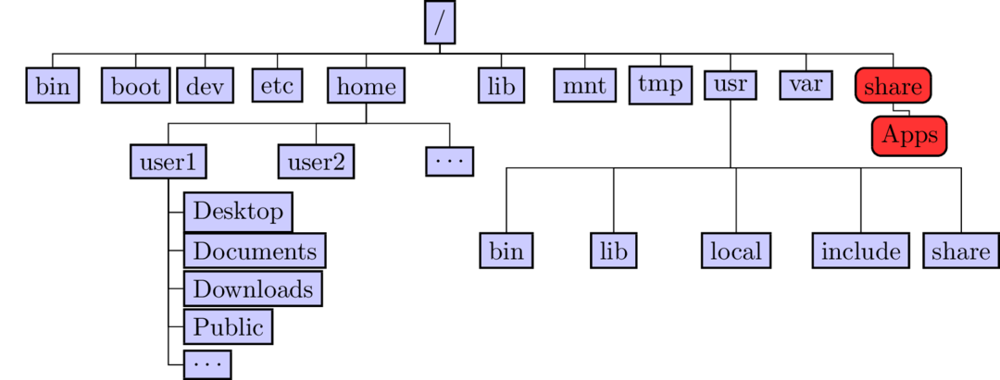
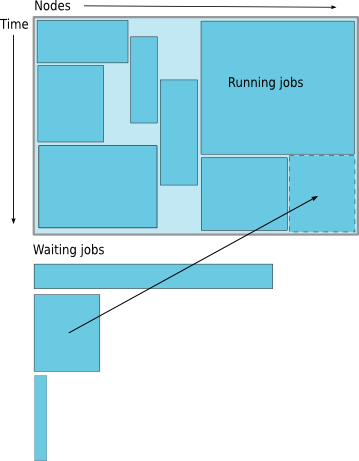

class: myback

```{r setup, include=FALSE}
options(htmltools.dir.version = FALSE)
library(tidyverse)
library(knitr)
knitr::opts_chunk$set(tidy.opts=list(width.cutoff=60),tidy=TRUE)
```
```{r xaringan-webcam, include = FALSE}
#xaringanExtra::use_webcam()
#xaringanExtra::use_xaringan_extra(c("tileview", "webcam"))
```

# About Us?

* Who?
  * Unit of Lehigh&#39;s Library & Technology Services within the Center for Innovation in Teaching & Learning.
* Our Mission
  - We enable Lehigh Faculty, Researchers and Scholars achieve their goals by providing various computational resources; hardware, software, and storage; consulting and training.
* Research Computing Staff
  * __Alex Pacheco, Manager &#38; XSEDE Campus Champion__
  * Steve Anthony, System Administrator
  * Dan Brashler, CAS Computing Consultant
  * Sachin Joshi, Data Analyst &amp; Visualization Specialist


---

# What do we do?

* Hardware Support
  * Provide system administration and support for Lehigh&#39;s HPC clusters.
  * Assist with purchase, installation and administration of servers and clusters.
- Data Storage
  - Provide data management services including storing and sharing data. 
* Software Support
  * Provide technical support for software applications, install software as requested and assist with purchase of software.
- Training & Consulting
  - Provide education and training programs to facilitate use of HPC resources and general scientific computing needs.
  - Provide consultation and support for code development and visualization.

---

# Sol: Lehigh&#39;s Shared HPC Cluster

```{r echo=FALSE}
sol <- tribble(~"Nodes",~"Intel Xeon CPU Type",~"CPU Speed (GHz)",~"CPUs",~"GPUs",~"CPU Memory (GB)",~"GPU Memory (GB)",~"CPU TFLOPS",~"GPU TFLOPs",~"SUs",
               9, "E5-2650 v3", "2.3", 180, 10, 8*128, 80, 5.76, 2.57,180*8760,
               33, "E5-2670 v3", "2.3", 792, 62, 33*128, 496, 25.344, 15.934,792*8760,
               14, "E5-2650 v4", "2.2", 336, 0, 14*64, 0, 9.6768, 0,336*8760,
               1, "E5-2640 v3", "2.6", 16, 0, 512, 0, 0.5632, 0,16*8760,
               24, "Gold 6140", "2.3", 864, 48, 24*192, 528, 41.472, 18.392,864*8760,
               6, "Gold 6240", "2.6", 216, 0, 6*192, 0, 10.368, 0,216*8760,
               2, "Gold 6230R", "2.1", 104, 0, 2*384, 0, 4.3264, 0, 104*8760
               )
sollts <- tribble(~"Nodes",~"Intel Xeon CPU Type",~"CPU Speed (GHz)",~"CPUs",~"GPUs",~"CPU Memory (GB)",~"GPU Memory (GB)",~"CPU TFLOPS",~"GPU TFLOPs",~"SUs",
               8, "E5-2650 v3", "2.3", 160, 0, 8*128, 0, 736*8/1000, 0,160*8760
               )

totalsol <- sol %>% summarise_if(is.numeric, sum) %>% 
  mutate("Intel Xeon CPU Type"="","CPU Speed (GHz)"="") %>% 
  select(Nodes,"Intel Xeon CPU Type","CPU Speed (GHz)",CPUs:SUs)

hawk <- tribble(~"Nodes",~"Intel Xeon CPU Type",~"CPU Speed (GHz)",~"CPUs",~"GPUs",~"CPU Memory (GB)",~"GPU Memory (GB)",~"CPU TFLOPS",~"GPU TFLOPs",~"SUs",
               26, "Gold 6230R", "2.1", 26*52, 0, 26*384, 0, 26*52*1.3*32/1000, 0,26*52*8760,
               4, "Gold 6230R", "2.1", 4*52, 0, 4*1536, 0, 4*52*1.3*32/1000, 0,4*52*8760,
               4, "Gold 5220R", "2.2", 4*48, 32, 4*192, 32*16, 4*48*1.4*16/1000, 253.38*32/1000,4*48*8760
               )
totalhawk <- hawk %>% summarise_if(is.numeric, sum) %>% 
  mutate("Intel Xeon CPU Type"="","CPU Speed (GHz)"="") %>% 
  select(Nodes,"Intel Xeon CPU Type","CPU Speed (GHz)",CPUs:SUs)

total <- rbind(totalsol,totalhawk) %>% summarise_if(is.numeric, sum) %>% 
  mutate("Intel Xeon CPU Type"="","CPU Speed (GHz)"="") %>% 
  select(Nodes,"Intel Xeon CPU Type","CPU Speed (GHz)",CPUs:SUs)
```

- built by investments from Provost<sup>a</sup> and Faculty.

```{r echo=FALSE}
knitr::kable(rbind(sol,totalsol), format = 'html')
```
<!-- 87 nodes interconnected by 2:1 oversubscribed Infiniband EDR (100Gb/s) fabric.
Only `r sprintf("%4.2fM",sollts$SUs/1e6)` SUs from Provost investment available to Lehigh researchers. -->

.footnote[
a: 8 Intel Xeon E5-2650 v3 nodes invested by Provost in 2016.
]


---
# Hawk

* Funded by [NSF Campus Cyberinfrastructure award 2019035](https://www.nsf.gov/awardsearch/showAward?AWD_ID=2019035&HistoricalAwards=false).
   - PI: __Ed Webb__ (MEM).
   - co-PIs: Balasubramanian (MEM), __Fredin__ (Chemistry), Pacheco (LTS), and __Rangarajan__ (ChemE).
   - Sr. Personnel: Anthony (LTS), Reed (Physics), Rickman (MSE), and __Tak&#225;&#269;__ (ISE). 

```{r echo=FALSE}
knitr::kable(rbind(hawk,totalhawk), format = 'html')
```
* 798TB (raw) Ceph based storage 
* Production: **Feb 1, 2021**.


---

# Configuration

```{r echo=FALSE}
knitr::kable(rbind(rbind(sol,hawk),total), format = 'html')
```

* `r  sprintf("%4.2fM",4.8)` SUs available for general use by proposal style allocation review process,
   * rest allocated to investors, and grant distribution including education use.


---

# Ceph Storage resource

* LTS provides various storage options for research and teaching.
* Some are cloud based and subject to Lehigh&#39;s Cloud Policy.
* For research, LTS provides a 2019TB (raw) storage system called [Ceph](https://go.lehigh.edu/ceph).
* Ceph 
    * based on the Ceph software,
    * in-house, built, operated and administered by Research Computing Staff,
        * located in the EWFM Data Center.
    * provides storage for Research Computing resources,
    * can be mounted as a network drive on Windows or CIFS on Mac and Linux.
        * [See Ceph FAQ](http://lts.lehigh.edu/services/faq/ceph-faq) for more details.
* Research groups 
    * can purchase a sharable project space @ &#36;375/TB for 5 years, OR 
    * request up to 5TB of Hawk's Ceph space available by proposal style allocation review process.
    * can share project space with anyone with a Lehigh ID at no additional charge.


---

# Network Layout Sol, Hawk &amp; Ceph


---

# Accessing Sol &amp; Hawk

* Sol: accessible using ssh while on Lehigh&#39;s network
    ```{bash eval=F}
    ssh username@sol.cc.lehigh.edu
    ```
   * Windows PC require a SSH client such as [MobaXterm](https://mobaxterm.mobatek.net/) or [Putty](https://putty.org/).
   * Mac and Linux PC&#39;s, ssh is built in to the terminal application. 
* If you are not on Lehigh&#39;s network, login to the ssh gateway
   ```{bash eval=F}
    ssh username@ssh.cc.lehigh.edu
   ``` 
   and then login to sol as above
  -  Alternatively,
  ```{bash eval=F}
  ssh -J username@ssh.cc.lehigh.edu username@sol.cc.lehigh.edu
  ```
  - [Click here](https://confluence.cc.lehigh.edu/x/JhH5Bg) to learn how to configure MobaXterm to use the SSH Gateway.


---

# 

* an NSF-funded open-source HPC portal based on Ohio Supercomputing Center’s original OnDemand portal. 

* Goals: provide an easy way for system administrators to provide web access to their HPC resources, including, but not limited to:
  - Plugin-free web experience
  - Easy file management
  - Command-line shell access
  - Job management and monitoring across different batch servers and resource managers
  - Graphical desktop environments and desktop applications
  
  
---

# Open OnDemand at Lehigh

* In Production since Aug 12, 2020.

* https://hpcportal.cc.lehigh.edu: Available on campus or VPN.

* Features:
  - Shell Access
  - File Management
  - Job Submission
  - Virtual Desktops: XFCE
  - Jupyter Notebooks
  - RStudio Server
  - MATLAB
  - Ansys Workbench
  - Abaqus
  - SAS
  - Various Visualization Tools
  

---

# Connecting to the HPC Portal

* HPC Account required
* Chrome or Firefox preferred
   * At least one user has reported problems with Safari

<span class="center">

</span>


---

# Dashboard


<span class="center">

</span>


---

# File Management

.pull-left[
* Launch File Explorer
* Navigate Storage
* Transfer Files to/from Sol
* Create, Edit, Delete, Rename Files &amp; Directories


<span class="center">

</span>

]

.pull-right[
<span class="center">


</span>
]


---

#  Shell Access

* Click Clusters > Sol Shell Access

<span class="center">

</span>


---

#  Shell Access

* Click Clusters > Sol Shell Access

<span class="center">

</span>

---
class: inverse, middle

#  Linux
  
  
---

# What is Linux?

* an operating system that evolved from a kernel created by Linus Torvalds when he was a student at the University of Helsinki.
* meant to be used as an alternative to other operating systems, Windows, Mac OS, MS-DOS, Solaris and others.
* most popular OS used in a Supercomputer<sup>a,b</sup>

| OS Family | Count | Share % |
|:---------:| -----:| -------:|
| Linux | 498 | 99.6 |
| Unix  |   2 |   .4 |


* It is required/neccessary/mandatory to learn Linux Programming (commands, shell scripting) if your research involves use of High Performance Computing or Supercomputing resources.

.footnote[
a: June 2017 Top 500 list.

b: June 2015 was the last Top 500 list featuring a Windows based supercomputer. 
]

---

# Where is Linux used?

* Linux distributions are tailored to different requirements such as
  - Server
  - Desktop
  - Workstation
  - Routers
  - Embedded devices
  - Mobile devices (Android is a Linux-based OS)
* Almost any software that you use on windows has a roughly equivalent software on Linux, most often multiple equivalent software
  - e.g. Microsoft Office equivalents are OpenOffice.org, LibreOffice, KOffice
  - [Visit for complete list](http://wiki.linuxquestions.org/wiki/Linux_software_equivalent_to_Windows_software)
* Linux offers you freedom, to choose your desktop environment, software.


---

# What is a Linux OS and Distro?

* Many software vendors release their own packaged Linux OS (kernel, applications) known as distribution
* Linux distribution = Linux kernel + GNU system utilities and libraries + Installation scripts + Management utilities etc.
- Debian, Ubuntu, Mint
- Red Hat, Fedora, __CentOS__
- Slackware, openSUSE, SLES, SLED
- Gentoo
* Application packages on Linux can be installed from source or from customized packages
- deb: Debian based distros e.g. Debian, Ubuntu, Mint
- rpm: Red Hat based distros, Slackware based distros.


---

# What is a Desktop Environment?


* Linux distributions offer a variety of desktop environment.
- K Desktop Environment (KDE)
- GNOME
- __XFCE__
- Lightweight X11 Desktop Environment (LXDE)
- Cinnamon
- MATE
- Dynamic Window Manager


---

# Shell versus Command


* What is a command and how do you use it?
  - __command__ is a directive to a computer program acting as an interpreter of some kind,
in order to perform a specific task.
  - __command prompt__ (or just __prompt__) is a sequence of (one or more) characters used in a command-line interface to indicate readiness to accept commands.
  - Its intent is to literally prompt the user to take action.
  - A prompt usually ends with one of the characters $, %, #, :, &gt; and often includes other information, such as the path of the current working directory.
* What is a Shell?
  - The command line interface is the primary interface to Linux/Unix operating
systems.
  - Shells are how command-line interfaces are implemented in Linux/Unix.
  - Each shell has varying capabilities and features and the user should choose the shell that best suits their needs.
  - The shell is simply an application running on top of the kernel and provides a powerful interface to the system.


---

# Types of Shell

* __sh__ : Bourne Shell
  - Developed by Stephen Bourne at AT&amp;T Bell Labs
* __csh__ : C Shell
  - Developed by Bill Joy at University of California, Berkeley
* __ksh__ : Korn Shell
  - Developed by David Korn at AT&amp;T Bell Labs
  - backward-compatible with the Bourne shell and includes many features of the C shell
* __bash__ : Bourne Again Shell
  - Developed by Brian Fox for the GNU Project as a free software replacement for the Bourne shell (sh).
  - Default Shell on Linux and Mac OSX
* __tcsh__ : TENEX C Shell
  - Developed by Ken Greer at Carnegie Mellon University
  - It is essentially the C shell with programmable command line completion, command-line editing, and a few other features.


---

# Shell Comparison

| Software | sh  | csh | ksh | bash | tcsh |
|:--------:|:---:|:---:|:---:|:----:|:----:|
| Programming Languages | &#10004; | &#10004; | &#10004; | &#10004; | &#10004; |
| Shell Variables |  &#10004; | &#10004; | &#10004; | &#10004; | &#10004; |
| Command alias | &#10008; | &#10004; | &#10004; | &#10004; | &#10004; |
| Command history | &#10008; | &#10004; | &#10004; | &#10004; | &#10004; |
| Filename completion | &#10008; | &#10070; | &#10070; | &#10004; | &#10004; |
| Command line editing | &#10008; | &#10008; | &#10070; | &#10004; | &#10004; |
| Job control | &#10008; | &#10004; | &#10004; | &#10004; | &#10004; |


&#10004; : Yes

&#10008; : No

&#10070; : Yes, not set by default

http://www.cis.rit.edu/class/simg211/unixintro/Shell.html

---

# Directory Structure

* All files are arranged in a hierarchial structure, like an inverted tree.
*  The top of the hierarchy is traditionally called __root__ (written as a slash / )




---

# Relative & Absolute Path
* Path means a position in the directory tree.
* You can use either the relative path or absolute path
* In relative path expression
  -  . (one dot or period) is the current working directory
  -  .. (two dots or periods) is one directory up
  -  You can combine . and .. to navigate the filee system hierarchy.
  -  the path is not defined uniquely and does depend on the current path.
  -  ../../tmp is unique only if your current working directory is your home directory.
* In absolute path expression
  -  the path is defined uniquely and does not depend on the current path
  -  /tmp is unique since /tmp is the abolute path


---

# Some Linux Terms (also called variables)

* __HOME__ : Your Home Directory on the system, /home/username
  - This is where you should be when you login the first time
  - Don&#39;t believe me, type `pwd` and hit enter
* __PATH__ : List of directories to search when executing a command
  - Enter `avogadro` at the command prompt
  - You should see an error saying `command not found`
* __LD_LIBRARY_PATH__ : List of directories to look for libraries executing code


---

# Linux Commands

* `man` shows the manual for a command or program.
  - `man pwd`
* `pwd`: print working directory, gives the absolute path of your current location in the directory hierarchy
* `echo`: prints whatever follows to the screen
  - `echo $HOME`: prints the contents of the variable __HOME__ i.e. your home directory to the screen
* `cd dirname`: change to folder called `dirname`
  - default `dirname` is your home directory
  - Useful option 
       - `cd -` go to previous directory
* `mkdir dirname`: create a directory called `dirname`
  - Create a directory, any name you want and cd to that directory 
       - `mkdir me450` followed by `cd me450`
  - Useful option
       - `mkdir -p dir1/dir2/dir3` create intermediate directories if they do not exist
  

---

# Linux Command (contd)

* `cp file1 file2`: command to copy file1 to file2
      - `cp -r /home/alp514/Workshop/2021HPC .` copy directories recursively
      - `cp -p ~alp514/in.lj ${HOME}/` preserve time stamps
* `rm file1`: delete a file called file1 
      - `rm -i` to be prompted for confirmation
      - `rm -r` to delete directories recursively 
      - `rm -f` delete without prompting - VERY DANGEROUS
* `ls dirname`: list contents of _dirname_ (leave blank for current directory)
      - `ls -l` show long form listing
      - `ls -a` show hidden files
      - `ls -t` sort by timestamp newest first, best when combined with `-l`
      - `ls -r` reverse sort (default alphabetical), best when combined with `-l -t` or `-lt`
* `alias`: create a shortcut to another command or name to execute a long string.
  - `alias rm="/bin/rm -i"`


---

# File Editing

* The two most commonly used editors on Linux/Unix systems are:
  -  `vi` or `vim` (vi improved)
  -  `emacs`
* `vi/vim` is installed by default on Linux/Unix systems and has only a command line interface (CLI).
* `emacs` has both a CLI and a graphical user interface (GUI).
* Other editors that you may come across on \*nix systems
  - `kate`: default editor for KDE.
  - `gedit`: default text editor for GNOME desktop environment.
  - `gvim`: GUI version of vim
  - `pico`: console based plain text editor
  - `nano`: GNU.org clone of pico
  - `kwrite`: editor by KDE.
  


---

# vi/emacs commands

* `vi/vim` and `emacs` are the two most popular \*nix file editors.
* Which one to use is up to you.
* `vi/vim` has two modes
  * Editing mode
  * Command mode
* `emacs` has only one mode as in any editor that you use.

| Inserting/Appending Text | Command |
|:------------------------:|:-------:|
| insert at cursor | i |
| insert at beginning of line | I |
| append after cursor | a |
| append at end of line | A |
| newline after cursor in insert mode | o |
| newline before cursor in insert mode | O |
| append at end of line | ea |
| exit insert mode | ESC |


---

# Editor Commands

.pull-left[
| Cursor Movement | vi | emacs |
|:---------------:|:-------:|:-----:|
| move left | h | Ctrl-b |
| move down | j | Ctrl-n |
| move up | k | Ctrl-p |
| move right | l | Ctrl-f |
| jump to beginning of line | ^ | Ctrl-a |
| jump to end of line | $ | Ctrl-e |
| goto line n | nG | ESC-x goto-line Enter n |
| goto top of file | 1G | ESC-&lt; |
| goto end of file | G | ESC-&gt; |
| move one page up | CNTRL-u | ESC-v |
| move one page down | CNTRL-d | Ctrl-v |
]

.pull-right[
| File Manipulation | vi | emacs |
|:-----------------:|:-------:|:-----:|
| edit/open a __file__ | :e __file__ | Ctrl-x Ctrl-f __file__ |
| insert file __file__ | :r __file__ | Ctrl-x i __file__ |
| save file | :w | Ctrl-x Ctrl-s | 
| save file and exit | :wq |  |
| quit without saving | :q! |   |
| exit | :q |  Ctrl-x Ctrl-c | 


| Window Management | vim | emacs |
|:-----------------:|:---:|:-----:|
| split window horizontally | :split or Ctrl-w s  | Ctrl-x 2 |
| split window vertically   | :vsplit or Ctrl-w v | Ctrl-x 3 |
| switch windows | Ctrl-w w | Ctrl-x o | 

]


---

# Editor Commands

| Text Manipulation | vi | emacs |
|:-----------------:|:-------:|:-----:|
| delete a line | dd | Ctrl-a Ctrl-k |
| delete n lines | ndd | Ctrl-a Esc n Ctrl-k |
| paste deleted line after cursor | p | Ctrl-y |
| paste before cursor | P | |
| undo edit | u | Ctrl-\_ or Ctrl-x u | 
| delete from cursor to end of line | D | Ctrl-k |
| replace a character | r | |
| join next line to current | J | | 
| change a line | cc | |
| change a word | cw | |
| change to end of line | c$ | |
| delete a character | x | Ctrl-d |
| delete a word | dw | Esc-d |


---

# Editor Cheatsheets

- Do a google search for more detailed cheatsheets
   * [vi](https://www.google.com/search?q=vi+cheatsheet)
   *   [emacs](https://www.google.com/search?q=emacs+cheatsheet)

- More on the **set -o** command
   *   The **set -o** command can be used to change the command line editor mode among other things (Do **man set** to find out more)

---
class: inverse, middle

# Software


---

# Available Software

* [Commercial, Free and Open source software](https://go.lehigh.edu/hpcsoftware). 
- Software is managed using module environment.
  - Why? We may have different versions of same software or software built with different compilers.
  - Module environment allows you to dynamically change your &#42;nix environment based on software being used.
  - Standard on many University and national High Performance Computing resource since circa 2011.

* How to use HPC Software on your [linux](https://confluence.cc.lehigh.edu/x/ygD5Bg) workstation?


---

# Module Command


| Command | Description |
|:-------:|:-----------:|
| <code>module avail</code> | show list of software available on resource |
| <code>module load abc</code> | add software <code>abc</code> to your environment (modify your <code>PATH</code>, <code>LD_LIBRARY_PATH</code> etc as needed) |
| <code>module unload abc</code> | remove <code>abc</code> from your environment |
| <code>module purge</code> | remove all modules from your environment |
| <code>module show abc</code> | display what variables are added or modified in your environment |
| <code>module help abc</code> | display help message for the module <code>abc</code> |
| <code>module spider abc</code> | learn more about package <code>abc</code> |

* Users who prefer not to use the module environment will need to modify their
  .bashrc or .tcshrc files. Run `module show` for list variables that need
  modified, appended or prepended.

---

# Installed Software

.pull-left[

* [Chemistry/Materials Science](https://confluence.cc.lehigh.edu/x/3KX0BQ)
  - Gaussian
  - **OpenMolcas**
  - **NWCHEM**
  - **Quantum Espresso**
  - **VASP** (Restricted Access)
* [Molecular Dynamics](https://confluence.cc.lehigh.edu/x/6qX0BQ)
  - **Desmond**
  - **GROMACS**
  - **LAMMPS**
  - **NAMD**

<span class="tiny strong">__MPI enabled__</span>
]

.pull-right[

* [Computational Fluid Dynamics](https://confluence.cc.lehigh.edu/x/BZFVBw)
  - Abaqus
  - Ansys
  - Comsol
  - **OpenFOAM**
  - **OpenSees**
* [Math](https://confluence.cc.lehigh.edu/x/1QL5Bg)
  - GAMS
  - GNU Octave
  - Gurobi
  - Magma
  - Maple
  - Mathematica
  - MATLAB]

---

# More Software

.pull-left[

* *Machine &amp; Deep Learning* 
   - TensorFlow
   - Caffe
   - SciKit-Learn
   - SciKit-Image
   - Theano
   - Keras

* *Natural Language Processing (NLP)*
   - Natural Language Toolkit (NLTK)
   - Stanford NLP    


<span class="tiny">_[Python packages](https://go.lehigh.edu/python)_</span>
]

.pull-right[

* [Bioinformatics](https://confluence.cc.lehigh.edu/x/y6X0BQ)
  - BamTools
  - BayeScan
  - bgc
  - BWA
  - FreeBayes
  - SAMTools
  - tabix
  - trimmomatic
  - Trinity
  - *barcode_splitter*
  - *phyluce* 
  - *VelvetOptimiser*]


---

#More Software

.pull-left[

* Scripting Languages
  - [R](https://confluence.cc.lehigh.edu/x/5aX0BQ)
  - Perl
  - [Python](https://go.lehigh.edu/python)
* [Compilers](https://confluence.cc.lehigh.edu/x/Sab0BQ)
  - GNU
  - Intel
  - JAVA
  - PGI/NVIDIA HPC SDK
  - CUDA
* [Parallel Programming](https://confluence.cc.lehigh.edu/x/Sab0BQ#Compilers-MPI)
  - MVAPICH2
  - MPICH
  - OpenMPI
]

.pull-right[

* Libraries
  - BLAS/LAPACK/GSL/SCALAPACK
  - Boost
  - FFTW
  - Intel MKL
  - HDF5
  - NetCDF
  - METIS/PARMETIS
  - QHull/QRupdate
  - SuiteSparse
  - SuperLU
]


---

# More Software

.pull-left[

* [Visualization Tools](https://confluence.cc.lehigh.edu/x/qan0BQ)
  - Atomic Simulation Environment 
  - Avogadro
  - Blender
  - Gabedit
  - GaussView
  - GNUPlot
  - Paraview
  - PWGui
  - PyMol
  - RDKit
  - VESTA
  - VMD
  - XCrySDen
]

.pull-right[

* Other Tools
  - Artleys Knitro
  - ROOT
  - CMake
  - GIT
  - [GNU Parallel](https://confluence.cc.lehigh.edu/x/B6b0BQ)
  - *Numba*
  - [RStudio Server](https://confluence.cc.lehigh.edu/x/NpBVBw)
  - Scons
  - Singularity
  - [Virtual Desktops](https://confluence.cc.lehigh.edu/x/g5BVBw)
]


<!---

# Module Command

<script id="asciicast-hGo9Uvwjh1sYYL4X50ZlqVMMn" src="https://asciinema.org/a/hGo9Uvwjh1sYYL4X50ZlqVMMn.js" async data-rows=20></script>


-->

---
class: inverse, middle

# Compilers and Compiler options


---

# Compilers

* Open Source: GNU Compiler (also called gcc even though gcc is the c compiler)
   - 8.3.1 (system default), and 9.3.0.
* Commercial: Only two seats of each.
   - Intel Compiler: 19.0.3 and 20.0.3
* Commercial but available free of charge
   - NVIDIA HPC SDK<sup>a</sup>: 20.9
   - Intel OneAPI: 2021.3
* All except gcc 8.3.1 and OneAPI are available via the module environment. 

.center[
| Language | GNU  | Intel | NVIDIA HPC SDK <sup>b</sup> | OneAPI<sup>d</sup> |
|:--------:|:----:|:-----:|::-------------:|:--------:|
| Fortran  | `gfortran` | `ifort` | `nvfortran` | `ifx` |
| C | `gcc` | `icc` | `nvc`<sup>c</sup> | `icx` |
| C++ | `g++` | `icpc` | `nvc++` | `icpx` |
]

.footnote[
a. includes CUDA for compiling on GPUs.<br />
b. NVIDIA HPC SDK replaces the old PGI compilers. `pgfortran`, `pgcc` and `pgc++` are available for now but you should change your commands to the new `nv` commands.<br />
c. `nvcc` is the cuda compiler while `nvc` is the C compiler. <br />
d. `source /share/Apps/intel-oneapi/2021/setvars.sh` to setup environment.
]


---

# Compiling Code

* Usage: `<compiler> <options> <source code>`
* Common Compiler options or flags:
  - `-o myexec`: compile code and create an executable `myexec`. If this option is not given, then a default `a.out` is created.
  - `-l{libname}`: link compiled code to a library called `libname`. e.g. to use lapack libraries, add `-llapack` as a compiler flag.
  - `-L{directory path}`: directory to search for libraries. e.g. `-L/usr/lib64 -llapack` will search for lapack libraries in `/usr/lib64`.
  - `-I{directory path}`: directory to search for include files and fortran modules.
  - `-On`: optmize code to level n where n=0,1,2,3.
  - `-g`: generate a level of debugging information in the object file (-On supercedes -g).
  - `-mcmodel=mem_model`: tells the compiler to use a specific memory model to generate code and store data where mem\_model=small, medium or large.
  - `-fpic/-fPIC`: generate position independent code (PIC) suitable for use in a shared library. 
* See [HPC Documentation](https://confluence.cc.lehigh.edu/display/hpc/Compilers#Compilers-CompilerFlags)


---

# Compiling and Running Serial Codes

<pre class="wrap" style="font-size: 14px">
[2018-02-22 08:47.27] ~/Workshop/2017XSEDEBootCamp/OpenMP
[alp514.sol-d118](842): icc -o laplacec laplace_serial.c
[2018-02-22 08:47.46] ~/Workshop/2017XSEDEBootCamp/OpenMP
[alp514.sol-d118](843): ./laplacec
Maximum iterations [100-4000]?
1000
---------- Iteration number: 100 ------------
[995,995]: 63.33  [996,996]: 72.67  [997,997]: 81.40  [998,998]: 88.97  [999,999]: 94.86  [1000,1000]: 98.67
---------- Iteration number: 200 ------------
[995,995]: 79.11  [996,996]: 84.86  [997,997]: 89.91  [998,998]: 94.10  [999,999]: 97.26  [1000,1000]: 99.28
---------- Iteration number: 300 ------------
[995,995]: 85.25  [996,996]: 89.39  [997,997]: 92.96  [998,998]: 95.88  [999,999]: 98.07  [1000,1000]: 99.49
---------- Iteration number: 400 ------------
[995,995]: 88.50  [996,996]: 91.75  [997,997]: 94.52  [998,998]: 96.78  [999,999]: 98.48  [1000,1000]: 99.59
---------- Iteration number: 500 ------------
[995,995]: 90.52  [996,996]: 93.19  [997,997]: 95.47  [998,998]: 97.33  [999,999]: 98.73  [1000,1000]: 99.66
---------- Iteration number: 600 ------------
[995,995]: 91.88  [996,996]: 94.17  [997,997]: 96.11  [998,998]: 97.69  [999,999]: 98.89  [1000,1000]: 99.70
---------- Iteration number: 700 ------------
[995,995]: 92.87  [996,996]: 94.87  [997,997]: 96.57  [998,998]: 97.95  [999,999]: 99.01  [1000,1000]: 99.73
---------- Iteration number: 800 ------------
[995,995]: 93.62  [996,996]: 95.40  [997,997]: 96.91  [998,998]: 98.15  [999,999]: 99.10  [1000,1000]: 99.75
---------- Iteration number: 900 ------------
[995,995]: 94.21  [996,996]: 95.81  [997,997]: 97.18  [998,998]: 98.30  [999,999]: 99.17  [1000,1000]: 99.77
---------- Iteration number: 1000 ------------
[995,995]: 94.68  [996,996]: 96.15  [997,997]: 97.40  [998,998]: 98.42  [999,999]: 99.22  [1000,1000]: 99.78

Max error at iteration 1000 was 0.034767
Total time was 4.099030 seconds.
</pre>


---

# Intel Compiler Options


| Flag | Description |
|:----|:--------|
| `-ipo` | Enables interprocedural optimization between files. |
| `-ax_code_/-x_code_` | Tells the compiler to generate multiple, feature-specific auto-dispatch code paths for Intel processors if there is a performance benefit. code can be COMMON-AVX512, CORE-AVX512, CORE-AVX2, CORE-AVX-I or AVX |
| `-xHost` | Tells the compiler to generate instructions for the highest instruction set available on the compilation host processor. DO NOT USE THIS OPTION  |
| `-fast` | Maximizes speed across the entire program. Also sets `-ipo`, `-O3`, `-no-prec-div`, `-static`, `-fp-model fast=2`, and `-xHost`. Not recommended |
| `-funroll-all-loops` | Unroll all loops even if the number of iterations is uncertain when the loop is entered. |
| `-mkl` | Tells the compiler to link to certain libraries in the Intel Math Kernel Library (Intel MKL) |
| `-static-intel/libgcc` | Links to Intel/GNU libgcc libraries statically, use -static to link all libraries dynamically |


---

# GNU Compiler Options


| Flag | Description |
|:----|:--------|
| `-march=processor` |  Generate instructions for the machine type processor . processor can be sandybridge, ivybridge, haswell, broadwell or skylake-avx512. |
| `-Ofast` |  Disregard strict standards compliance. `-Ofast` enables all `-O3` optimizations. It also enables optimizations that are not valid for all standard-compliant programs. It turns on `-ffast-math` and the Fortran-specific `-fstack-arrays`, unless `-fmax-stack-var-size` is specified, and `-fno-protect-parens`. |
| `-funroll-all-loops` |  Unroll all loops even if the number of iterations is uncertain when the loop is entered. |
| `-shared`/`-static` | Links to libraries dynamically/statically |


---

# NVIDIA HPC Compiler Options


| Flag | Description |
|:----|:--------|
| `-acc` | Enable OpenACC directives. |
| `-tp processor` | Specify the type(s) of the target processor(s). processor can be sandybridge-64, haswell-64, or skylake-64. |
| `-mtune=processor` | Tune to processor everything applicable about the generated code, except for the ABI and the set of available instructions. processor can be sandybridge, ivybridge, haswell, broadwell or skylake-avx512. Some older programs/makefile might use -mcpu that is deprecated |
| `-fast` | Generally optimal set of flags. |
| `-Mipa` | Invokes interprocedural analysis and optimization.  |
| `-Munroll` | Controls loop unrolling. |
| `-Minfo` |  Prints informational messages regarding optimization and code generation to standard output as compilation proceeds.|
| `-shared` | Instructs the linker to generate a shared object file. Implies `-⁠fpi`. |
| `-Bstatic` | Statically link all libraries, including the PGI runtime. |


<!---

# Compilers for OpenMP & TBB

* OpenMP support is built-in.

| Compiler | OpenMP Flag | TBB Flag |
|:---:|:---:|:---:|
| GNU | `-fopenmp` | `-L$TBBROOT/lib/intel64_lin/gcc4.4 -ltbb` |
| Intel | `-qopenmp` | `-L$TBBROOT/lib/intel64_lin/gcc4.4 -ltbb` |
| PGI/NVIDIA HPC SDK | `-mp` |

* TBB is available as part of Intel Compiler suite.
* `$TBBROOT` depends on the Intel Compiler Suite you want to use.

<pre>
[alp514.sol](1083): module show intel
-------------------------------------------------------------------
/share/Apps/share/Modules/modulefiles/toolchain/intel/16.0.3:

module-whatis    Set up Intel 16.0.3 compilers. 
conflict         pgi 
conflict         gcc 
setenv           INTEL_LICENSE_FILE /share/Apps/intel/licenses/server.lic 
setenv           IPPROOT /share/Apps/intel/compilers_and_libraries_2016.3.210/linux/ipp 
setenv           MKLROOT /share/Apps/intel/compilers_and_libraries_2016.3.210/linux/mkl 
setenv           TBBROOT /share/Apps/intel/compilers_and_libraries_2016.3.210/linux/tbb 
...
snip
...
</pre>


# Compiling and Running OpenMP Codes


<pre>
[2018-02-22 08:47.56] ~/Workshop/2017XSEDEBootCamp/OpenMP/Solutions
[alp514.sol-d118](845): icc -qopenmp -o laplacec laplace_omp.c
[2018-02-22 08:48.09] ~/Workshop/2017XSEDEBootCamp/OpenMP/Solutions
[alp514.sol-d118](846): OMP_NUM_THREADS=4 ./laplacec
Maximum iterations [100-4000]?
1000
---------- Iteration number: 100 ------------
[995,995]: 63.33  [996,996]: 72.67  [997,997]: 81.40  [998,998]: 88.97  [999,999]: 94.86  [1000,1000]: 98.67
---------- Iteration number: 200 ------------
[995,995]: 79.11  [996,996]: 84.86  [997,997]: 89.91  [998,998]: 94.10  [999,999]: 97.26  [1000,1000]: 99.28
---------- Iteration number: 300 ------------
[995,995]: 85.25  [996,996]: 89.39  [997,997]: 92.96  [998,998]: 95.88  [999,999]: 98.07  [1000,1000]: 99.49
---------- Iteration number: 400 ------------
[995,995]: 88.50  [996,996]: 91.75  [997,997]: 94.52  [998,998]: 96.78  [999,999]: 98.48  [1000,1000]: 99.59
---------- Iteration number: 500 ------------
[995,995]: 90.52  [996,996]: 93.19  [997,997]: 95.47  [998,998]: 97.33  [999,999]: 98.73  [1000,1000]: 99.66
---------- Iteration number: 600 ------------
[995,995]: 91.88  [996,996]: 94.17  [997,997]: 96.11  [998,998]: 97.69  [999,999]: 98.89  [1000,1000]: 99.70
---------- Iteration number: 700 ------------
[995,995]: 92.87  [996,996]: 94.87  [997,997]: 96.57  [998,998]: 97.95  [999,999]: 99.01  [1000,1000]: 99.73
---------- Iteration number: 800 ------------
[995,995]: 93.62  [996,996]: 95.40  [997,997]: 96.91  [998,998]: 98.15  [999,999]: 99.10  [1000,1000]: 99.75
---------- Iteration number: 900 ------------
[995,995]: 94.21  [996,996]: 95.81  [997,997]: 97.18  [998,998]: 98.30  [999,999]: 99.17  [1000,1000]: 99.77
---------- Iteration number: 1000 ------------
[995,995]: 94.68  [996,996]: 96.15  [997,997]: 97.40  [998,998]: 98.42  [999,999]: 99.22  [1000,1000]: 99.78

Max error at iteration 1000 was 0.034767
Total time was 2.459961 seconds.
</pre>


# Compilers for MPI Programming

* MPI is a library, not a compiler, built or compiled for different compilers.

| Language | Compile Command |
|:--------:|:---:|
| Fortran  | `mpif90` |
| C | `mpicc` |
| C++ | `mpicxx` |

* Usage: `<compiler> <options> <source code>`
<pre>
[2017-10-30 08:40.30] ~/Workshop/2017XSEDEBootCamp/MPI/Solutions
[alp514.sol](1096): mpif90 -o laplace_f90 laplace_mpi.f90 
[2017-10-30 08:40.45] ~/Workshop/2017XSEDEBootCamp/MPI/Solutions
[alp514.sol](1097): mpicc -o laplace_c laplace_mpi.c
[2017-10-30 08:40.57] ~/Workshop/2017XSEDEBootCamp/MPI/Solutions
</pre>

* The MPI compiler command is just a wrapper around the underlying compiler.
<pre>
[alp514.sol](1080): mpif90 -show
ifort -fPIC -I/share/Apps/mvapich2/2.1/intel-16.0.3/include
   -I/share/Apps/mvapich2/2.1/intel-16.0.3/include  
   -L/share/Apps/mvapich2/2.1/intel-16.0.3/lib -lmpifort -Wl,
   -rpath -Wl,/share/Apps/mvapich2/2.1/intel-16.0.3/lib -Wl,
   --enable-new-dtags -lmpi
</pre>


# MPI Libraries

* There are two different MPI implementations commonly used.
* `MPICH`: Developed by Argonne National Laboratory.
   - used as a starting point for various commercial and open source MPI libraries
   - `MVAPICH2`: Developed by D. K. Panda with support for  InfiniBand, iWARP, RoCE, and Intel Omni-Path. (default MPI on Sol),
   - `Intel MPI`: Intel's version of MPI. __You need this for Xeon Phi MICs__,
      - available in cluster edition of Intel Compiler Suite. Not available at Lehigh.
   - `IBM MPI` for IBM BlueGene, and 
   - `CRAY MPI` for Cray systems.
* `OpenMPI`: A Free, Open Source implementation from merger of three well know MPI implementations. Can be used for commodity network as well as high speed network.
   - `FT-MPI` from the University of Tennessee,
   - `LA-MPI` from Los Alamos National Laboratory,
   - `LAM/MPI` from Indiana University


# Running MPI Programs


* Every MPI implementation come with their own job launcher: `mpiexec` (MPICH,OpenMPI &amp; MVAPICH2), `mpirun` (OpenMPI)  or `mpirun_rsh` (MVAPICH2).
* Example: `mpiexec [options] <program name> [program options]`
* Required options: number of processes and list of hosts on which to run program.

| Option Description | mpiexec | mpirun | mpirun_rsh |
|:-----------:|:-------:|:------:|:----------:|
| run on `x` cores | -n x | -np x | -n x |
| location of the hostfile | -f filename | -machinefile filename | -hostfile filename |

* To run a MPI code, you need to use the launcher from the same implementation that was used to compile the code.
* For e.g.: You cannot compile code with OpenMPI and run using the MPICH and MVAPICH2's launcher.
   - Since MVAPICH2 is based on MPICH, you can launch MVAPICH2 compiled code using MPICH's launcher.
* SLURM scheduler provides `srun` as a wrapper around all mpi launchers.


# Compiling and Running MPI Codes

<pre>
[2018-02-22 08:48.27] ~/Workshop/2017XSEDEBootCamp/MPI/Solutions
[alp514.sol-d118](848): mpicc -o laplacec laplace_mpi.c
[2018-02-22 08:48.41] ~/Workshop/2017XSEDEBootCamp/MPI/Solutions
[alp514.sol-d118](849): mpiexec -n 4 ./laplacec
Maximum iterations [100-4000]?
1000
---------- Iteration number: 100 ------------
[995,995]: 63.33  [996,996]: 72.67  [997,997]: 81.40  [998,998]: 88.97  [999,999]: 94.86  [1000,1000]: 98.67
---------- Iteration number: 200 ------------
[995,995]: 79.11  [996,996]: 84.86  [997,997]: 89.91  [998,998]: 94.10  [999,999]: 97.26  [1000,1000]: 99.28
---------- Iteration number: 300 ------------
[995,995]: 85.25  [996,996]: 89.39  [997,997]: 92.96  [998,998]: 95.88  [999,999]: 98.07  [1000,1000]: 99.49
---------- Iteration number: 400 ------------
[995,995]: 88.50  [996,996]: 91.75  [997,997]: 94.52  [998,998]: 96.78  [999,999]: 98.48  [1000,1000]: 99.59
---------- Iteration number: 500 ------------
[995,995]: 90.52  [996,996]: 93.19  [997,997]: 95.47  [998,998]: 97.33  [999,999]: 98.73  [1000,1000]: 99.66
---------- Iteration number: 600 ------------
[995,995]: 91.88  [996,996]: 94.17  [997,997]: 96.11  [998,998]: 97.69  [999,999]: 98.89  [1000,1000]: 99.70
---------- Iteration number: 700 ------------
[995,995]: 92.87  [996,996]: 94.87  [997,997]: 96.57  [998,998]: 97.95  [999,999]: 99.01  [1000,1000]: 99.73
---------- Iteration number: 800 ------------
[995,995]: 93.62  [996,996]: 95.40  [997,997]: 96.91  [998,998]: 98.15  [999,999]: 99.10  [1000,1000]: 99.75
---------- Iteration number: 900 ------------
[995,995]: 94.21  [996,996]: 95.81  [997,997]: 97.18  [998,998]: 98.30  [999,999]: 99.17  [1000,1000]: 99.77
---------- Iteration number: 1000 ------------
[995,995]: 94.68  [996,996]: 96.15  [997,997]: 97.40  [998,998]: 98.42  [999,999]: 99.22  [1000,1000]: 99.78

Max error at iteration 1000 was 0.034767
Total time was 1.030180 seconds.
</pre>

-->

---

# Best Practices 

* Build for 64 bit architecture by adding `-m64`
* Use `-mcmodel=medium` if you have large static arrays
* Intel Compiler
  * DO NOTE USE `-xHost`, use `-x<code>` or `-ax<code>` instead
     * OR optimize for all available architectures using `-axCOMMON-AVX512,CORE-AVX512,CORE-AVX2,CORE-AVX-I,AVX`
  * DO NOT USE `-fast` (at least on Sol and Hawk)
     * Instead use `-ipo -O3 -no-prec-div -static -fp-model fast=2`
     * and `-x<code>` or `-ax<code>` instead.
  * Use `-mkl` if using MKL libraries.
     * If you need specific option see the [MKL Link Advisor](https://software.intel.com/content/www/us/en/develop/tools/oneapi/components/onemkl/link-line-advisor.html)
* GNU Compiler
  * Use `-march=<processor>` to optimize for a specific processor.
     * GNU compiler cannot build multi-architecture binaries.
     * If you are building only one executable, then optimize for the lowest processor i.e. ivybridge (if you plan to use debug queue) or haswell


---
class: inverse, middle


# Exercise


---

# Get Started with Linux and HPC


* Login to Sol using a SSH client or Open OnDemand portal
    * `ssh <username>@sol.cc.lehigh.edu`
    * https://hpcportal.cc.lehigh.edu

* Copy Workshop material
    * `cp -r /home/alp514/Workshop/2021HPC/parprog .`

* Compile the fortran and c code in the `get_started` directory. Edit the code 
    * `cd parprog/get_started`
    * `gcc -o helloc hello.c`
    * `gfortran -o hellof hello.f90`

* Load another compiler for e.g. intel 20.0.3 and compile again
    * `module load intel/20.0.3`

---
class: inverse, middle

# Scheduler Basics


---

# How does a cluster look?


.pull-left[

]

.pull-right[

]


---

# Cluster Environment

* A cluster is a group of computers (nodes) that works together closely.

.pull-left[

* Two types of nodes:
   - Head/Login Node,
   - Compute Node

* Multi-user environment.

* Each user may have multiple jobs running simultaneously.
]

.pull-right[

]


---

# Scheduler &amp; Resource Management

* A software that manages resources (CPU time, memory, etc) and schedules job execution.
- Simple Linux Utility for Resource Management (SLURM)
    - Scheduler
    - Resource Manager
    - Allocation Manager

* A job can be considered as a user’s request to use a certain amount of resources for a certain amount of time.

* The Scheduler or queuing system determines
    -  order jobs are executed, and
    -  which node(s) jobs are executed.


---

# How to run jobs

* All compute intensive jobs are scheduled.
- Write a script to submit jobs to a scheduler.
  - need to have some background in shell scripting (bash/tcsh).
* Have an understanding of 
   * Resources required (which depends on configuration)
       * number of nodes,
       * number of processes per node, and
       * memory required to run your job
   - Amount of time resources are required?
       - have an estimate for how long your job will run.
       - jobs have a max walltime of 2 or 3 days. 
             - can your jobs be restarted from a checkpoint.
   * Which partition to submit jobs?
       * SLURM uses the term _partition_ instead of _queue_.


---
 
# Job Scheduling

.pull-left[

* Map jobs onto the node-time space.
    - Assuming CPU time is the only resource.

* Need to find a balance between
    - honoring the order in which jobs are received, and
    - maximizing resource utilization.
]

.pull-right[

]


---
 
# Backfilling

.pull-left[
* A strategy to improve utilization:
   - Allow a job to jump ahead of others when there are enough idle nodes.
   - Must not affect the estimated start time of the job with the highest priority.
]
.pull-right[
]


---
 
# How much time must I request

* Ask for an amount of time that is
    - long enough for your job to complete, and
    - as short as possible to increase the chance of backfilling.

.pull-left[

]
--
.pull-right[

]


---

# How does backfilling work?


* [Adaptive Computing](http://docs.adaptivecomputing.com/suite/8-0/basic/help.htm#topics/moabWorkloadManager/topics/optimization/backfill.html%3FTocPath%3DMoab%2520Workload%2520Manager%7COptimizing%2520Scheduling%2520Behavior%2520-%2520Backfill%252C%2520Node%2520Sets%7C_____2)


---

# Available Queues on Sol

| Partition Name | Max Runtime in hours | Max SU consumed node per hour |
|:----------:|:--------------------:|:--------------------:|
| lts/lts-gpu | 72 | 19/20 |
| im1080/im1080-gpu | 48 | 20/24 | 
| eng/eng-gpu | 72 | 22/24 |
| engc | 72 | 24 |
| himem | 72 | 48 |
| enge/engi | 72 | 36 |
| im2080/im2080-gpu | 48 | 28/36 |
| im2080-gpu | 48 | 36 |
| chem/health | 48 | 36 |
| debug | 1 | 16 |
| hawkcpu | 72 | 52 |
| hawkmem | 72 | 52 |
| hawkgpu | 72 | 48 |
| infolab | 72 | 52 |


---

# How much memory?

* The amount of installed memory less the amount that is used by the operating system and other utilities.

* A general rule of thumb on most HPC resources: leave 1-2GB for the OS to run. 

| Partition | Max Memory/core (GB) | Recommended Memory/Core (GB) |
|:---------:|:--------------------:|:----------------------------:|
| lts | 6.4 | 6.3 |
| eng/im1080/enge/engi/im2080/chem/health | 5.3 | 5.2 |
| engc | 2.66 | 2.5 |
| himem | 32 | 31.8 |
| hawkcpu/infolab | 7.38 | 7.3 |
| hawkmem | 29.5 | 29.4 |
| hawkgpu | 4.0 | 3.9 |


*  <code>if you need to run a single core job that requires 10GB memory in the im1080 partition, you need to request 2 cores even though you are only using 1 core.</code>  

???

| Partition | Max Memory/core (GB) | Recommended Memory/Core (GB) |
|:---------:|:--------------------:|:----------------------------:|
| hawk | 7.38 | 7.2 |
| hawk-tb | 29.54 | 29 | 
| hawk-gpu | 3.7 | 3.6 |


---

# File Systems - Where to run jobs?

* There are three distinct file spaces on Sol.
   * __HOME__, your home directory. Each research group is provided with a 1TB quota shared among all group members.
   * __SCRATCH__, 500GB scratch storage on the local disk shared by all jobs running on the node.
   * __CEPHFS__, 29TB global parallel scratch for running jobs with a lifetime of 7 days.
* Best Practices
   - Store all input files, submit scripts, and output files following job completion in HOME
   - Single node jobs, use SCRATCH to run your jobs and store temporary files
      - SCRATCH is deleted by the SLURM scheduler when job is complete, so make sure that you copy all required data back to HOME.
      - SLURM automatically creates `/scratch/${USER}/${SLURM_JOBID}`
   - All jobs, use CEPHFS. CEPHFS contents are kept for 14 days after your job ends.
      - SLURM automatically creates <code>/share/ceph/scratch/${USER}/${SLURM_JOBID}</code>
   - Most modules set `SCRATCH` and `CEPHFS_SCRATCH` variables to these directories.


---
class: inverse, middle

#  Job Manager Commands

* Submission
* Monitoring
* Manipulating
* Reporting

---

# Job Types

* Interactive Jobs:
  - Set up an interactive environment on compute nodes for users.
  - Will log you into a compute node and wait for your prompt.
  - Purpose: testing and debugging code. __Do not run jobs on head node!!!__
      * All compute node have a naming convention __sol-[a,b,c,d,e]###__ 
      * head node is __sol__.
* Batch Jobs:
   - Executed using a batch script without user intervention.
       - Advantage: system takes care of running the job.
       - Disadvantage: cannot change sequence of commands after submission.
   - Useful for Production runs.
   - Workflow: write a script -> submit script -> take mini vacation ->
   analyze results.

---

# Useful SLURM Directives

| SLURM Directive | Description |
|:---------------:|:-----------:|
|  --partition=queuename | Submit job to the <em>queuename</em> partition | 
|  --time=hh:mm:ss | Request resources to run job for <em>hh</em> hours, <em>mm</em> minutes and <em>ss</em> seconds |
|  --nodes=m | Request resources to run job on <em>m</em> nodes |
|  --ntasks-per-node=n | Request resources to run job on <em>n</em> processors on each node requested |
|  --ntasks=n | Request resources to run job on a total of <em>n</em> processors | 
|  --job-name=jobname | Provide a name, <em>jobname</em> to your job |
|  --output=filename.out | Write SLURM standard output to file filename.out |
|  --error=filename.err | Write SLURM standard error to file filename.err |
|  --mail-type=events | Send an email after job status events is reached. events can be NONE, BEGIN, END, FAIL, REQUEUE, ALL, TIME&#95;LIMIT(&#95;90,80)|
|  --mail-user=address | Address to send email |
|  --account=mypi | charge job to the __mypi__ account |
|  --gres=gpu:# | Specifies number of gpus requested in the gpu partitions, min 1 cpu per gpu | 

---

# Useful SLURM Directives (contd)

* SLURM can also take short hand notation for the directives

| Long Form | Short Form |
|:---------:|:----------:|
| --partition=queuename | -p queuename |
| --time=hh:mm:ss | -t hh:mm:ss |
| --nodes=m | -N m |
| --ntasks=n | -n n |
| --account=mypi | -A mypi |
| --job-name=jobname | -J jobname |
| --output=filename.out | -o filename.out |


---

# SLURM Filename Patterns

* SLURM allows for a filename pattern to contain one or more replacement
  symbols, which are a percent sign "%" followed by a letter (e.g. %j). 

| Pattern | Description |
|:-------:|:-----------:|
| %A |    Job array's master job allocation number |
| %a |    Job array ID (index) number |
| %J |    jobid.stepid of the running job (e.g. "128.0") |
| %j |    jobid of the running job |
| %N |    short hostname. This will create a separate IO file per node |
| %n |    Node identifier relative to current job (e.g. "0" is the first node of the running job) This will create a separate IO file per node |
| %s |    stepid of the running job |
| %t |    task identifier (rank) relative to current job. This will create a separate IO file per task |
| %u |    User name |
| %x |    Job name |


---

# Useful SLURM environmental variables

* SLURM creates environmental variables that can be used in the submit script.

| SLURM Command | Description | 
|:-------------:|:-----------:|
| SLURM_SUBMIT_DIR | Directory where job was submitted |
| SLURM_NTASKS | Total number of cores for job |
| SLURM_JOB_NUM_NODES | Total number of nodes for job |
| SLURM_JOB_NODELIST | List of nodes assigned to your job |
| SLURM_JOB_ID or SLURM_JOBID | Job ID number given to this job |
| SLURM_JOB_PARTITION | Partition job is running on |
| SLURM_JOB_NAME | Name of the job |


---

# Job Types: Interactive

- Use `srun` command with SLURM Directives followed by `--pty /bin/bash`.
    * `srun --time=<hh:mm:ss> --nodes=<# of nodes> --ntasks-per-node=<# of core/node> -p <queue name> --pty /bin/bash`
    * If you have `soltools` module loaded, then use `interact` with at least one SLURM Directive.
        * `interact -t 20` [Assumes `-p lts -n 1 -N 1`]
* Run a job interactively replace `--pty /bin/bash --login` with the appropriate command. 
    * For e.g. `srun -t 1 -n 52 -p hawkcpu $(which lammps) -in in.lj -var x 1 -var n 10000`
    * Default values are 3 days, 1 node, 1 task and lts partition.


---

# Job Types: Batch 

* Workflow: write a script -> submit script -> take mini vacation -> analyze
  results.

* Batch scripts are written in bash, tcsh, csh or sh.

* Add SLURM directives after the shebang line but before any shell commands.
<pre>
   #!/bin/bash
   #SBATCH --time=1:00:00
   #SBATCH --nodes=1
   #SBATCH --ntasks-per-node=20
   #SBATCH -p lts
   source /etc/profile.d/zlmod.sh
   cd ${SLURM_SUBMIT_DIR}
</pre>
* Submitting Batch Jobs:
<pre>
   sbatch myjob.slr
</pre>
* `sbatch` can take `#SBATCH DIRECTIVES` as command line arguments.
<pre>
   sbatch --time=1:00:00 --nodes=1 --ntasks-per-node=20 -p lts myjob.slr
</pre>


---

# Submit script for Serial Jobs


<pre>
#!/bin/bash
#SBATCH --partition=lts
#SBATCH --time=1:00:00
#SBATCH --nodes=1
#SBATCH --ntasks-per-node=1
#SBATCH -J myjob

source /etc/profile.d/zlmod.sh
cd ${SLURM_SUBMIT_DIR}
#SBATCH --mail-type=ALL <--- this is a comment not a SLURM DIRECTIVE
./myjob < filename.in > filename.out

# Example
/share/Apps/examples/simple_jobs/laplace_serial << EOF
400
EOF


</pre>


---

# Submit script for OpenMP Job

<pre>
#!/bin/tcsh
#SBATCH --partition=im1080
# Directives can be combined on one line
#SBATCH --time=1:00:00 --nodes=1 --ntasks-per-node=20
#SBATCH --job-name=myjob

source /etc/profile.d/zlmod.csh
cd ${SLURM_SUBMIT_DIR}
# Use either
setenv OMP_NUM_THREADS 20
./myjob < filename.in > filename.out

# OR
OMP_NUM_THREADS=20 ./myjob < filename.in > filename.out

# Example
OMP_NUM_THREADS=4 /share/Apps/examples/simple_jobs/laplace_omp << EOF
400
EOF

exit
</pre>


---

# Submit script for MPI Job

<pre>
#!/bin/bash
#SBATCH --partition=lts
#SBATCH --time=1:00:00
#SBATCH --nodes=2
#SBATCH --ntasks-per-node=2
## For --partition=im1080, 
###  use --ntasks-per-node=20
### and --qos=nogpu
#SBATCH --job-name=myjob

source /etc/profile.d/zlmod.sh
module load mvapich2

cd ${SLURM_SUBMIT_DIR}
srun ./myjob < filename.in > filename.out

# Example
srun -n 4 /share/Apps/examples/simple_jobs/laplace_mpi << EOF
400
EOF

exit
</pre>


---

# Submit script for LAMMPS GPU job

<pre>
#!/bin/bash
#SBATCH --partition=hawkgpu
# Directives can be combined on one line
#SBATCH --time=1:00:00
#SBATCH --nodes=1
# 1 CPU can be be paired with only 1 GPU
# 1 GPU can be paired with all 24 CPUs
#SBATCH --ntasks-per-node=6
#SBATCH --gres=gpu:1
# Need both GPUs, use --gres=gpu:2
#SBATCH --job-name myjob

source /etc/profile.d/zlmod.sh
cd ${SLURM_SUBMIT_DIR}
# Load LAMMPS Module
module load lammps
# Run LAMMPS for input file in.lj
srun $(which lammps) -in in.lj -sf gpu -pk gpu 1 

exit
</pre>


---

# Submit script for Gaussian job

<pre>
#!/bin/bash

#SBATCH --partition=hawkcpu
#SBATCH --nodes=1
#SBATCH --ntasks-per-node=12
#SBATCH --time=12:00:00
# For workshop only
#SBATCH --account=hpc2021_qc_073121
#SBATCH --reservation=hpc2021_qc_073121_161


cd ${SLURM_SUBMIT_DIR}
cp /share/Apps/examples/gaussian/water-hexamer-cage-opt-freq.com .

module load gaussian

g09 < water-hexamer-cage-opt-freq.com > water-hexamer-cage-opt-freq.log

</pre>

* Gaussian module sets `GAUSS_SCRDIR` to `CEPHFS_SCRATCH` to store temporary files.


---

# Need to run multiple jobs

* In sequence or serially:
    * Option 1: Submit jobs as soon as previous jobs complete.
    * Option 2: Submit jobs with a dependency.
       * [SLURM](https://confluence.cc.lehigh.edu/x/FqH0BQ#SLURM-SubmittingDependencyjobs):
  `sbatch --dependency=afterok:<JobID> <Submit Script>`

* In parallel, use [GNU Parallel](https://confluence.cc.lehigh.edu/x/B6b0BQ).


---

# Monitoring &amp; Manipulating Jobs


| SLURM Command | Description |
|:-----------:|:-----------:|:-------------:|
| squeue | check job status (all jobs) |
| squeue -u username | check job status of user <em>username</em> |
| squeue --start | Show <strong>estimated</strong> start time of jobs in queue |
| scontrol show job jobid | Check status of your job identified by <em>jobid</em> |
| scancel jobid | Cancel your job identified by <em>jobid</em> |
| scontrol hold jobid | Put your job identified by <em>jobid</em> on hold |
| scontrol release jobid | Release the hold that <strong>you put</strong> on <em>jobid</em> |

* The following scripts written by RC staff can also be used for monitoring
  jobs. 
   * __checkq__: `squeue` with additional useful option. 
   * __checkload__: `sinfo` with additional options to show load on compute nodes.  
- load the `soltools` module to get access to RC staff created scripts.


---

# Modifying Resources for Queued Jobs

* Modify a job after submission but before starting: 
    * `scontrol update SPECIFICATION jobid=<jobid>`
- Examples of `SPECIFICATION`:
    * add dependency after a job has been submitted: `dependency=<attributes>`
    * change job name: `jobname=<name>`
    * change partition: `partition=<name>`
    * modify requested runtime: `timelimit=<hh:mm:ss>`
    * request gpus (when changing to one of the gpu partitions): `gres=gpu:<1-4>`
* SPECIFICATIONs can be combined 
* for e.g. command to move a queued job to `im1080` partition and change timelimit to 48 hours for a job 123456 
   * `scontrol update partition=im1080 timelimit=48:00:00 jobid=123456`


---

# Usage Reporting

* [sacct](http://slurm.schedmd.com/sacct.html): displays accounting data for all jobs and job steps in the SLURM job accounting log or Slurm database.
* [sshare](http://slurm.schedmd.com/sshare.html): Tool for listing the shares of associations to a cluster. 

* We have created scripts based on these to provide usage reporting:
    -  `alloc_summary.sh`
        - included in your .bash_profile,
        - prints allocation usage on your login shell.
    -  `balance`
        - prints allocation usage summary.


---

# Online Usage Reporting  

* [Monthly usage summary](https://webapps.lehigh.edu/hpc/usage/dashboard.html) (updated daily)
- [Scheduler Status](https://webapps.lehigh.edu/hpc/monitor) (updated every 15 mins)
* [Current AY Usage Reports](https://webapps.lehigh.edu/hpc/monitor/ay2021.html) (updated daily)
- Prior AY Usage Reports
    * [AY1920](https://webapps.lehigh.edu/hpc/monitor/ay1920.html) 
    * [AY1819](https://webapps.lehigh.edu/hpc/monitor/ay1819.html)
    * [AY1718](https://webapps.lehigh.edu/hpc/monitor/ay1718.html)
    * [AY1617](https://webapps.lehigh.edu/hpc/monitor/ay1617.html)
* <span class="alert">Usage reports restricted to Lehigh IPs</span>


---

# Additional Help &amp; Information

* Issue with running jobs or need help to get started: <https://lts.lehigh.edu/help>
- More Information
  * [Research Computing](https://go.lehigh.edu/rcwiki)
  * Training
     * [Seminars](https://go.lehigh.edu/hpcseminars)
     * [Workshops](https://go.lehigh.edu/hpcworkshops)

- My contact info
  * eMail:  <alp514@lehigh.edu>
  * Tel: (610) 758-6735 
  * Location: Room 296, EWFM Computing Center
  * [Schedule](https://www.google.com/calendar/embed?src=alp514%40lehigh.edu&ctz=America/New_York )


---
class: inverse, middle

# Exercise


---

# Submitting Jobs on the Cluster

* Submit a job to run the code you just compiled
<pre class="wrap" style="background-color: var(--white); font-size: 12px">
srun -p hawkgpu -n 1 -N 1 -t 10 -A hpc2021_prog_083121 &lt;executable&gt;
</pre>
* Submit a job to run on a gpu
<pre class="wrap" style="background-color: var(--white); font-size: 12px">
module load nvhpc
nvcc -o saxpy saxpy.cu
srun -p hawkgpu -n 1 -N 1 -t 10 --gres=gpu:1 -A hpc2021_prog_083121 ./saxpy
</pre>
* Submit a LAMMPS job or any other of your choice and compare timing results
<pre class="wrap" style="background-color: var(--white); font-size: 12px">
module load hawkgpu
module load lammps
srun -p hawkgpu -n 1 -N 1 --gpu:gres=1 -t 10 -A hpc2021_prog_083121 $(which lmp) -in in.lj -var n 1 -var x 4 -sf gpu -pk gpu 1
</pre>

.pull-left[
| CPUs | Time (0 GPU) | Speed Up |
|:----:|:-----:|:----:|
| 1 | 111.235 | `r sprintf("%4.2f",111.235/111.235)` |
| 2 | 55.2948 | `r sprintf("%4.2f",111.235/55.2948)` |
| 3 | 38.5418 | `r sprintf("%4.2f",111.235/38.5418)` |
| 4 | 30.2332 | `r sprintf("%4.2f",111.235/30.2332)` |
| 5 | 25.0032 | `r sprintf("%4.2f",111.235/25.0032)` |
| 6 | 20.4588 | `r sprintf("%4.2f",111.235/20.4588)` |
]

.pull-right[
| CPUs | Time (1 GPU) | SpeedUp | SpeedUp vs CPU |
|:----:|:-----:|:----:|:---:|
| 1 |  8.62814 | `r sprintf("%4.2f",8.62814/8.62814)` | `r sprintf("%4.2f",111.235/8.62814)` |
| 2 |  5.48937 | `r sprintf("%4.2f",8.62814/5.48937)` | `r sprintf("%4.2f",55.2948/5.48937)` |
| 3 |  4.43548 | `r sprintf("%4.2f",8.62814/4.43548)` | `r sprintf("%4.2f",38.5418/4.43548)` |
| 4 |  3.9407  | `r sprintf("%4.2f",8.62814/3.9407)` | `r sprintf("%4.2f",30.2332/3.9407)` |
| 5 |  3.85239 | `r sprintf("%4.2f",8.62814/3.85239)` | `r sprintf("%4.2f",25.0032/3.85239)` |
| 6 |  3.78487 | `r sprintf("%4.2f",8.62814/3.78487)` | `r sprintf("%4.2f",20.4588/3.78487)` |
]


---
class: inverse, middle

# Quantum Chemistry Workshop


---

# Getting Started

* Login to Open OnDemand portal: https://hpcportal.cc.lehigh.edu
* Select "Interactive Apps" > "Quantum Chemistry"
   - This app pre-selects hawkcpu partition for you
   - The only options you need to enter are _Number of hours_ and _Number of cpus_ required.
       * The maximum cpus you can request is 8.
       * 4 nodes are reserved for this workshop providing around 6 cores for each of the 30 attendees.
   - Click "Launch" to submit your job.
   - When resources are ready, click "Launch Quantum Chemistry" to start a desktop session.
   - Click Gauss View desktop icon to start Gauss View
   

