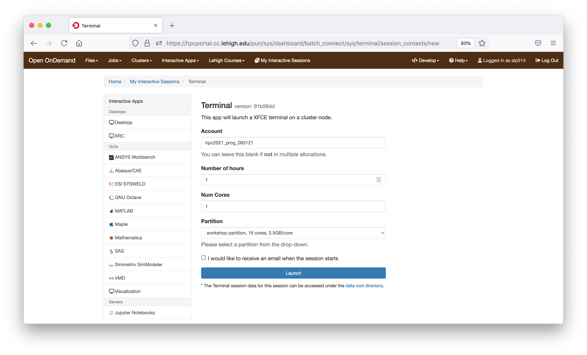
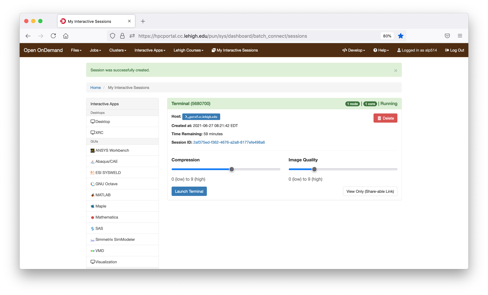
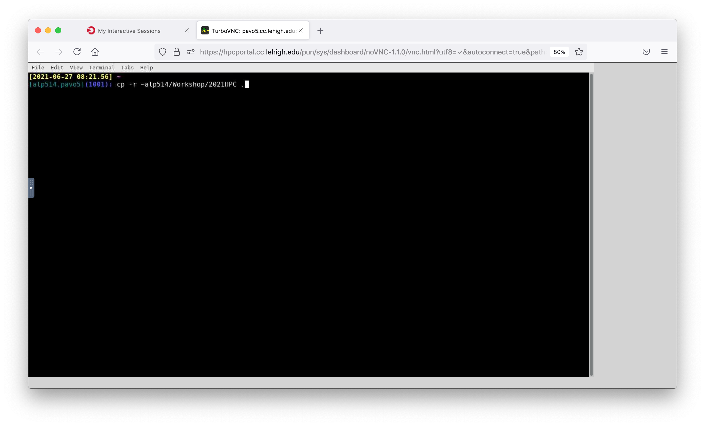

class: myback

```{r setup, include=FALSE}
options(htmltools.dir.version = FALSE)
library(tidyverse)
library(knitr)
```
```{r xaringan-webcam, include = FALSE}
#xaringanExtra::use_webcam()
xaringanExtra::use_xaringan_extra(c("tileview", "webcam"))
```

# About Us?

* Who?
  * Unit of Lehigh&#39;s Library & Technology Services within the Center for Innovation in Teaching & Learning.
* Our Mission
  - We enable Lehigh Faculty, Researchers and Scholars achieve their goals by providing various computational resources; hardware, software, and storage; consulting and training.
* Research Computing Staff
  * __Alex Pacheco, Manager &#38; XSEDE Campus Champion__
  * Steve Anthony, System Administrator
  * Dan Brashler, CAS Computing Consultant
  * _Sachin Joshi, Data Analyst &amp; Visualization Specialist_


---

# Workshop Schedule

| Day | Session | Instructor |
|:---:|:----:|:----:|
| June 28 | Fortran | Alex Pacheco |
| June 29 | C | Sachin Joshi |
| June 30 | Debugging & Profiling | Alex Pacheco |

* 9AM - 4PM on all days with a break for lunch between Noon and 1PM
* Afternoon of June 30 is free time for 
      * programming related discussion and Q&A, 
      * completing exercises, 
      * help session/consultation with programming in your research
* Upcoming Workshop
    * Parallel Programming Workshop on July 13-15 covering OpenMP, OpenACC and MPI
    * [Registration](https://lehigh.co1.qualtrics.com/jfe/form/SV_6LjCFTLfSUay2mq)
* Computing time for Workshop provided by [NSF Campus Cyberinfrastructure award 2019035](https://www.nsf.gov/awardsearch/showAward?AWD_ID=2019035&HistoricalAwards=false).

---

# Sol: Lehigh&#39;s Shared HPC Cluster

```{r echo=FALSE}
sol <- tribble(~"Nodes",~"Intel Xeon CPU Type",~"CPU Speed (GHz)",~"CPUs",~"GPUs",~"CPU Memory (GB)",~"GPU Memory (GB)",~"CPU TFLOPS",~"GPU TFLOPs",~"SUs",
               9, "E5-2650 v3", "2.3", 180, 10, 8*128, 80, 5.76, 2.57,180*8760,
               33, "E5-2670 v3", "2.3", 792, 62, 33*128, 496, 25.344, 15.934,792*8760,
               14, "E5-2650 v4", "2.2", 336, 0, 14*64, 0, 9.6768, 0,336*8760,
               1, "E5-2640 v3", "2.6", 16, 0, 512, 0, 0.5632, 0,16*8760,
               24, "Gold 6140", "2.3", 864, 48, 24*192, 528, 41.472, 18.392,864*8760,
               6, "Gold 6240", "2.6", 216, 0, 6*192, 0, 10.368, 0,216*8760,
               2, "Gold 6230R", "2.1", 104, 0, 2*384, 0, 4.3264, 0, 104*8760
               )
sollts <- tribble(~"Nodes",~"Intel Xeon CPU Type",~"CPU Speed (GHz)",~"CPUs",~"GPUs",~"CPU Memory (GB)",~"GPU Memory (GB)",~"CPU TFLOPS",~"GPU TFLOPs",~"SUs",
               8, "E5-2650 v3", "2.3", 160, 0, 8*128, 0, 736*8/1000, 0,160*8760
               )

totalsol <- sol %>% summarise_if(is.numeric, sum) %>% 
  mutate("Intel Xeon CPU Type"="","CPU Speed (GHz)"="") %>% 
  select(Nodes,"Intel Xeon CPU Type","CPU Speed (GHz)",CPUs:SUs)

hawk <- tribble(~"Nodes",~"Intel Xeon CPU Type",~"CPU Speed (GHz)",~"CPUs",~"GPUs",~"CPU Memory (GB)",~"GPU Memory (GB)",~"CPU TFLOPS",~"GPU TFLOPs",~"SUs",
               26, "Gold 6230R", "2.1", 26*52, 0, 26*384, 0, 26*52*1.3*32/1000, 0,26*52*8760,
               4, "Gold 6230R", "2.1", 4*52, 0, 4*1536, 0, 4*52*1.3*32/1000, 0,4*52*8760,
               4, "Gold 5220R", "2.2", 4*48, 32, 4*192, 32*16, 4*48*1.4*16/1000, 253.38*32/1000,4*48*8760
               )
totalhawk <- hawk %>% summarise_if(is.numeric, sum) %>% 
  mutate("Intel Xeon CPU Type"="","CPU Speed (GHz)"="") %>% 
  select(Nodes,"Intel Xeon CPU Type","CPU Speed (GHz)",CPUs:SUs)

total <- rbind(totalsol,totalhawk) %>% summarise_if(is.numeric, sum) %>% 
  mutate("Intel Xeon CPU Type"="","CPU Speed (GHz)"="") %>% 
  select(Nodes,"Intel Xeon CPU Type","CPU Speed (GHz)",CPUs:SUs)
```

- built by investments from Provost<sup>a</sup> and Faculty.

```{r echo=FALSE}
knitr::kable(rbind(sol,totalsol), format = 'html')
```
<!-- 87 nodes interconnected by 2:1 oversubscribed Infiniband EDR (100Gb/s) fabric.
Only `r sprintf("%4.2fM",sollts$SUs/1e6)` SUs from Provost investment available to Lehigh researchers. -->

.footnote[
a: 8 Intel Xeon E5-2650 v3 nodes invested by Provost in 2016.
]


---
# Hawk

* Funded by [NSF Campus Cyberinfrastructure award 2019035](https://www.nsf.gov/awardsearch/showAward?AWD_ID=2019035&HistoricalAwards=false).
   - PI: __Ed Webb__ (MEM).
   - co-PIs: Balasubramanian (MEM), Fredin (Chemistry), Pacheco (LTS), and __Rangarajan__ (ChemE).
   - Sr. Personnel: Anthony (LTS), Reed (Physics), Rickman (MSE), and __Tak&#225;&#269;__ (ISE). 

```{r echo=FALSE}
knitr::kable(rbind(hawk,totalhawk), format = 'html')
```
* 798TB (raw) Ceph based storage 
* Production: **Feb 1, 2021**.


---

# Network Layout Sol, Hawk &amp; Ceph


---

# Accessing Sol &amp; Hawk

* Sol: accessible using ssh while on Lehigh&#39;s network
    ```{bash eval=F}
    ssh username@sol.cc.lehigh.edu
    ```
   * Windows PC require a SSH client such as [MobaXterm](https://mobaxterm.mobatek.net/) or [Putty](https://putty.org/).
   * Mac and Linux PC&#39;s, ssh is built in to the terminal application. 
* If you are not on Lehigh&#39;s network, login to the ssh gateway
   ```{bash eval=F}
    ssh username@ssh.cc.lehigh.edu
   ``` 
   and then login to sol as above
  -  Alternatively,
  ```{bash eval=F}
  ssh -J username@ssh.cc.lehigh.edu username@sol.cc.lehigh.edu
  ```
  - [Click here](https://confluence.cc.lehigh.edu/x/JhH5Bg) to learn how to configure MobaXterm to use the SSH Gateway.


---

# 

* an NSF-funded open-source HPC portal based on Ohio Supercomputing Center’s original OnDemand portal. 

* Goals: provide an easy way for system administrators to provide web access to their HPC resources, including, but not limited to:
  - Plugin-free web experience
  - Easy file management
  - Command-line shell access
  - Job management and monitoring across different batch servers and resource managers
  - Graphical desktop environments and desktop applications

  
  
---

# Connecting to the HPC Portal

* https://hpcportal.cc.lehigh.edu: Available on campus or VPN.
* Chrome or Firefox preferred
   * At least one user has reported problems with Safari

<span class="center">

</span>


------

# Dashboard


<span class="center">

</span>


---

#  Shell Access

* Click Clusters > Sol Shell Access

<span class="center">

</span>


---

#  Shell Access

* Click Clusters > Sol Shell Access

<span class="center">

</span>

---

# File Management

.pull-left[
* Launch File Explorer
* Navigate Storage
* Transfer Files to/from Sol
* Create, Edit, Delete, Rename Files &amp; Directories


<span class="center">

</span>

]

.pull-right[
<span class="center">


</span>
]


---

# HPC Workshop 

* If you are a HPC user, login to the cluster as you normally do

* Others, login to the HPC Portal
* start an interactive session on the workshop partition 
    * connect to the terminal using the Shell Access tab and request an interactive session
         * `srun -p workshop -A hpc2021_prog_083121 -n 1 -t 60 --pty /bin/bash --login`
    * select Terminal from "Interactive Apps"
         * enter hpc2021_prog_083121 for accounts
         * select 1 cpu
         * wall clock time of 1 (for 1 hour)
         * select workshop 

---

# Terminal App for HPC Workshop

<span class="center">

</span>


---

# Terminal App for HPC Workshop

<span class="center">

</span>

---

# Terminal App for HPC Workshop

* Copy Fortran and Debugging demo and exercise files 

<span class="center">

</span>

