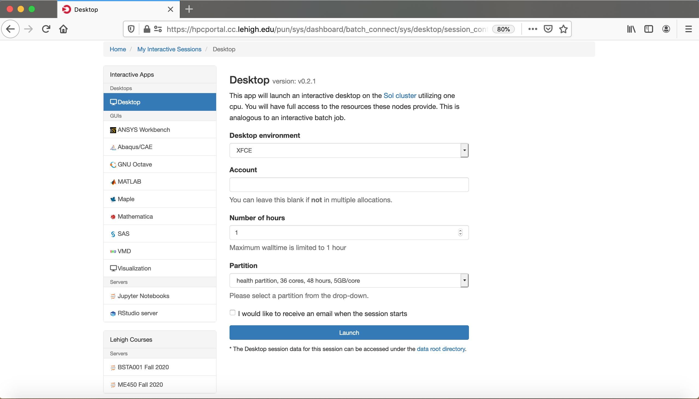

class: myback

```{r setup, include=FALSE}
options(htmltools.dir.version = FALSE)
library(tidyverse)
library(knitr)
```
# Sol

```{r echo=FALSE}
sol <- tribble(~"Nodes",~"Intel Xeon CPU Type",~"CPU Speed (GHz)",~"CPUs",~"GPUs",~"CPU Memory (GB)",~"GPU Memory (GB)",~"CPU TFLOPS",~"GPU TFLOPs",~"SUs",
               9, "E5-2650 v3", "2.3", 180, 10, 8*128, 80, 5.76, 2.57,180*8760,
               33, "E5-2670 v3", "2.3", 792, 62, 33*128, 496, 25.344, 15.934,792*8760,
               14, "E5-2650 v4", "2.2", 336, 0, 14*64, 0, 9.6768, 0,336*8760,
               1, "E5-2640 v3", "2.6", 16, 0, 512, 0, 0.5632, 0,16*8760,
               24, "Gold 6140", "2.3", 864, 48, 24*192, 528, 41.472, 18.392,864*8760,
               6, "Gold 6240", "2.6", 216, 0, 6*192, 0, 10.368, 0,216*8760,
               2, "Gold 6230R", "2.1", 104, 0, 2*384, 0, 4.3264, 0, 104*8760
               )
sollts <- tribble(~"Nodes",~"Intel Xeon CPU Type",~"CPU Speed (GHz)",~"CPUs",~"GPUs",~"CPU Memory (GB)",~"GPU Memory (GB)",~"CPU TFLOPS",~"GPU TFLOPs",~"SUs",
               8, "E5-2650 v3", "2.3", 160, 0, 8*128, 0, 736*8/1000, 0,160*8760
               )

totalsol <- sol %>% summarise_if(is.numeric, sum) %>% 
  mutate("Intel Xeon CPU Type"="","CPU Speed (GHz)"="") %>% 
  select(Nodes,"Intel Xeon CPU Type","CPU Speed (GHz)",CPUs:SUs)
```

- Lehigh&#39;s Shared High Performance Computing Cluster 
  - built by investments from Provost and Faculty.
  - 9 nodes<sup>a</sup>, dual 10-core Intel Xeon E5-2650 v3 2.3GHz CPU, 128GB RAM.
  - 33 nodes, dual 12-core Intel Xeon E5-2670 v3 2.3Ghz CPU, 128GB RAM.
  - 14 nodes, dual 12-core Intel Xeon E5-2650 v4 2.3Ghz CPU, 64GB RAM.
  - 1 node, dual 8-core Intel Xeon 2630 v3 2.4GHz CPU, 512GB RAM.
  - 24 nodes, dual 18-core Intel Xeon Gold 6140 2.3GHz CPU, 192GB RAM.
  - 6 nodes, dual 18-core Intel Xeon Gold 6240 2.6GHz, 192GB RAM.
  - 2 nodes, dual 26-core Intel Xeon Gold 6230R, 2.1GHz, 384GB RAM
  - 72 nVIDIA GTX 1080 & 48 nVIDIA RTX 2080TI GPU cards.
  - 2:1 oversubscribed Infiniband EDR (100Gb/s) interconnect fabric.
  - `r sprintf("%4.2fM",totalsol$SUs/1e6)` core hours or service units (SUs) of computing available.
      - Only `r sprintf("%4.2fM",sollts$SUs/1e6)` from Provost investment available Lehigh researchers.
<br />

.footnote[
a: 8 nodes invested by Provost available to all Lehigh researchers.
]


---

# Sol Configuration


```{r echo=FALSE}
knitr::kable(rbind(sol,totalsol), format = 'html')
```


---

# Condo Investments

* Sustainable model for High Performance Computing at Lehigh.
* Faculty (Condo Investor) purchase compute nodes from grants to increase overall capacity of Sol.
* LTS will provide for four years or length of hardware warranty purchased,
   * System Administration, Power and Cooling, User Support for Condo Investments.
* Condo Investor
   * receives annual allocation equivalent to their investment for the length of
     investment,
   * can utilize allocations on all available nodes, including nodes from other Condo Investors,
   * allows idle cycles on investment to be used by other Sol users,
   * unused allocation will not rollover to the next allocation cycle,
   * can purchase additional SUs in 10K increments (minimum 50K not required)
       *  must be consumed in current allocation cycle.
* Annual Allocation cycle is Oct. 1 - Sep. 30.

---

# Condo Investors

* Dimitrios Vavylonis, Physics (1 node)
* Wonpil Im, Biological Sciences (37 nodes, 98 GPUs)
* Anand Jagota, Chemical Engineering (1 node)
* Brian Chen, Computer Science & Engineering (3 nodes)
* Ed Webb & Alp Oztekin, Mechanical Engineering (6 nodes)
* Jeetain Mittal & Srinivas Rangarajan, Chemical Engineering (13 nodes, 16 GPUs)
* Seth Richards-Shubik, Economics (1 node)
* Ganesh Balasubramanian, Mechanical Engineering (7 nodes)
* Department of Industrial & Systems Engineering (2 nodes)
* Paolo Bocchini, Civil and Structural Engineering (1 node)
* Lisa Fredin, Chemistry (6 nodes)
* Hannah Dailey, Mechanical Engineering (1 node)
* College of Health (2 nodes)
- Condo Investments: `r sum(sol$Nodes)-sollts$Nodes` nodes, `r sum(sol$CPUs)-sollts$CPUs` CPUs, `r sum(sol$GPUs)-sollts$GPUs` GPUs, `r sprintf("%5.2fM",(sum(sol$SUs)-sollts$SUs)/1e6)` SUs
- Lehigh Investments: `r sollts$Nodes` nodes, `r sollts$CPUs` CPUs, `r sprintf("%5.2fM",sollts$SUs/1e6)`  SUs
- Total SU on Sol after Condo Investments: `r sprintf("%4.2fM",totalsol$SUs/1e6)`

---

# Storage resources

* LTS provides various storage options for research and teaching.
* Some are cloud based and subject to Lehigh&#39;s Cloud Policy.
* For research, LTS provides a 768TB storage system called [Ceph](https://go.lehigh.edu/ceph).
* Ceph 
    * based on the Ceph software,
    * in-house, built, operated and administered by Research Computing Staff,
        * located in the EWFM Data Center.
    * provides storage for Research Computing resources,
    * can be mounted as a network drive on Windows or CIFS on Mac and Linux.
        * [See Ceph FAQ](http://lts.lehigh.edu/services/faq/ceph-faq) for more details.
* Research groups can purchase a sharable project space @ &#36;375/TB for 5 years,
    * can share project space with anyone with a Lehigh ID at no additional charge.


---

# Hawk

* Funded by [NSF Campus Cyberinfrastructure award 2019035](https://www.nsf.gov/awardsearch/showAward?AWD_ID=2019035&HistoricalAwards=false).
   - PI: Ed Webb (MEM).
   - co-PIs: Balasubramanian (MEM), Fredin (Chemistry), Pacheco (LTS), and Rangarajan (ChemE).
   - Sr. Personnel: Anthony (LTS), Reed (Physics), Rickman (MSE), and Tak&#225;&#269; (ISE). 
* Compute
  - 26 nodes, dual 26-core Intel Xeon Gold 6230R, 2.1GHz, 384GB RAM.
  - 4 nodes, dual 26-core Intel Xeon Gold 6230R, 1536GB RAM.
  - 4 nodes, dual 24-core Intel Xeon Gold 5220R, 192GB RAM, 8 nVIDIA Tesla T4.
* Storage
  - 7 nodes, single 16-core AMD EPYC 7302P, 3.0GHz, 128GB RAM, two 240GB SSDs (for OS).
  - Per node
      - 3x 1.9TB SATA SSD (for CephFS).
      - 9x 12TB SATA HDD (for Ceph).
* Production: **Feb 1, 2021**.

???

  - **Total: 34 nodes, 1752 CPUs, 16.9TB RAM, 32 GPUs, 77TFLOPs, 15.3M SUs**
  - **Total Storage: 796TB (raw) or 225TB (usable)**
      - 50% allocated to proposal team, 20% to Open Science Grid and 30% to Lehigh researchers
      - 40% allocated to proposal team, 35% to Lehigh researchers, 25% to Provost and LTS (R Drive)  

---

```{r hawk_cluster,echo=F, warning=F}
hawk <- tribble(~"Nodes",~"Intel Xeon CPU Type",~"CPU Speed (GHz)",~"CPUs",~"GPUs",~"CPU Memory (GB)",~"GPU Memory (GB)",~"CPU TFLOPS",~"GPU TFLOPs",~"SUs",
               26, "Gold 6230R", "2.1", 26*52, 0, 26*384, 0, 26*52*1.3*32/1000, 0,26*52*8760,
               4, "Gold 6230R", "2.1", 4*52, 0, 4*1536, 0, 4*52*1.3*32/1000, 0,4*52*8760,
               4, "Gold 5220R", "2.2", 4*48, 32, 4*192, 32*16, 4*48*1.4*16/1000, 253.38*32/1000,4*48*8760
               )
totalhawk <- hawk %>% summarise_if(is.numeric, sum) %>% 
  mutate("Intel Xeon CPU Type"="","CPU Speed (GHz)"="") %>% 
  select(Nodes,"Intel Xeon CPU Type","CPU Speed (GHz)",CPUs:SUs)

total <- rbind(sollts,totalhawk) %>% summarise_if(is.numeric, sum) %>% 
  mutate("Intel Xeon CPU Type"="","CPU Speed (GHz)"="") %>% 
  select(Nodes,"Intel Xeon CPU Type","CPU Speed (GHz)",CPUs:SUs)

```

### Hawk

```{r echo=FALSE}
knitr::kable(rbind(hawk,totalhawk), format = 'html')
```

--

### Hawk and Lehigh&#39;s Investment in Sol

```{r echo=FALSE}
rbind(sollts,totalhawk) %>%
  select(Nodes,CPUs:SUs) %>%
  knitr::kable(format = 'html')
```

<!--

# LTS Managed Faculty Resources 

* __Monocacy__: Ben Felzer, Earth & Environmental Sciences.
  * Eight nodes, dual 8-core Intel Xeon E5-2650v2, 2.6GHz, 64GB RAM.
     * Theoretical Performance: 2.662TFlops.
- __Baltrusaitislab__: Jonas Baltrusaitis, Chemical Engineering.
  - Three nodes, dual 16-core AMD Opteron 6376, 2.3Ghz, 128GB RAM.
     - Theoretical Performance: 1.766TFlops.
* __Pisces__: Keith Moored, Mechanical Engineering and Mechanics.
  * Six nodes, dual 10-core Intel Xeon E5-2650v3, 2.3GHz, 64GB RAM, nVIDIA Tesla K80.
     * Theoretical Performance: 3.840 TFlops (CPU) + 17.46TFlops (GPU).
- __Pavo__: decommissioned faculty cluster for development and education.
  - Twenty nodes, dual 8-core Intel Xeon E5-2650v2, 2.6GHz, 64GB RAM.
     - Theoretical Performance: 6.656TFlops.


# Summary of Computational Resources 

<br />


```{r hpc_cluster,echo=F, warning=F}
cluster <- tribble(
    ~"Cluster",~"Cores",~"CPU Memory",~"CPU TFLOPs",~"GPUs",~"CUDA Cores",~"GPU Memory",~"GPU TFLOPS",
#    "Maia",32,128,0.640,0,0,0,0,
    "Monocacy",128,512,2.662,0,0,0,0,
    "Pavo<sup>a</sup>",320,1280,6.656,0,0,0,0,
    "Baltrusaitis",96,384,1.766,0,0,0,0,
    "Pisces",120,384,3.840,12,29952,144,17.422,
    "Sol",totalsol$CPUs,totalsol$"CPU Memory (GB)",totalsol$"CPU TFLOPS",totalsol$GPUs,393216,totalsol$"GPU Memory (GB)",totalsol$"GPU TFLOPs",
    "Hawk",totalhawk$CPUs,totalhawk$"CPU Memory (GB)",totalhawk$"CPU TFLOPS",totalhawk$GPUs,totalhawk$GPUs*2560,totalhawk$"GPU Memory (GB)",totalhawk$"GPU TFLOPs")
cluster %>% summarise_if(is.numeric, sum) %>% 
    mutate(Cluster="Total") %>% 
    select("Cluster","Cores":"GPU TFLOPS") -> total
rbind(cluster,total) %>% kable()
```

- Monocacy, Baltrusaitis and Pisces: decommissioning scheduled for Sep 30, 2021.

.footnote[
a: 3 nodes available for short simulations or debug runs.
]

-->
---

# Network Layout Sol, Hawk &amp; Ceph


<!---

# Data Transfer, ScienceDMZ and Globus

* NSF funded [Science DMZ](https://www.nsf.gov/awardsearch/showAward?AWD_ID=1340992&HistoricalAwards=false) to improve campus connectivity to the national research cyberinfrastructure.
* Upto 50TB storage is available on the Data Transfer Node (DTN) on ScienceDMZ.
  * Storage space is only for data transfer. Once transfer is complete, storage needs to be deleted from DTN.
* Access to DTN with shell access provided on request.
* [Globus](https://www.globus.org) is the preferred method to transfer data to and from NSF and DOE supercomputing centers.
  * hosted service that manages the entire operation, monitoring performance and errors, retrying failed transfers, correcting problems automatically whenever possible, and reporting status to keep you informed while you focus on your research.
  * [How to Use Globus at Lehigh?](https://researchcomputing.lehigh.edu/help/globus)
  * No special access required on DTN to transfer data via Globus.

-->

---
class: inverse, middle

# Allocations

---

# Resource Partition

| Investigator | Compute (SU) | Storage (TB)|
|:------------:|:-------:|:-------:|
| Proposing Team | 7.67M | 85 |
| OSG | 3.07M | 5 |
| Lehigh General | 3.84M | 75 |
| Provost DF | 0.77M | 20 |
| LTS | | 30TB |

- 50% to proposing team including
  - 300K SUs allocated for educational, outreach and training (EOT).
- 20% of resources with Open Science Grid (Grant requirement)
- 5% of compute and 20TB to be distributed at the Provost’s discretion.
- 30TB to LTS’s R-Drive (provides all faculty up to 1TB of storage space)
- 25% of compute and 75TB available Lehigh comnunity through XSEDE style proposal.
  - reviewed by Research Computing Allocation Review Committee (RCARC)
      - 10% (380K) for small allocations similar to StartUp Allocations on XSEDE.
      - 90% (3.45M) for large allocations similar to Research Allocations on XSEDE.

---

# Resource Management

- Do away with charges for computing on Sol and add 1.4M SUs from Sol.
- Create a Director's Discretionary Fund (DDF) from Lehigh General
  - to allow Manager of Research Computing to distribute compute and storage.
- Faculty PIs can request allocation based on their needs
   - Trial: for researchers who want to try out Sol/Hawk 
      - distributed at discretion of Manager Research Computing
   - StartUp: for researchers with small computing needs
      - proposals approved by at least one member of RCARC
   - Research (including Storage): for researchers with large computing or storage needs
      - proposals reviewed and approved by entire RCARC twice a year
   - Education: for courses, workshops and other education, outreach and training purposes   

---

# Total Resource

| Investigator | Compute (SU) | Storage (TB)| Sol Compute (SU) | Total Compute (SU) |
|:------------:|:------------:|:-----------:|:----------------:|:------------------:|
| Proposing Team | 7.64M | 80 | | 7.64M |
| DDF | 300K | 20 | 500K | 800K |
| OSG | 3.07M | 5 | | 3.07M |
| StartUp | 380K | 20 | 120K | 500K |
| Research | 3.45M | 40 | 550K | 4M |
| Provost DF | 770K | 20 | 230K | 1M |
| LTS R Drive| | 30TB | | | |

---

# Director's Discretionary Fund

- Trial Allocations: short term allocations designed for new users. 
  - Total Available: 300K SUs, 20TB.
  - Max 10K per PI, 1TB Storage.
  - 6 month duration.
  - Requirement: Short abstarct describing proposed work.
  - Progress report will be required for renewals or subsequent allocation request.
  - Apply anytime at https://go.lehigh.edu/hpcalloctrial

- Education Allocations: for courses, workshops and other EOT purposes
  - Total Available: 500K SUs
  - Up to 50K SUs per course, assuming 2 courses in Fall & Spring.
  - 100K for REU programs.
  - 200K for workshops, and other Summer programs.
  - Apply at https://go.lehigh.edu/hpcallocedu 

---

# StartUp Allocations

- Maximum available: 500K SU.
- Max 25K per request.
- Max 2 startup allocations per PI.
- 1TB per PI (across all projects).
- Reviewed & approved on a rolling basis by at least one allocation committee member.
- Requirement: short abstract with the description of the work.
- Can be renewed annually
- Renewal requires progress report, publication list, grants/ awards and list of graduated students if any.
- Apply anytime at https://go.lehigh.edu/hpcallocstartup

---

# Research Allocations

- For requests > 25K SUs but <300K SUs.
- Max allocation is 300K per PI at any given time.
- Requires a detailed proposal similar to XSEDE. Should contain
  - Abstract, Description of the project and how Hawk will be used.
  - If possible, justify requested allocations based on benchmarks results
  - Report of prior work done using Sol or Hawk
  - List of publications, presentations, awards and students graduated.  
- Reviewed and Approved semi annually by allocation committee.
- Allocations to begin on Jan1 and Jul 1 and last a year.
  - Call for proposals will be issued in May and Nov in the HPC mailing list
- Total time allocated is 4M annually or 2M for each semi annual request period.


---

# Storage Allocations

- Every PI will be allocated 1TB by the HPC Manager from the DDF and Lehigh StartUp allocation (40TB).
- HPC PIs who need more storage can request additional storage by justify needs with their compute allocation request.
- Non HPC PIs will need to submit a research proposal describing
   - Abstract and description of project.
   - Describe why other forms of storage are not suitable and any plans to backup data stored.
   - Plans to  move/save the data if project is not renewed/approved next year.
- Proposal reviewed and approved by allocation committee.
- Same timelines as Research Allocations

---

# Allocation Committee

| Name | College | 
|:----:|:-------:|
| Wonpil Im (co-chair) | CAS |
| Ed Webb (co-chair) | RCEAS |
| Ganesh Balasubramanian | RCEAS |
| Brian Chen | RCEAS |
| Ben Felzer | CAS |
| Lisa Fredin | CAS |
| Srinivas Rangarajan | RCEAS |
| Rosi Reed | CAS |
| Seth Richards-Shubik | CoB |
| | CoH |
| | CoE |
| Alex Pacheco | LTS |


---

# Allocation Committe Responsibility

| Allocation Type | Max SUs | Max TB | Approval Authority | Request Window | Approval Timeline |
|:-----:|:----:|:----:|:----:|:----:|:----:|
| Trial | 10K | 1 | HPC | Rolling | 2-3 Business days |
| StartUp | 25K | 1 | One RCARC member | Rolling | 1 week |
| Trial/StartUp Renewals | 25K | 1 | Two RCARC members | Rolling | 2-3 weeks |
| Research/Storage | 300K | 5 | RCARC Committee | Every 6 months | Within a month of submission deadline |


---

# XSEDE Research Allocation Request

* Eligibility: faculty members and researchers, including postdoctoral researchers, at a U.S.-based institution.
  * Investigators with support from any funding source, not just NSF, are encouraged to apply.
  * an individual investigator may have only one active Research project at a time. 
  * PIs can request that other users be given accounts to use the allocation.
- Required Components
  * [Main Document](https://portal.xsede.org/allocations/research#requireddocs-main):
     * 10 pages for requests &lt; 10M SUs.
     * 15 pages for requests &ge; 10M SUs.
  * [Progress Report](https://portal.xsede.org/allocations/research#requireddocs-progress): 3 pages.
  * [Code Performance &amp; Resource Costs](https://portal.xsede.org/allocations/research#requireddocs-codeperformance): 5 pages.
  * [Curriculum Vitae (CV)](https://portal.xsede.org/allocations/research#requireddocs-cv): 2 pages.
  * [References](https://portal.xsede.org/allocations/research#requireddocs-refs): No limit.
  * Optional - [Special Requirements](https://portal.xsede.org/allocations/research#requireddocs-reqs): 1 page.
  


---

# Main Document Guidance

  * [Scientific Background and Support](https://portal.xsede.org/allocations/research#maindoc-scientificbackground)
    * succinctly state the scientific objectives that will be facilitated by the allocation(s).
  * [Research Questions](https://portal.xsede.org/allocations/research#maindoc-researchquestions)
    * identify the specific research questions that are covered by the allocation request.
  * [Resource Usage Plan](https://portal.xsede.org/allocations/research#maindoc-resourceusage)
    * The bulk of the Main Document should focus on the resource usage plan and allocation request. 
    * **Inadequate justification for requested resources is the primary reason for most reduced or denied allocations.**
  * [Justifying Allocation Amounts](https://portal.xsede.org/allocations/research#maindoc-allocations)
    * combine quantitative parameters from the resource usage plan with basic resource usage cost information to calculate the allocation needed. 
    * tabulate and calculate the costs for each resource and resource type.
  * [Resource Appropriateness](https://portal.xsede.org/allocations/research#maindoc-resourceappropriateness)
    * briefly detail the rationale for selecting the requested resources.
  * [Disclosure of Access to Other Compute Resources](https://portal.xsede.org/allocations/research#maindoc-accesstoresources)


---
class: inverse, middle

# New Features on Sol & Hawk
# Upcoming Events
# Outlook 

---

# Open On Demand Web Portal

- Open, Interactive HPC via the Web. 
    - Easy to use, plugin-free, web-based access to supercomputers,
    - File Management,
    - Command-line shell access,
    - Job management and monitoring, and 
    - Various Interactive Applications.
         - Jupyter Notebooks
         - RStudio Servers
         - Virtual Desktop Interface
         - MATLAB
         - Visualization Tools
         - Tailored apps for course use
    - Developed by [Ohio Supercomputing Center](https://openondemand.org/) with support from NSF
         - SI2-SSE-1534949 and CSSI-Software-Frameworks-1835725
- https://hpcportal.cc.lehigh.edu
     - Lehigh IP or VPN required.
 

---

# Open On Demand Web Portal




---

# Singularity Containers

* <em>Containers for Science</em>
   - Developed by Greg Kurtzer at Lawrence Berkeley National Lab.
* Not based on Docker, but can directly import/run Docker images.
* HPC oriented - can run mpi applications across multiple nodes.
* Can run images in user space.
* BYOS - build on your local system, run on Sol, Hawk and most Supercomputing Centers.


--

* Open On Demand Apps
   - Virtual Desktop Interface
   - Desktop Environment to launch GUI Apps
   - RStudio Server
* Ansys 2020 R2
* Bioinformatics Application - Cactus 
   

---

# Application tuning for Hybrid Architectures

* Using [SPACK](https://spack.io) to install most applications.
* Applications are optimized for
    - Ivybridge (Pavo - dev cluster), Haswell and Skylake CPU Architectures.
    - MPICH (Hawk/GbE) and MVAPICH2 (Sol,Pavo/Infiniband)
* Application delivered using LMOD (replaces TCL environment modules).
   - Not all applications visible by default.
   - Dynamically swap applications depending on architecture and mpi implementation.
   - By default, application built using 
      - Intel and MPICH visible on Hawk (Skylake)
      - Intel and MVAPICH2 visible on Sol (Haswell & Skylake) and Pavo (Ivybridge)
* For help with an application not working as expected, specify
   - application name and version
   - partition application was running on


---

# Upcoming HPC Seminars

* Fridays from 2:00PM - 4:00PM.
  - Research Computing Resources at Lehigh (Feb. 5)
  - Linux: Basic Commands & Environment (Feb. 12).
  - Using SLURM scheduler on Sol (Feb. 19).
  - Introduction to Open OnDemand (Feb. 26).
  - Python Programming (Mar. 5).
  - Build/Bring Your Own Software (Mar. 12)
  - Python Data Structure (Mar. 19)
  - Creating $\LaTeX$ Documents using Overleaf (Mar. 26)
  - R Programming (Apr. 2).
  - Data Visualization with Python (Apr. 9).
  - Data Visualization with R (Apr. 16).
  - Machine Learning (Apr. 23).
  - Shiny Apps in R (Apr. 30).
* Register at https://go.lehigh.edu/hpcseminars


---

# Summer Activities 

* Programming Workshops (0.5 - 2 days for each topic)
   - C/C++
   - Fortran
   - OpenMP
   - MPI
   - OpenACC
   - CUDA
* HPC Seminars


--

* Volunteer as TA's
* Interested in hosting a workshop, adding to or assisting with above topics


---

# Future Plans for Growth

* EWFM Data Center.
    * Add Row 4 for further expansion of Sol.
         * Requests from various faculty will consume all available space and power in row 2 within 6 months.
    * Power and Cooling for Row 4.
    * Upgrade from 15KW/rack in Row 2 to 30KW/rack as nodes are decommissioned.

* Develop Indirect Cost Recovery plans to replace Hawk in 2024-25

* Apply for Cluster Grants
    * NIH S10 within the next two years.
    * NSF MRI in 2023-24 to replace Hawk.
    * Any infrastructure grants we missed?

 


---

# More Information

- Investing in Sol
  - Contact Alex Pacheco or Steve Anthony
* More Information
  * [Research Computing](https://go.lehigh.edu/hpc)
  * [Research Computing Seminars](https://go.lehigh.edu/hpcseminars)
  * [Accounts & Allocations](https://go.lehigh.edu/hpcusagepolicy)
  * [Condo Program](https://confluence.cc.lehigh.edu/x/EgL5Bg)
  * [Proposal Assistance](https://confluence.cc.lehigh.edu/x/FgL5Bg)
  * [Data Management Plans](http://libraryguides.lehigh.edu/researchdatamanagement)
  * Subscribe
      * [Research Computing Mailing List](https://lists.lehigh.edu/mailman/listinfo/hpc-l)
      * [HPC Training Google Groups](mailto:hpctraining-list+subscribe@lehigh.edu)

---

# Thanks to

* ORSP Staff - Heather Messina and Andrew Kline
* Purchasing Services - Jane Altemose and Nick Rose
* TIO Operations Staff - Lori Carroll and Ryan Pacala
* Other TIO/LTS Staff - Munroe Sellog, Jeff Deschler, Keith Erekson, James Monek, Ilena Key
* Past and Present University Leadership - Pat Farrell, Bruce Taggart, Greg Reihman, Bob Flowers, Steve DeWeerth and Nathan Urban  
* All HPC Users


--

* In publications, reports, and presentations that utilize Sol, Hawk and Ceph, please acknowledge Lehigh University using the following statement:

<em>"Portions of this research were conducted on Lehigh University's Research Computing infrastructure partially supported by NSF Award 2019035"</em>


---
class: inverse middle

# Thank You!
# Questions?


