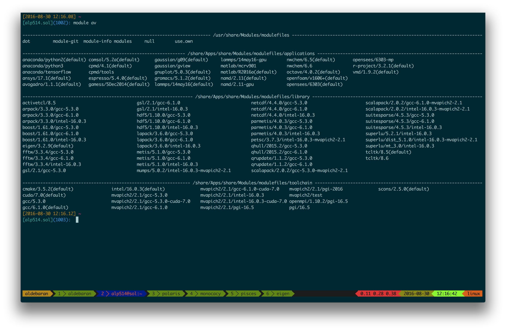

---
title       : Research Computing Resources at Lehigh University
subtitle    : Library & Technology Services
author      : https://researchcomputing.lehigh.edu
job         : 
logo        : lu.png
framework   : io2012        # {io2012, html5slides, shower, dzslides, ...}
highlighter : highlight.js      # {highlight.js, prettify, highlight}
hitheme     : tomorrow      # 
widgets     : [mathjax]            # {mathjax, quiz, bootstrap}
mode        : selfcontained # {standalone, draft}
--- .lehigh

## About Us?

* Who?
  - Unit of Lehigh's Library & Technology Services within the Center for Innovation in Teaching & Learning

* Our Mission
  - We enable Lehigh Faculty, Researchers and Scholars achieve their goals by providing various computational resources; hardware, software, and storage; consulting and training.
  
* Research Computing Staff
  - __Alex Pacheco, Manager & XSEDE Campus Champion__
  - Steve Anthony, HPC User Support & System Administrator
  - Dan Brashler, Computing Consultant
  - Mary Jo Schulze, Software Specialist

---.lehigh

## What do we do?

* Hardware Support
  - Provide system administration and support for Lehigh's HPC clusters.
     - 6 University owned and 4 Faculty owned 
     - 4 University owned clusters to be decommissioned on Dec. 31, 2016.
  - Assist with purchase, installation and administration of servers and clusters.
* Data Storage
  - Provide data management services including storing and sharing data. 
* Software Support
  - Provide technical support for software applications, install software as requested and assist with purchase of software.
* Training & Consulting
  - Provide education and training programs to facilitate use of HPC resources and general scientific computing needs.
  - Provide consultation and support for code development and visualization.

--- .lehigh

## Research Computing Resources

* <strong> Maia </strong>
  - Free 32-core Symmetric Multiprocessor (SMP) system available to all Lehigh Faculty, Staff and Students
  - dual 16-core AMD Opteron 6380 2.5GHz CPU
  - 128GB RAM and 4TB HDD
  - Theoretical Performance: 640 GFLOPs (640 billion floating point operations per second)
  - Access: Batch Scheduled, no interactive access to Maia

  $$latex
  GFLOPs = cores \times clock \times \frac{FLOPs}{cycle}
  $$

  [FLOPs for various AMD & Intel CPU generation](http://stackoverflow.com/questions/15655835/flops-per-cycle-for-sandy-bridge-and-haswell-sse2-avx-avx2)

--- .lehigh

## Research Computing Resources

* <strong> Sol </strong>
  - Lehigh's Flagship High Performance Computing Cluster
  - 8 nodes, dual 10-core Intel Xeon E5-2650 v3 2.3GHz CPU, 25MB Cache
  - Condo Investors
     - Dimitrios Vavylonis, Physics
          - 1 node, dual 10-core Intel Xeon E5-2650 v3 2.3GHz CPU, 25MB Cache
     - Wonpil Im, Biological Sciences
          - 25 nodes, dual 12-core Intel Xeon E5-2670 v3 2.3Ghz CPU, 30 MB Cache
  - 128 GB RAM and 1TB HDD per node
  - 2:1 oversubscribed Infiniband EDR (100Gb/s) interconnect fabric
  - Theoretical Performance: 28.7 TFLOPs
  - Access: Batch Scheduled, interactive on login node for compiling, editing only
  

--- .lehigh

## Research Computing Resources

* Resources due for retirement on December 31, 2016.
* Available only to FY 2015-16 users
* <strong> Corona </strong>
  - 40 nodes, dual 8-core AMD Opteron 6128 2GHz CPU, 32GB RAM and 1TB HDD
  - 24 nodes, dual 8-core AMD Opteron 6128 2GHz CPU, 64GB RAM and 2TB HDD, 
      - Infiniband QDR (40Gb/s) interconnect fabric.
  - Theoretical Performance: 8.2TFlops (8.2 trillion Flops)

* <strong> Trit </strong>: Three SunFire x2270 Servers with  dual 4-core Intel Xeon X5570, 2.95GHz, 48GB RAM, 500GB HDD
* <strong> Capella </strong>: One node, quad 4-core AMD Opteron 8384, 2GHz, 64GB RAM, 2x 146GB HDD
* <strong> Cuda0 </strong>: One node, 6-core Intel Xeon X5650, 2.66GHz, 24GB RAM, 200GB HDD, 4 nVIDIA Fermi Devices (C2050, C2070, 2x M2070)

--- .lehigh

## LTS Managed Faculty Resources 

* Ben Felzer, Earth & Environmental Sciences
  - Eight nodes, dual 8-core Intel Xeon E5-2650v2, 2.6GHz, 64GB RAM
     * Theoretical Performance: 2.662TFlops
* Heather Jaeger, Chemistry
  - Twenty nodes, dual 8-core Intel Xeon E5-2650v2, 2.6GHz, 64GB RAM
     * Theoretical Performance: 6.656TFlops
* Jonas Baltrusaitis, Chemical Engineering
  - Three nodes, dual 16-core AMD Opteron 6376, 2.3Ghz, 128GB RAM
     * Theoretical Performance: 1.766TFlops
* Keith Moored, Mechanical Engineering and Mechanics
  - Six nodes, dual 10-core Intel Xeon E5-2650v3, 2.3GHz, 64GB RAM, nVIDIA Tesla K80
     * Theoretical Performance: 4.416 TFlops (CPU) + 17.46TFlops (GPU)

--- .lehigh

## Apply for an account

* [Apply for an account at the LTS website] (https://idmweb.cc.lehigh.edu/accounts/?page=hpc)
   - Click on Services > Account & Password > Lehigh Computing Account > Request an account
   - Click on the big blue button "Start Special Account Request" > Research Computing Account 
   - Maia
       - Click on "FREE Linux command-line computing"
   - Sol
       - Click on "Fee-based research computing"
       - Annual charge of \$50/account paid by Lehigh Faculty or Research Staff, and
       - Annual charge for computing time

--- .lehigh

## Allocation Charges, Effective Oct. 1, 2016

* Cost per core-hour or service unit (SU) is 1&cent;
* SU is defined as 1 hour of computing on 1 core of the Sol base compute node.
   - One base compute node of Sol consumes 20 SU/hour, 480 SU/day and 175,200 SU/year
* No free usage if allocation balance is zero


* PIs can share allocations with their collaborators
   - Minimum Annual Purchase of 50,000 SU - &#36;500/year
   - Additional Increments of 10,000 SU - &#36;100 per 10K increments
   - Fixed Allocation cycle: Oct 1 - Sep 30
   - Unused allocations do not rollover to next allocation cycle
   - <em>Working on implementing a rolling allocation cycle, only for minimum purchase.</em>
   - Total available computing time for purchase annually: 1.4M SUs or 1 year of continous computing on 8 nodes

--- .lehigh

## Example Allocation Request

- PI requires 100K SUs of computing time per year
<ul class="unilist">
  <li><span class="unibull">&#x2776;</span> One Purchase:
     <ul><li> 100K SU for &#36;1000/year</li></ul>
  </li>
  <li><span class="unibull">&#x2777;</span>Multiple Purchases:
     <ul><li> Initial 50K SUs for &#36;500/year.</li>
     <li> Multiple additional purchases of 10K SUs for &#36;100 each as required.</li></ul>
  </li>
</ul>
* All 100K SUs (<span class="txtbull">&#x2776;</span> and <span class="txtbull">&#x2777;</span>) must be used up by Sep. 30 of next year.
     * If rolling allocation cycle is implemented, then all 100K SUs (<span class="txtbull">&#x2776;</span> and <span class="txtbull">&#x2777;</span>) must be used up within 1 year of initial 50K purchase.

* Need more than 175K SU/year or
* Do not think 1.4M SUs are enough for all HPC users, then
* BECOME A CONDO INVESTOR
 

--- .lehigh

## Condo Investments

* New sustainable model for High Performance Computing at Lehigh
* Faculty (Condo Investor) purchase compute nodes from grants to increase overall capacity of Sol
* LTS will provide for four years
   - System Administration, Power and Cooling, User Support for Condo Investments
* Condo Investor
   - receives annual allocation equivalent to their investment for four years
   - can utilize allocations on all available nodes, including nodes from other Condo Investors
   - allows idle cycles on investment to be used by other Sol users
   - unused allocation will not rollover to the next allocation cycle.
   - can purchase additional SUs in 10K increments (minimum 50K not required)
       -  and must be consumed in current allocation cycle
* Annual Allocation cycle is Oct. 1 - Sep. 30.

--- .lehigh

## Condo Investors

* Two at initial launch 
   - Dimitrios Vavylonis, Physics
       - One dual 10-core Intel Xeon E5-2650 v3 2.3GHz CPU, 25MB Cache
       - Annual Allocation: 175,200 SUs
   - Wonpil Im, Biological Sciences
       - 25 dual 12-core Intel Xeon E5-2670 v3 2.3Ghz CPU, 30 MB Cache
       - Annual Allocation: 5,256,000 SUs

* Total SU on Sol after Condo Investments: 6,832,800
* Available capacity for additional investments: 38

--- .lehigh

## Accessing Research Computing Resources

* All Research Computing resources are accessible using ssh while on Lehigh's network
* Sol: `ssh username@sol.cc.lehigh.edu`
* Maia: No direct access to Maia, instead login to the polaris
* Polaris: `ssh username@polaris.cc.lehigh.edu`
  - Polaris is a gateway that also hosts the batch scheduler for Maia.
  - No computing software including compilers is available on Polaris.
  - Login to Polaris and request computing time on Maia including interactive access.
* If you are not on Lehigh's network, login to the ssh gateway to get to Research Computing resources.
  - `ssh username@ssh.cc.lehigh.edu`

--- .lehigh

## Storage resources

* LTS provides various storage options for research and teaching..
* Some are cloud based and subject to Lehigh's Cloud Policy
* For research, LTS provides a 1PB storage system called Ceph
* Ceph is based on the Ceph software
* Research groups can purchase a sharable project space on Ceph @ $200/TB/year
* Ceph is in-house, built, operated and administered by LTS Research Computing Staff.
  - located in Data Center in EWFM with a backup cluster in Packard Lab
* HPC users can write job output directly to their Ceph volume
* Ceph volume can be mounted as a network drive on Windows or CIFS on Mac and Linux
  - [See Ceph FAQ] (http://lts.lehigh.edu/services/faq/ceph-faq) for more details
* Storage quota on
  - Maia: 5GB
  - Sol: 150GB

--- .lehigh

## Available Software

* Commercial and Free, Open source software is installed on
  - Maia: /zhome/Apps
  - Sol: /share/Apps
* Software is managed using module environment
  - Why? We may have different versions of same software or software built with different compilers
  - Module environment allows you to dynamically change your *nix environment based on software being used
  - Standard on many University and national High Performance Computing resource since circa 2011

--- .lehigh

## Software on Sol



--- .lehigh

## Module Command

<table>
<tr><th>Command</th><th>Description</th></tr>
<tr><td><code>module avail</code></td><td> show list of software available on resource</td></tr>
<tr><td><code>module load abc</code></td><td> add software <code>abc</code> to your environment (modify your <code>PATH</code>, <code>LD_LIBRARY_PATH</code> etc as needed)</td></tr>
<tr><td><code>module unload abc</code></td><td> remove <code>abc</code> from your envionment</td></tr>
<tr><td><code>module swap abc1 abc2</code></td><td> swap <code>abc1</code> with <code>abc2</code> in your environment</td></tr>
<tr><td><code>module purge</code></td><td> remove all modules from your environment</td></tr>
<tr><td><code>module show abc</code></td><td> display what variables are added or modified in your environment</td></tr>
<tr><td><code>module help abc</code></td><td> display help message for the module <code>abc</code></td></tr>
</table>

--- .lehigh &twocol_width

## Installed Software

*** =left width:45%

* Chemistry/Materials Science
  - CPMD
  - GAMESS
  - Gaussian
  - NWCHEM
  - Quantum Espresso
  - *VASP*
* Molecular Dynamics
  - *Desmond*
  - GROMACS
  - LAMMPS
  - NAMD

*** =right width:45%

* Computational Fluid Dynamics
  - *Abaqus*
  - Ansys
  - Comsol
  - OpenFOAM
  - OpenSees
* Math
  - GNU Octave
  - *Magma*
  - Maple
  - Mathematica
  - Matlab

--- .lehigh  &twocol_width

## More Software

*** =left width:35%

* Scripting Languages
  - R
  - Perl
  - Python
* Compilers
  - GNU
  - Intel
  - PGI
* Parallel Programming
  - MVAPICH2

*** =right width:65%

* Libraries
  - BLAS/LAPACK/GSL/SCALAPACK
  - Boost
  - FFTW
  - Intel MKL
  - HDF5
  - NetCDF
  - METIS/PARMETIS
  - PetSc
  - QHull/QRupdate
  - SuiteSparse
  - SuperLU

--- .lehigh &twocol_width
 
## More Software

*** =left width:30%

* Visualization Tools
  - Avogadro 
  - GaussView
  - GNUPlot
  - VMD
* Other Tools
  - CMake
  - *Gams*
  - *Gurobi* 
  - Scons

*** =right width:70%

* You can always install a software in your home directory
* Stay compliant with software licensing
* Modify your .bashrc/.tcshrc to add software to your path, OR
* create a module and dynamically load it so that it doesn't interfere 
 with other software installed on the system
  - e.g. You might want to use openmpi instead of mvapich2 
  - the system admin may not want install it system wide for just one user
* Add the directory where you will install the module files to the variable 
  MODULEPATH in .bashrc/.tcshrc
```{sh eval=FALSE}
# My .bashrc file
export MODULEPATH=${MODULEPATH}:/home/alp514/modulefiles
```

--- .lehigh

## Module File Example


--- .lehigh

## Bracket Computing


--- .lehigh &twocol_width

## XSEDE

* The E<b>x</b>treme <b>S</b>cience and <b>E</b>ngineering <b>D</b>iscovery <b>E</b>nvironment (<strong>XSEDE</strong>) is the most advanced, powerful, and robust collection of integrated advanced digital resources and services in the world. 

* It is a single virtual system that scientists can use to interactively share computing resources, data, and expertise.

* Scientists and engineers around the world use these resources and services—things like supercomputers, collections of data, and new tools—to make our lives healthier, safer, and better. 

* XSEDE, and the experts who lead the program, will make these resources easier to use and help more people use them.


*** =left width:60%
* The five-year, $121-million project is supported by the National Science Foundation. 

* It replaces and expands on the NSF TeraGrid project.

*** =right width:40%


--- .lehigh 

## XSEDE Resources

* XSEDE is composed of multiple partner institutions known as Service Providers or SPs, each of which contributes one or more allocatable services. 

* Resources include High Performance Computing (HPC) machines, High Throughput Computing (HTC) machines, visualization, data storage, testbeds, and services. 


* Texas Advanced Computing Center (TACC) 
   - Stampede: 9.6 PFlops 
   - Wrangler for Data Analytics
   - Maverick for Interactive Visualization and Data Analytics
* Louisiana State University
   -  SuperMIC: 925 TFlops 
* National Institute for Computational Sciences (NICS) 
   - Darter: 248.9 TFlops

--- .lehigh 

## XSEDE Resources

* San Diego Supercomputing Center (SDSC) 
   - Comet: 2 PFlops
   - Gordon: 341 TFlops

* Indiana University 
   - Jetstream: a cloud-based, on-demand system for 24/7 access

* Pittsburgh Supercomputing Center
   - Bridges: 1.3 PFlops (deployment in progress) 

* Stanford University
   - XStream: 1PFlops of 8 x NVIDIA Tesla K80 compute nodes

* Open Science Grid

<!--

-->

--- .lehigh 

## How do I get started on XSEDE?

* Apply for an account at the [XSEDE Portal](https://portal.xsede.org).
* There is no charge to get an XSEDE portal account.  
* You need a portal account to register for XSEDE Tutorials and Workshops
* To use XSEDE's compute and data resources, you need to have an allocation.
* An allocation on a particular resource activates your account on that allocation.
* Researchers and Educators from US universities and federal research labs can 
serve as Principle Investigators on XSEDE allocation.
* A PI can add students to his/her allocations.
* XSEDE also has a Campus Champion Program
* A XSEDE Campus Champion is a local source of knowledge about high-performance 
and high-throughput computing and other digital services, opportunities and resources. 
* A Campus Champion can request start up allocations on all XSEDE resources to help 
 local users with getting started on XSEDE resources.

--- .lehigh

## Getting Help

* Issue with running jobs or need help to get started: 
  * Open a help ticket: <http://go.lehigh.edu/rchelp>
* Investing in Sol
  * Contact Alex Pacheco or Steve Anthony
* More Information
  * [Condo Program and Available Equipment] (http://researchcomputing.lehigh.edu/services/condo)
  * [Proposal Assistance] (http://researchcomputing.lehigh.edu/services/proposalassist)
  * [Data Management Plans] (http://libraryguides.lehigh.edu/researchdatamanagement)
  * [Research Computing] (https://researchcomputing.lehigh.edu)
  * [Research Computing Training] (https://researchcomputing.lehigh.edu/training)


--- .lehigh

## Upcoming Training

* CITL Classroom (EWFM 379) on Tuesdays from 2PM - 4PM and Zoom Webcast.
  - Using SLURM scheduler on Sol (Oct. 4)
  - Shell Scripting ( Oct. 11)
  - Research Data Management (Oct. 25)
  - Version Control with GIT (Nov. 1)
  - MATLAB (Nov. 8)
  - Enhancing Research Impact (Nov. 15)
  - Python Programming(Nov. 22)


* Subscribe
     * Research Computing Mailing List: <https://lists.lehigh.edu/mailman/listinfo/hpc-l>
     * HPC Training Google Groups: <mailto:hpctraining-list+subscribe@lehigh.edu>


 
