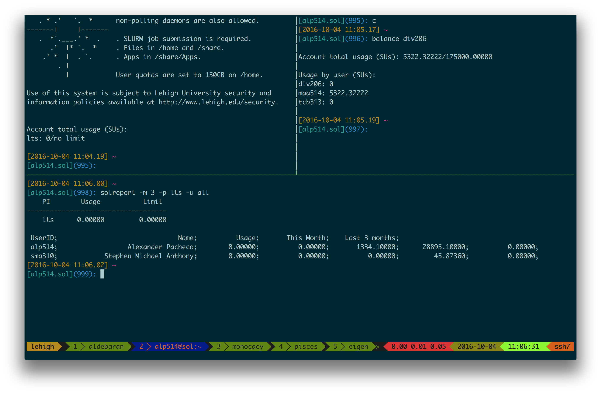

---
title       : Introduction to Linux & HPC
subtitle    : Library & Technology Services
author      : https://researchcomputing.lehigh.edu
job         : 
logo        : lu.png
framework   : io2012        # {io2012, html5slides, shower, dzslides, ...}
highlighter : highlight.js      # {highlight.js, prettify, highlight}
hitheme     : tomorrow      # 
widgets     : [mathjax]            # {mathjax, quiz, bootstrap}
mode        : selfcontained # {standalone, draft}
--- .class

## About Us?

* Who?
  - Unit of Lehigh's Library & Technology Services within the Center for Innovation in Teaching & Learning

* Our Mission
  - We enable Lehigh Faculty, Researchers and Scholars achieve their goals by providing various computational resources; hardware, software, and storage; consulting and training.
  
* Research Computing Staff
  - Steve Anthony, System Administrator
  - Dan Brashler, CAS Senior Computing Consultant
  - Sachin Joshi, Data Analyst & Visualization Specialist
  - __Alex Pacheco, Manager & XSEDE Campus Champion__

--- .class

## Background and Defintions

* Computational Science and Engineering
    - Gain understanding, mainly through the analysis of mathematical models implemented on computers.
    - Construct mathematical models and quantitative analysis techniques, using computers to analyze and solve scientific problems.
    - Typically, these models require large amount of floating-point calculations not possible on desktops and laptops.
    -  The field's growth drove the need for HPC and benefited from it.
* HPC
    - High Performance Computing (HPC) is computation at the forefront of modern technology, often done on a supercomputer. 
* Supercomputer
    -  A supercomputer is a computer at the frontline of current processing capacity, particularly speed of calculation.

--- .class

## Why use HPC?

*  HPC may be the only way to achieve computational goals in a given amount of time
     - Size: Many problems that are interesting to scientists and engineers cannot fit on a PC usually because they need more than a few GB of RAM, or more than a few hundred GB of disk.
     - Speed: Many problems that are interesting to scientists and engineers would take a very long time to run on a PC: months or even years; but a problem that would take a month on a PC might only take a few hours on a supercomputer


--- .class

##  Parallel Computing

* many calculations are carried out simultaneously
*  based on principle that large problems can often be divided into smaller ones, which are then solved in parallel
*  Parallel computers can be roughly classified according to the level at which the hardware supports parallelism.
    - Multicore computing
    -  Symmetric multiprocessing
    -  Distributed computing
    -  Grid computing
    -  General-purpose computing on graphics processing units (GPGPU)


--- .class &twocol_width

## What does HPC do?

*** =left width:45%

* Simulation of Physical Phenomena
     - Storm Surge Prediction
     -  Black Holes Colliding
     -  Molecular Dynamics
* Data analysis and Mining
     -  Bioinformatics
     -  Signal Processing
     -  Fraud detection
* Visualization


*** =right width:45%

* Design
     -  Supersonic ballute
     -  Boeing 787 design
     -  Drug Discovery
     -  Oil Exploration and Production
     -  Automotive Design
     -  Art and Entertainment


--- .class

## HPC by Disciplines

* Traditional Disciplines
    - Science: Physics, Chemistry, Biology, Material Science
    - Engineering: Mechanical, Structural, Civil, Environmental, Chemical
* Non Traditional Disciplines
    - Finance
        - Preditive Analytics
        - Trading
    - Humanities
         - Culturomics or cultural analytics: study human behavior and cultural trends through quantitative analysis of digitized texts, images and videos.

--- .class

## What is Linux?

* Linux is an operating system that evolved from a kernel created by Linus Torvalds when he was a student at the University of Helsinki.
* It’s meant to be used as an alternative to other operating systems, Windows, Mac OS, MS-DOS, Solaris and others.
* Linux is the most popular OS used in a Supercomputer
   * From June 2017 Top 500 List

| OS Family | Count | Share % |
|:---------:| -----:| -------:|
| Linux | 498 | 99.6 |
| Unix  |   2 |   .4 |

* If you are using a Supercomputer/High Performance Computer for your research, it will be based on a *nix OS.
* It is required/neccessary/mandatory to learn Linux Programming (commands, shell scripting) if your research involves use of High Performance Computing or Supercomputing resources.

<!--
--- .class

## Where is Linux used?

* Linux distributions are tailored to different requirements such as
  - Server
  - Desktop
  - Workstation
  -  Routers
  - Embedded devices
  -  Mobile devices (Android is a Linux-based OS)
* Almost any software that you use on windows has a roughly equivalent software on Linux, most often multiple equivalent software
  - e.g. Microsoft Office equivalents are OpenOffice.org, LibreOffice, KOffice
  - [ Visit for complete list ]
    (http://wiki.linuxquestions.org/wiki/Linux_software_equivalent_to_Windows_software)
* Linux offers you freedom, to choose your desktop environment, software.

-->

<!--
--- .class .tiny

## What is a Linux OS, Distro, Desktop Environment?

* Many software vendors release their own packaged Linux OS (kernel, applications) known as distribution
* Linux distribution = Linux kernel + GNU system utilities and libraries + Installation scripts + Management utilities etc.
    - Debian, Ubuntu, Mint
    - Red Hat, Fedora, CentOS
    - Slackware, openSUSE, SLES, SLED
    - Gentoo
* Application packages on Linux can be installed from source or from customized packages
    - deb: Debian based distros e.g. Debian, Ubuntu, Mint
    - rpm: Red Hat based distros, Slackware based distros.
* Linux distributions offer a variety of desktop environment.
    - K Desktop Environment (KDE)
    - GNOME
    - Xfce
    - Lightweight X11 Desktop Environment (LXDE)
    - Cinnamon
    - MATE
    - Dynamic Window Manager

-->

--- .class .small

## Difference between Shell and Command

* What is a Shell?
    - The command line interface is the primary interface to Linux/Unix operating
systems.
    - Shells are how command-line interfaces are implemented in Linux/Unix.
    - Each shell has varying capabilities and features and the user should choose the shell that best suits their needs.
    - The shell is simply an application running on top of the kernel and provides a powerful interface to the system.
* What is a command and how do you use it?
    - __command__ is a directive to a computer program acting as an interpreter of some kind,
in order to perform a specific task.
    - __command prompt__ (or just __prompt__) is a sequence of (one or more) characters used in a command-line interface to indicate readiness to accept commands.
    - Its intent is to literally prompt the user to take action.
    - A prompt usually ends with one of the characters $, %, #, :, > and often includes other information, such as the path of the current working directory.

--- .class .small

## Types of Shell

* sh : Bourne Shell
  - Developed by Stephen Bourne at AT&T Bell Labs
* csh : C Shell
  - Developed by Bill Joy at University of California, Berkeley
* ksh : Korn Shell
  - Developed by David Korn at AT&T Bell Labs
  - backward-compatible with the Bourne shell and includes many features of the C shell
* bash : Bourne Again Shell
  - Developed by Brian Fox for the GNU Project as a free software replacement for the Bourne shell (sh).
  - Default Shell on Linux and Mac OSX
* tcsh : TENEX C Shell
  - Developed by Ken Greer at Carnegie Mellon University
  - It is essentially the C shell with programmable command line completion, command-line editing, and a few other features.


--- .class

## Directory Structure

* All files are arranged in a hierarchial structure, like an inverted tree.
*  The top of the hierarchy is traditionally called __root__ (written as a slash / )


--- .class

## Relative & Absolute Path
* Path means a position in the directory tree.
* You can use either the relative path or absolute path
* In relative path expression
  -  . (one dot or period) is the current working directory
  -  .. (two dots or periods) is one directory up
  -  You can combine . and .. to navigate the filee system hierarchy.
  -  the path is not defined uniquely and does depend on the current path.
  -  ../../tmp is unique only if your current working directory is your home directory.
* In absolute path expression
  -  the path is defined uniquely and does not depend on the current path
  -  /tmp is unique since /tmp is the abolute path

--- .class 

## Variables

* Linux permits the use of variables, similar to any programming language such as C,C++, Fortran etc
* A variable is a named object that contains data used by one or more applications.
* There are two types of variables, Environment and User Defined and can contain anumber, character or a string of characters.
* Environment Variables provides a simple way to share configuration settings between multiple applications and processes in Linux.
* By Convention, enviromental variables are often named using all uppercase letters.
   - `PATH`, `LD_LIBRARY_PATH`, `LD_INCLUDE_PATH`, `TEXINPUTS`, etc
* To reference a variable (environment or user defined) prepend `$` to the name of the variable
* Its a good practice to protect your variable name within `{...}` such as `${PATH}` when referencing it. (We’ll see an example in a few slides)
   - `$PATH`, `${LD_LIBRARY_PATH}`
* The command `printenv` will list the current environmental variables.

--- .class

## Variables (contd)

* Rules for Variable Names
   1. Variable names must start with a letter or underscore
   2. Number can be used anywhere else
   3. DO NOT USE special characters such as @, #, %, $
   4. Case sensitive
*  Examples
   - Allowed: `VARIABLE`, `VAR1234able`, `var name`, `VAR`
   - Not Allowed: `1VARIABLE`, `%NAME`, `$myvar`, `VAR@NAME`
* Assigning value to a variable
   * Shell: `myvar=somevalue`
   * Environment: `export name=value`
* You can convert any Shell variable to Environment variable using the `export` command
   * Convert to Environment: `export myvar`

--- .class

## Linux Commands

* `man` shows the manual for a command or program.
  - `man pwd`
* `pwd`: print working directory, gives the absolute path of your current location in the directory hierarchy
* `cd dirname`: change to folder called `dirname`
  - If you omit directory name, you will end up in your home directory
  - Enter `cd `
* `mkdir dirname`: create a directory called `dirname`
  - Create a directory, any name you want and cd to that directory 
  - I would enter the command `mkdir ise407` followed by `cd ise407`
  - Use the `pwd` command to check your current location 
  

--- .class .small

## Linux Command (contd)

* `cp file1 file2`: command to copy file1 to file2
  - You can use absolute or relative path for the source and destination `cp ../file .`
  - If you need to copy over a directory and its contents, add a `-r flag`
  - `cp -r /home/alp514/sum2017 .`
* `rm file1`: delete a file called file1 
  - Unlike other OS's, once you delete a file it cannot be deleted.
  - Use `-r` flag to delete directories recursively
  - Use `-i` for prompt before deletion
* `ls`: list contents of current directory
  - If you provide a directory path as an argument, then the contents of that directory will be listed
* `echo`: prints whatever follows to the screen
  - `echo $HOME`: prints the contents of the variable __HOME__ i.e. your home directory to the screen
* `alias`: create a shortcut to another command or name to execute a long string.
  - `alias rm="/bin/rm -i"`


---  .class

## File Editing

* The two most commonly used editors on Linux/Unix systems are:
  -  vi or vim (vi improved)
  -  emacs
* vi/vim is installed by default on Linux/Unix systems and has only a command line interface (CLI).
* emacs has both a CLI and a graphical user interface (GUI).
* Other editors that you may come across on *nix systems
  - kate: default editor for KDE.
  - gedit: default text editor for GNOME desktop environment.
  - gvim: GUI version of vim
  - pico: console based plain text editor
  - nano: GNU.org clone of pico
  - kwrite: editor by KDE.


--- .class  &twocol_width

## vi/emacs commands

*** =left width:45%

<table>
<tr><th>Inserting/Appending Text</th><th>vi Command</th></tr>
<tr>
<td>insert at cursor</td><td>i</td>
</tr><tr>
<td>insert at beginning of line</td><td>I</td>
</tr><tr>
<td>append after cursor</td><td>a</td>
</tr><tr>
<td>append at end of line</td><td>A</td>
</tr><tr>
<td>newline after cursor in insert mode</td><td>o</td>
</tr><tr>
<td>newline before cursor in insert mode</td><td>O</td>
</tr><tr>
<td>append at end of line</td><td>ea</td>
</tr><tr>
<td>exit insert mode</td><td>ESC</td>
</tr>
</table>


* C: Control Key
* ESC: Escape Key
* M: Meta Key, usually mapped to ESC


*** =right width:45%

<table>
<tr><th>Cursor Movement</th><th>vi Command</th><th>emacs Command</th></tr>
<tr><td>move left</td><td>h</td><td>C-b</td></tr>
<tr><td>move down</td><td>j</td><td>C-n</td></tr>
<tr><td>move up</td><td>k</td><td>C-p</td></tr>
<tr><td>move right</td><td>l</td><td>C-f</td></tr>
<tr><td>jump to beginning of line</td><td>^</td><td>C-a</td></tr>
<tr><td>jump to end of line</td><td>$</td><td>C-e</td></tr>
<tr><td>goto line n</td><td>nG</td><td>M-x goto-line n</td></tr>
<tr><td>goto top of file</td><td>1G</td><td>M-<</td></tr>
<tr><td>goto end of file</td><td>G</td><td>M-></td></tr>
<tr><td>move one page up</td><td>C-u</td><td>M-v</td></tr>
<tr><td>move one page down</td><td>C-d</td><td>C-v</td></tr>
</table>


--- .class  &twocol_width

## vi/emacs commands

*** =left width:45%

<table>
<tr><th>File Manipulation</th><th>vi Command</th><th>emacs Command</th></tr>
<tr><td>save file</td><td>:w</td><td>C-x C-s</td></tr>
<tr><td>save file and exit</td><td>:wq</td><td></td></tr>
<tr><td>quit</td><td>:q</td><td>C-x C-c</td></tr>
<tr><td>quit without saving</td><td>:q!</td><td></td></tr>
<tr><td>delete a line</td><td>dd</td><td>C-a C-k</td></tr>
<tr><td>delete n lines</td><td>ndd</td><td>C-a M-n C-k</td></tr>
<tr><td>paste deleted line after cursor</td><td>p</td><td>C-y</td></tr>
<tr><td>paste before cursor</td><td>P</td><td></td></tr>
<tr><td>undo edit</td><td>u</td><td>C-_ or C-x u</td></tr>
<tr><td>delete from cursor to end of line</td><td>D</td><td>C-k</td></tr>
</table>

*** =right width:45%

<table>
<tr><th>File Manipulation</th><th>vi Command</th><th>emacs Command</th></tr>
<tr><td>replace a character</td><td>r</td><td></td></tr>
<tr><td>join next line to current</td><td>J</td><td></td></tr>
<tr><td>change a line</td><td>cc</td><td></td></tr>
<tr><td>change a word</td><td>cw</td><td></td></tr>
<tr><td>change to end of line</td><td>c$</td><td></td></tr>
<tr><td>delete a character</td><td>x</td><td>C-d</td></tr>
<tr><td>delete a word</td><td>dw</td><td>M-d</td></tr>
<tr><td>edit/open file </td><td>:e file</td><td>C-x C-f file</td></tr>
<tr><td>insert file </td><td>:r file</td><td>C-x i file</td></tr>
</table>

--- .class #id &twocol_width

## File Permission

*** =left width:45%


* In *NIX OS’s, you have three types of file permissions
  - read (r)
  - write (w)
  - execute (x)
* for three types of users
  - user
  - group
  - world i.e. everyone else who has access to the system

$$ d\underbrace{rwx}_{u}\overbrace{r-x}^g\underbrace{r-x}_o $$


*** =right width:45%

```{bash echo=F}
ls -l | head -4 | tail -n +2
```
* The first character signifies type of file
  - d: directory
  - -: regular file
  - l: symbolic link
* The next three characters of first triad signifies what the owner can do
* The second triad signifies what group member can do
* The third triad signifies what everyone else can do

--- .class &twocol

## File Permission

*** =left

* Read carries a weight of 4
* Write carries a weight of 2
* Execute carries a weight of 1
* The weights are added to give a value of 7 (rwx), 6(rw), 5(rx) or 3(wx) permissions.
* `chmod` is a *NIX command to change permissions on a file
* To give user rwx, group rx and world x permission, the command is
  -  `chmod 751 filename`
* To only give only user rwx, the command is
  - `chmod 700 filename` 

*** =right

* Instead of using numerical permissions you can also use symbolic mode
  - u/g/o or a user/group/world or all i.e. ugo
  - +/- Add/remove permission
  - r/w/x read/write/execute
* Give everyone execute permission:
  - `chmod a+x hello.sh`
  - `chmod ugo+x hello.sh`
* Remove group and world read & write permission:
  - `chmod go-rw hello.sh`

--- .class #id 


## Scripting Language

* A __scripting language__ or __script language__ is a _programming language_ that supports
the writing of scripts.
* __Scripting Languages__ provide a higher level of abstraction than standard
programming languages.
* Compared to programming languages, scripting languages do not distinguish between
data types: integers, real values, strings, etc.
* Scripting Languages tend to be good for automating the execution of other programs.
   - analyzing data
   - running daily backups
* They are also good for writing a program that is going to be used only once and then
discarded.
* A __script__ is a program written for a software environment that automate the execution
of tasks which could alternatively be executed one-by-one by a human operator.
* The majority of script programs are “quick and dirty”, where the main goal is to get
the program written quickly.


--- .class #id

## Writing your first script

* Write a script
   * A shell script is a file that contains ASCII text.
   * Create a file, hello.sh with the following lines

```{bash eval=F}
#!/bin/bash
# My First Script
echo "Hello World!"
```

* Set permissions

```{bash eval=F}
chmod +x hello.sh
```

* Execute the script

```{bash eval=F}
./hello.sh
```

```{bash echo=F}
sh ./hello.sh
```

--- .class #id

## Breaking down the script

* My First Script

```{bash echo=F}
cat hello.sh
```

* The first line is called the ”ShaBang” line. It tells the OS which interpreter to use. 
* Other options are:
   * sh : `#!/bin/sh`
   * ksh : `#!/bin/ksh`
   * csh : `#!/bin/csh`
   * tcsh: `#!/bin/tcsh`
* The second line is a comment. All comments begin with `#`.
* The third line tells the OS to print ”Hello World!” to the screen.
* Slides written in R Markdown. ## in orange implies screen output

--- .class #id

## Quotation

* Double Quotation " "
   * Enclosed string is expanded 
* Single Quotation ' '
   * Enclosed string is read literally
* Back Quotation &grave;  &grave;
   * Used for command substitution
   * Enclosed string is executed as a command
   * In bash, you can also use \$( ) instead of &grave;  &grave;

```{bash}
myvar=hello
myname=Alex
echo "$myvar $myname"
echo '$myvar $myname'
echo $(pwd)
```

--- .class #id

## Arithmetic Operations


| Operation | Operator | Example |
|:---------:|:--------:|:-------:|
| Addition | + | `$((1+2))`
| Subtraction | - | `let c=$a-$b`
| Multiplication | * | `$[$a*$b]` |
| Division | / | `` `expr $a/$b` ``
| Exponentiation | ** | `$[2**3]` |
| Modulo | % | `let c%=5` |

* You can use C-style increment operators (`let c++`)
* Only integer arithmetic works in bash
* Use `bc` or `awk` for floating point arithmetic
   - `echo "3.8 + 4.2" | bc`
   - `echo "scale=5; 2/5" | bc`
   - `bc <<< "scale=5; 2/5"`
   - `echo 3.8 4.2 | awk '{print $1*$2}'`

--- .class .small

## Declare command

* Use the declare command to set variable and functions attributes.
* Create a constant variable i.e. read only variable
   - `declare -r var`
   - `declare -r varName=value`
* Create an integer variable
   - `declare -i var`
   - `declare -i varName=value`
* You can carry out arithmetic operations on variables declared as integers

```{bash}
j=10/5 ; echo $j
```

```{bash}
declare -i j ; j=10/5 ; echo $j
```


--- .class #id

## Flow Control

* Shell Scripting Languages execute commands in sequence similar to programming languages such as C, Fortran, etc.
* Control constructs can change the sequential order of commands.
   - Conditionals: `if`
   - Loops: `for`, `while`, `until`

--- .class .tiny

## Conditionals: if

* An `if ... then` construct tests whether the exit status of a condition is 0, and if so, executes one or more commands.

```{bash eval=F}
if [ condition1 ]
then
  some commands
fi
```

* if the exit status of a condition is non-zero, `bash` allows a `if ... then ... else` construct

```{bash eval=F}
if [ condition1 ]; then
  some commands
else
  some commands
fi
```

* You can also add another if statement i.e. else if or `elif` if you want to check another conditional

```{bash eval=F}
if [ condition1 ]; then
  some commands
elif [ condition2 ]; then
  some commands
else
  some commands
fi
```

--- .class

## Comparison operators

* integers and strings

| Operation | Integer | String |
|:---------:|:-------:|:------:|
| equal to | `if [ 1 -eq 2 ]` | `if [ $a == $b ]` |
| not equal to | `if [ $a -ne $b ]` | `if [ $a != $b ]` |
| greater than | `if [ $a -gt $b ]` | |
| greater than or equal to | `if [ 1 -ge $b ]` | |
| less than | `if [ $a -lt 2 ]` | |
| less than or equal to | `if [ $a -le $b ]` | |
| zero length or null | | `if [ -z $a ]` |
| non zero length | | `if [ -n $a ]` |


--- .class .tiny

## Other Operators

* File Test Operators

| Operation | Example |
|:---------:|:-------:|
| file exists | `if [ -e .bashrc ]` |
| file is a regular file | `if [ -f .bashrc ]` |
| file is a directory | `if [ -d /home ]` |
| file is not zero size | `if [ -s .bashrc ]` |
| file has read permission | `if [ -r .bashrc ]` |
| file has write permission | `if [ -w .bashrc ]` |
| file has execute permission | `if [ -x .bashrc ]` |

* Logical Operators

| Operation | Example |
|:---------:|:-------:|
| NOT | `if [ ! -e .bashrc ]` |
| AND | `if [ $a -eq 2 ] && [ $x -gt $y ]` |
| OR | `if [[ $a -gt 0` $\mid\mid$ `$x -lt 5 ]]` |

--- .class #id

## Nested ifs

* `if` statements can be nested and/or simplied using logical operators

```{bash eval=F}
if [ $a -gt 0 ]; then
  if [ $a -lt 5 ]; then
    echo "The value of a lies somewhere between 0 and 5"
  fi
fi

if [[ $a -gt 0 && $a -lt 5 ]]
  echo "The value of a lies somewhere between 0 and 5"
fi 

if [[ $a -gt 0 || $x -lt 5 ]]
  echo "a is positive or x is less than 5"
fi
```

--- .class #id

## Loops

* A _loop_ is a block of code that iterates a list of commands.
* `for` is the basic loop construct

```{bash eval=F}
for arg in list
do
  some commands
done
```

* `while` (`until`) tests for a condition at the top of a loop, and keeps looping as
long as that condition is true (false)

```{bash eval=F}
while [ condition ]; do
  some commands
done
```

```{bash eval=F}
until [ condition ]; do
  some commands
done
```

--- .class  &twocol_width

## Loop Example

*** =left width:45%

```{bash eval=F}
#!/bin/bash
echo -n " Enter a number less than 10: "
read counter
factorial=1
for i in $(seq 1 $counter); do
  let factorial*=$i
done
echo $factorial
```

```{bash eval=F}
#!/bin/bash
echo -n " Enter a number less than 10: "
read counter
factorial=1
while [ $counter -gt 0 ]; do
  factorial=$(( $factorial * $counter ))
  counter=$(( $counter - 1 ))
done
echo $factorial
```

```{bash eval=F}
#!/bin/bash
echo -n " Enter a number less than 10: "
read counter
factorial=1
until [ $counter -le 1 ]; do
  factorial=$[ $factorial * $counter ]
  let counter-=1
done
echo $factorial
```

*** =right width:45%

```{bash}
bash factorial.sh << EOF
10
EOF
```


```{bash}
bash factorial1.sh << EOF
10
EOF
```


```{bash}
bash factorial2.sh << EOF
10
EOF
```


--- .class 

## Arrays

* Array elements may be initialized with the __variable[xx]__ notation
  `variable[xx]=1`
* Initialize an array during declaration
  `name=(firstname 'last name')`
* reference an element i of an array name
   `${name[i]}`
* print the whole array
   `${name[@]}`
* print length of array
   `${#name[@]}`
* print length of element i of array name
  `${#name[i]}`
* `${#name}` prints the length of the first element of the array
* Add an element to an existing array
   `name=(title ${name[@]})`
* copy an array name to an array user
   `user=(${name[@]})`
* concatenate two arrays
   `nameuser=(${name[@]} ${user[@]})`
* delete an entire array
   `unset name`
* remove an element i from an array
   `unset name[i]`
* the first array index is zero (0)

--- .class

## Command Line Arguments

* Similar to programming languages, bash (and other shell scripting languages) can also take command line arguments
   * `./scriptname arg1 arg2 arg3 arg4 ...`
   * `$0,$1,$2,$3, etc`: positional parameters corresponding to
   * `./scriptname,arg1,arg2,arg3,arg4,...` respectively
   * for more than 9 arguments, position parameters need to be protected for e.g. `${10}` OR
   * use `shift N`: shift positional parameters from `N+1` to `$#` are renamed to variable names from `$1` to `$# - N + 1`
   * `$#`: number of command line arguments
   * `$*`: all of the positional parameters, seen as a single word
   * `$@`: same as `$*` but each parameter is a quoted string.


--- .class

## Example - Command Line Arguments

```{bash eval=F}
#!/bin/bash
USAGE="USAGE: $0 <at least 1 argument>"
if [[ "$#" -lt 1 ]]; then
   echo $USAGE
   exit
fi
echo "Number of Arguments: " $#
echo "List of Arguments: " $@
echo "Name of script that you are running: " $0
echo "Command You Entered:" $0 $*
while [ "$#"  -gt 0 ]; do
  echo "Argument List is: " $@
  echo "Number of Arguments: " $#
  shift 
done
```

```{bash}
sh ./shift.sh $(seq 1 3)
```

--- .class

## Functions

* Like ”real” programming languages, bash has functions.
* A function is a subroutine, a code block that implements a set of operations, a ”black box” that performs a specified task.
* Wherever there is repetitive code, when a task repeats with only slight variations in procedure, then consider using a function.

```{bash eval=F}
function function_name {
  somecommands
}

OR

function_name () {
  some commands
}
```

--- .class &twocol_width

## Example Function

*** =left width:40%

```{bash eval=F}
#!/bin/bash

usage () {
  echo "USAGE: $0 [atleast 11 arguments]"
  exit
}	

[[ "$#" -lt 11 ]] && usage

echo "Number of Arguments: " $#
echo "List of Arguments: " $@
echo "Name of script that you are running: " $0
echo "Command You Entered:" $0 $*
echo "First Argument" $1
echo "Tenth and Eleventh argument" $10 $11 ${10} ${11}

echo "Argument List is: " $@
echo "Number of Arguments: " $#
shift 9
echo "Argument List is: " $@
echo "Number of Arguments: " $#
```

*** =right width:55%

```{bash}
sh ./shift10.sh $(seq 1 10)
```

```{bash}
sh ./shift10.sh $(seq 0 2 30) 
```

--- .class

## Function Arguments

* You can also pass arguments to a function.
* All function parameters or arguments can be accessed via `$1, $2, $3,..., $N`.
* `$0` always point to the shell script name.
* `$*` or `$@` holds all parameters or arguments passed to the function.
* `$#` holds the number of positional parameters passed to the function.
* Array variable called `FUNCNAME` contains the names of all shell functions currently in the execution call stack.
* By default all variables are global.
* Modifying a variable in a function changes it in the whole script.
* You can create a local variables using the local command

```{bash eval=F}
local var=value
local varName
``` 

--- .class &twocol_width

## Recursive Function

* A function may recursively call itself.

*** =left width:45%

```{bash eval=F}
#!/bin/bash
usage () {  echo "USAGE: $0 <integer>" ;   exit }

factorial() {
  local i=$1 ; local f
  declare -i i ; declare -i f

  if [[ "$i" -le 2 && "$i" -ne 0 ]]; then
    echo $i
  elif [[ "$i" -eq 0 ]]; then
    echo 1
  else
    f=$(( $i - 1 ))
    f=$( factorial $f )
    f=$(( $f * $i ))
    echo $f
  fi
}

if [[ "$#" -eq 0 ]]; then
  usage
else
  for i in $@ ; do
    x=$( factorial $i )
    echo "Factorial of $i is $x"
  done
fi

```

*** =right width:45%

```{bash}
sh ./factorial3.sh $(seq 1 2 18)
```

--- .class

## Research Computing Resources

* <strong> Maia </strong>
  - 32-core Symmetric Multiprocessor (SMP) system available to all Lehigh Faculty, Staff and Students
  - dual 16-core AMD Opteron 6380 2.5GHz CPU
  - 128GB RAM and 4TB HDD
  - Theoretical Performance: 640 GFLOPs (640 billion floating point operations per second)
  - Access: Batch Scheduled, no interactive access to Maia

  $$latex
  GFLOPs = cores \times clock \times \frac{FLOPs}{cycle}
  $$

  [FLOPs for various AMD & Intel CPU generation](https://en.wikipedia.org/wiki/FLOPS#FLOPs_per_cycle)

  - `Currently out of warranty`. 
  - `Will be permanently shut down in case of hardware failure`
  - `No plans to replace Maia`

--- .class

## Research Computing Resources

* <strong>Sol</strong>: 80 node Shared Condominium Cluster
  - 9 nodes, dual 10-core Intel Xeon E5-2650 v3 2.3GHz CPU, 25MB Cache, 128GB
  RAM
  - 33 nodes, dual 12-core Intel Xeon E5-2670 v3 2.3Ghz CPU, 30 MB Cache,
  128GB RAM
  - 14 nodes, dual 12-core Intel Xeon E5-2650 v4 2.3Ghz CPU, 30 MB Cache, 64GB
  RAM
  - 1 node, dual 8-core Intel Xeon 2630 v3 2.4GHz CPU, 20 MB Cache, 512GB RAM
  - 23 nodes, dual 18-core Intel Xeon Gold 6140 2.3GHz CPU, 24.7 MB Cache, 192GB RAM
  - 66 nVIDIA GTX 1080 GPU cards
  - 48 nVIDIA RTX 2080 GPU cards
  - 1TB HDD per node
  - 2:1 oversubscribed Infiniband EDR (100Gb/s) interconnect fabric
  - Theoretical Performance: 80.3968 TFLOPs (CPU) + 34.5876 TFLOPs (GPU)
  - Access: Batch Scheduled, interactive on login node for compiling, editing
  only

--- .class

## Sol

|  Processor  | Partition | Nodes  | CPUs  | GPUs  |  CPU Memory (GB)  | GPU Memory (GB)  | CPU TFLOPs  | GPU TFLOPs  |  Annual SUs  |
|:-----------:|:---------:|-------:|------:|------:|------------------:|-----------------:|------------:|------------:|-------------:| 
|  E5-2650v3  |  lts | 9  |  180  |  4  |  1152  |  32  |  5.76  |  1.028  | 1,576,800  |
|  E5-2670v3  |  imlab, eng | 33  |  792  |  62  |  4224  |  496  |  25.344  |  15.934  |  6,937,920  |
|  E5-2650v4  |  engc | 14  |  336  |      |  896  |     |  9.6768  |    |  2,943,360  | 
|  E5-2640v3  |  himem | 1  |  16  |    |  512  |  |  0.5632  |    |  140,160  |
|  Gold 6140  |  enge, engi, unnamed | 23  |  828  |  48  |  4416  |  528  |  39.744  |  17.626  |  7,253,280  |
|    |   |  80  |  2152  |  114  |  11200  |  1056  |  81.088  |  34.588  |  18,851,520  |

* Haswell (v3) and Broadwell (v4) provide 256-bit Advanced Vector Extensions SIMD instructions
   - double the base FLOPs at expense of CPU Speed
* Skylake (Gold) provide 512-bit Advanced Vector Extensions SIMD instructions
   - quadruple the base FLOPs at expense of CPU Speed

<!--
--- .class #id

## Accessing Research Computing Resources

* All Research Computing resources are accessible using ssh while on Lehigh's network
* Sol: `ssh username@sol.cc.lehigh.edu`
* Maia: No direct access to Maia, instead login to Polaris
  - `ssh username@polaris.cc.lehigh.edu`
  - Polaris is a gateway that also hosts the batch scheduler for Maia
  - No computing software including compilers is available on Polaris
  - Login to Polaris and request computing time on Maia including interactive access
      - On Polaris, run the `maiashell` command to get interactive access to
        Maia for 15 minutes.
* If you are not on Lehigh's network, login to the ssh gateway to get to Research Computing resources
  - `ssh username@ssh.cc.lehigh.edu`

-->

--- .class

## What about Storage resources

* LTS provides various storage options for research and teaching
* Some are cloud based and subject to Lehigh's Cloud Policy
* For research, LTS is deploying a 600TB refreshed Ceph storage system
* Ceph is based on the Ceph software
* Research groups can purchase a sharable project space on Ceph @ &#36;375/TB for 5 year duration
* Ceph is in-house, built, operated and administered by LTS Research Computing Staff.
  - located in Data Center in EWFM with a backup cluster in Packard Lab
* HPC users can write job output directly to their Ceph volume
* Ceph volume can be mounted as a network drive on Windows or CIFS on Mac and Linux
  - [See Ceph FAQ] (http://lts.lehigh.edu/services/faq/ceph-faq) for more details
* Storage quota on
  - Maia: 5GB
  - Sol: 150GB

--- .class #id

## Network Layout Sol &amp; Ceph Storage Cluster


--- .class

## How do I get started using HPC resources?

* Login to sol: `ssh -X username@sol.cc.lehigh.edu`
   - You should see something like `[alp514@sol ~]$ ` if you are logged
     into sol
   - This is known as the command prompt
   - sol is the head/login and storage node for the monocacy cluster. 
   - __Do not run computation on this node.__
   - Editing files, compiling code are acceptable computation on this node.
   - Running intense computation on this node causes a high load on the storage
     that would cause other users jobs to run slow.
   - All compute nodes are labelled as sol-[a-e][1-6][01-18]
      - [a-e] for each distinct type of node
      - [1-6] is the rack number in the HPC row
      - [01-18] is the location in the rack with 01 at the bottom and 18 at the
        top 

--- .class #id

## Available Software

* Commercial, Free and Open source software is installed on
  - [Maia](https://webapps.lehigh.edu/dokuwiki/sites/researchcomputing/doku.php?id=maia#installed_software): /zhome/Apps
  - [Sol](https://webapps.lehigh.edu/dokuwiki/sites/researchcomputing/doku.php?id=sol#installed_software): /share/Apps
* Software is managed using module environment
  - Why? We may have different versions of same software or software built with different compilers
  - Module environment allows you to dynamically change your *nix environment based on software being used
  - Standard on many University and national High Performance Computing resource since circa 2011
* How to use Sol/Maia Software on your [linux](https://webapps.lehigh.edu/dokuwiki/sites/researchcomputing/doku.php?id=linux) workstation
* LTS provides [licensed and open source software](https://software.lehigh.edu) for Windows, Mac and Linux and [Gogs](https://gogs.cc.lehigh.eu), a self hosted Git Service or Github clone 


--- .class #id

## Module Command

| Command | Description |
|:-------:|:-----------:|
| <code>module avail</code> | show list of software available on resource |
| <code>module load abc</code> | add software <code>abc</code> to your environment (modify your <code>PATH</code>, <code>LD_LIBRARY_PATH</code> etc as needed) |
| <code>module unload abc</code> | remove <code>abc</code> from your environment |
| <code>module swap abc1 abc2</code> | swap <code>abc1</code> with <code>abc2</code> in your environment |
| <code>module purge</code> | remove all modules from your environment |
| <code>module show abc</code> | display what variables are added or modified in your environment |
| <code>module help abc</code> | display help message for the module <code>abc</code> |

* Users who prefer not to use the module environment will need to modify their
  .bashrc or .tcshrc files. Run `module show` for list variables that need
  modified, appended or prepended

--- .class &twocol_width

## Installed Software

*** =left width:45%

* Chemistry/Materials Science
  - **CPMD**
  - **GAMESS**
  - Gaussian
  - **NWCHEM**
  - **Quantum Espresso**
  - **VASP** (Restricted Access)
* Molecular Dynamics
  - **Desmond**
  - **GROMACS**
  - **LAMMPS**
  - **NAMD**

<span class="tiny strong">__MPI enabled__</span>

*** =right width:45%

* Computational Fluid Dynamics
  - Abaqus
  - Ansys
  - Comsol
  - **OpenFOAM**
  - OpenSees
* Math
  - GNU Octave
  - Magma
  - Maple
  - Mathematica
  - Matlab


--- .class &twocol_width

## More Software

*** =left width:45%

* *Machine &amp; Deep Learning* 
   - TensorFlow
   - Caffe
   - SciKit-Learn
   - SciKit-Image
   - Theano
   - Keras

* *Natural Language Processing (NLP)*
   - Natural Language Toolkit (NLTK)
   - Stanford NLP    


<span class="tiny">_[Python packages](https://go.lehigh.edu/python)_</span>


*** =right width:45%

* Bioinformatics
  - BamTools
  - BayeScan
  - bgc
  - BWA
  - FreeBayes
  - SAMTools
  - tabix
  - trimmomatic
  - *barcode_splitter*
  - *phyluce* 
  - *VelvetOptimiser*

--- .class  &twocol_width

## More Software

*** =left width:35%

* Scripting Languages
  - R
  - Perl
  - Python
* Compilers
  - GNU
  - Intel
  - JAVA
  - PGI
  - CUDA
* Parallel Programming
  - MVAPICH2
  - OpenMPI


*** =right width:65%

* Libraries
  - BLAS/LAPACK/GSL/SCALAPACK
  - Boost
  - FFTW
  - Intel MKL
  - HDF5
  - NetCDF
  - METIS/PARMETIS
  - PetSc
  - QHull/QRupdate
  - SuiteSparse
  - SuperLU

--- .class &twocol_width
 
## More Software

*** =left width:45%

* Visualization Tools
  - Atomic Simulation Environment 
  - Avogadro
  - GaussView
  - GNUPlot
  - PWGui
  - PyMol
  - RDKit
  - VESTA
  - VMD
  - XCrySDen

*** =right width:45%

* Other Tools
  - Artleys Knitro
  - CMake
  - GNU Parallel
  - Lmod
  - *Numba*
  - Scons
  - SPACK
  - *MD Tools*
     * BioPython
     * CCLib
     * MDAnalysis

--- .class

## Using your own Software?


* You can always install a software in your home directory
   - [SPACK](https://spack.readthedocs.io) is an excellent package manager that can even create module files
* `Stay compliant with software licensing`
* Modify your .bashrc/.tcshrc to add software to your path, OR
* create a module and dynamically load it so that it doesn't interfere 
 with other software installed on the system
  - e.g. You might want to use openmpi instead of mvapich2 
  - the system admin may not want install it system wide for just one user
* Add the directory where you will install the module files to the variable 
  MODULEPATH in .bashrc/.tcshrc
```{sh eval=FALSE}
# My .bashrc file
export MODULEPATH=${MODULEPATH}:/home/alp514/modulefiles
```

--- .class

## Compilers

* Various versions of compilers installed on Sol 
* Open Source: GNU Compiler (also called gcc even though gcc is the c compiler)
   - 4.8.5 (system default), 5.3.0, 6.1.0 and 7.1.0
* Commercial: Only two seats of each
   - Intel Compiler: 16.0.3, 17.0.0, 17.0.3 and 18.0.1
   - Portland Group or PGI: 16.5, 16.10, 17.4, 17.7 and 18.3
* _We are licensed to install any available version_
* On Sol, all except gcc 4.8.5 are available via the module environment

| Language | GNU | Intel | PGI |
|:--------:|:---:|:-----:|:---:|
| Fortran  | `gfortran` | `ifort` | `pgfortran` |
| C | `gcc` | `icc` | `pgcc` |
| C++ | `g++` | `icpc` | `pgc++` |


--- .class .small

## Compiling Code

* Usage: `<compiler> <options> <source code>`
* Example:
  - `ifort -o saxpyf saxpy.f90`
  - `gcc -o saxpyc saxpy.c`
* Common Compiler options or flags
  - `-o myexec`: compile code and create an executable myexec, default executable is `a.out`.
  - `-l{libname}`: link compiled code to a library called libname. 
  - `-L{directory path}`: directory to search for libraries. 
  - `-I{directory path}`: directory to search for include files and fortran modules.
      - `-L/share/Apps/gsl/2.1/intel-16.0.3/lib -lgsl -I/share/Apps/gsl/2.1/intel-16.0.3/include`
  - target Sandybridge and later processors for optimization using unified binary
     - Intel: `-axCORE-AVX512,CORE-AVX2,CORE-AVX-I,AVX` 
     - PGI: `-tp sandybridge,haswell,skylake`
     - GNU: cannot create unified binary targeting multiple architectures

--- .class

## Compiling and Running Serial Codes

```{sh eval=FALSE}
[2018-02-22 08:47.27] ~/Workshop/2017XSEDEBootCamp/OpenMP
[alp514.sol-d118](842): icc -o laplacec laplace_serial.c
[2018-02-22 08:47.46] ~/Workshop/2017XSEDEBootCamp/OpenMP
[alp514.sol-d118](843): ./laplacec
Maximum iterations [100-4000]?
1000
---------- Iteration number: 100 ------------
[995,995]: 63.33  [996,996]: 72.67  [997,997]: 81.40  [998,998]: 88.97  [999,999]: 94.86  [1000,1000]: 98.67
---------- Iteration number: 200 ------------
[995,995]: 79.11  [996,996]: 84.86  [997,997]: 89.91  [998,998]: 94.10  [999,999]: 97.26  [1000,1000]: 99.28
---------- Iteration number: 300 ------------
[995,995]: 85.25  [996,996]: 89.39  [997,997]: 92.96  [998,998]: 95.88  [999,999]: 98.07  [1000,1000]: 99.49
---------- Iteration number: 400 ------------
[995,995]: 88.50  [996,996]: 91.75  [997,997]: 94.52  [998,998]: 96.78  [999,999]: 98.48  [1000,1000]: 99.59
---------- Iteration number: 500 ------------
[995,995]: 90.52  [996,996]: 93.19  [997,997]: 95.47  [998,998]: 97.33  [999,999]: 98.73  [1000,1000]: 99.66
---------- Iteration number: 600 ------------
[995,995]: 91.88  [996,996]: 94.17  [997,997]: 96.11  [998,998]: 97.69  [999,999]: 98.89  [1000,1000]: 99.70
---------- Iteration number: 700 ------------
[995,995]: 92.87  [996,996]: 94.87  [997,997]: 96.57  [998,998]: 97.95  [999,999]: 99.01  [1000,1000]: 99.73
---------- Iteration number: 800 ------------
[995,995]: 93.62  [996,996]: 95.40  [997,997]: 96.91  [998,998]: 98.15  [999,999]: 99.10  [1000,1000]: 99.75
---------- Iteration number: 900 ------------
[995,995]: 94.21  [996,996]: 95.81  [997,997]: 97.18  [998,998]: 98.30  [999,999]: 99.17  [1000,1000]: 99.77
---------- Iteration number: 1000 ------------
[995,995]: 94.68  [996,996]: 96.15  [997,997]: 97.40  [998,998]: 98.42  [999,999]: 99.22  [1000,1000]: 99.78

Max error at iteration 1000 was 0.034767
Total time was 4.099030 seconds.
```

--- .class &twocol_width

## Compilers for Parallel Programming: OpenMP & TBB

* OpenMP support is built-in

| Compiler | OpenMP Flag | TBB Flag |
|:---:|:---:|:---:|
| GNU | `-fopenmp` | `-L$TBBROOT/lib/intel64_lin/gcc4.4 -ltbb` |
| Intel | `-qopenmp` | `-L$TBBROOT/lib/intel64_lin/gcc4.4 -ltbb` |
| PGI | `-mp` |

*** =left width:35%

* TBB is available as part of Intel Compiler suite
- `$TBBROOT` depends on the Intel Compiler Suite you want to use.
- Not sure if this will work for PGI Compilers

*** =right width:60%

```{sh eval=FALSE}
[alp514.sol](1083): module show intel
-------------------------------------------------------------------
/share/Apps/share/Modules/modulefiles/toolchain/intel/16.0.3:

module-whatis    Set up Intel 16.0.3 compilers. 
conflict         pgi 
conflict         gcc 
setenv           INTEL_LICENSE_FILE /share/Apps/intel/licenses/server.lic 
setenv           IPPROOT /share/Apps/intel/compilers_and_libraries_2016.3.210/linux/ipp 
setenv           MKLROOT /share/Apps/intel/compilers_and_libraries_2016.3.210/linux/mkl 
setenv           TBBROOT /share/Apps/intel/compilers_and_libraries_2016.3.210/linux/tbb 
...
snip
...


```


--- .class

## Compiling and Running OpenMP Codes


```{sh eval=FALSE}
[2018-02-22 08:47.56] ~/Workshop/2017XSEDEBootCamp/OpenMP/Solutions
[alp514.sol-d118](845): icc -qopenmp -o laplacec laplace_omp.c
[2018-02-22 08:48.09] ~/Workshop/2017XSEDEBootCamp/OpenMP/Solutions
[alp514.sol-d118](846): OMP_NUM_THREADS=4 ./laplacec
Maximum iterations [100-4000]?
1000
---------- Iteration number: 100 ------------
[995,995]: 63.33  [996,996]: 72.67  [997,997]: 81.40  [998,998]: 88.97  [999,999]: 94.86  [1000,1000]: 98.67
---------- Iteration number: 200 ------------
[995,995]: 79.11  [996,996]: 84.86  [997,997]: 89.91  [998,998]: 94.10  [999,999]: 97.26  [1000,1000]: 99.28
---------- Iteration number: 300 ------------
[995,995]: 85.25  [996,996]: 89.39  [997,997]: 92.96  [998,998]: 95.88  [999,999]: 98.07  [1000,1000]: 99.49
---------- Iteration number: 400 ------------
[995,995]: 88.50  [996,996]: 91.75  [997,997]: 94.52  [998,998]: 96.78  [999,999]: 98.48  [1000,1000]: 99.59
---------- Iteration number: 500 ------------
[995,995]: 90.52  [996,996]: 93.19  [997,997]: 95.47  [998,998]: 97.33  [999,999]: 98.73  [1000,1000]: 99.66
---------- Iteration number: 600 ------------
[995,995]: 91.88  [996,996]: 94.17  [997,997]: 96.11  [998,998]: 97.69  [999,999]: 98.89  [1000,1000]: 99.70
---------- Iteration number: 700 ------------
[995,995]: 92.87  [996,996]: 94.87  [997,997]: 96.57  [998,998]: 97.95  [999,999]: 99.01  [1000,1000]: 99.73
---------- Iteration number: 800 ------------
[995,995]: 93.62  [996,996]: 95.40  [997,997]: 96.91  [998,998]: 98.15  [999,999]: 99.10  [1000,1000]: 99.75
---------- Iteration number: 900 ------------
[995,995]: 94.21  [996,996]: 95.81  [997,997]: 97.18  [998,998]: 98.30  [999,999]: 99.17  [1000,1000]: 99.77
---------- Iteration number: 1000 ------------
[995,995]: 94.68  [996,996]: 96.15  [997,997]: 97.40  [998,998]: 98.42  [999,999]: 99.22  [1000,1000]: 99.78

Max error at iteration 1000 was 0.034767
Total time was 2.459961 seconds.
```

--- .class &twocol

## Compilers for Parallel Programming: MPI

* MPI is a library and not a compiler, built or compiled for different compilers.

| Language | Compile Command |
|:--------:|:---:|
| Fortran  | `mpif90` |
| C | `mpicc` |
| C++ | `mpicxx` |

* Usage: `<compiler> <options> <source code>`
*** =left

```{sh eval=FALSE}
[2017-10-30 08:40.30] ~/Workshop/2017XSEDEBootCamp/MPI/Solutions
[alp514.sol](1096): mpif90 -o laplace_f90 laplace_mpi.f90 
[2017-10-30 08:40.45] ~/Workshop/2017XSEDEBootCamp/MPI/Solutions
[alp514.sol](1097): mpicc -o laplace_c laplace_mpi.c
[2017-10-30 08:40.57] ~/Workshop/2017XSEDEBootCamp/MPI/Solutions
```

*** =right

* The MPI compiler command is just a wrapper around the underlying compiler
```{bash eval=FALSE}
[alp514.sol](1080): mpif90 -show
ifort -fPIC -I/share/Apps/mvapich2/2.1/intel-16.0.3/include 
  -I/share/Apps/mvapich2/2.1/intel-16.0.3/include 
  -L/share/Apps/mvapich2/2.1/intel-16.0.3/lib 
  -lmpifort -Wl,-rpath -Wl,/share/Apps/mvapich2/2.1/intel-16.0.3/lib 
  -Wl,--enable-new-dtags -lmpi
```


--- .class .small

## MPI Libraries

* There are two different MPI implementations commonly used
* `MPICH`: Developed by Argonned National Laboratory
   - used as a starting point for various commercial and open source MPI libraries
   - `MVAPICH2`: Developed by D. K. Panda with support for  InfiniBand, iWARP, RoCE, and Intel Omni-Path. (default MPI on Sol)
   - `Intel MPI`: Intel's version of MPI. __You need this for Xeon Phi MICs__.
      - available in cluster edition of Intel Compiler Suite. Not available at Lehigh
   - `IBM MPI` for IBM BlueGene and 
   - `CRAY MPI` for Cray systems
* `OpenMPI`: A Free, Open Source implementation from merger of three well know MPI implementations. Can be used for commodity network as well as high speed network
   - `FT-MPI` from the University of Tennessee
   - `LA-MPI` from Los Alamos National Laboratory
   - `LAM/MPI` from Indiana University


--- .class

## Running MPI Programs


* Every MPI implementation come with their own job launcher: `mpiexec` (MPICH,OpenMPI &amp; MVAPICH2), `mpirun` (OpenMPI)  or `mpirun_rsh` (MVAPICH2)
* Example: `mpiexec [options] <program name> [program options]`
* Required options: number of processes and list of hosts on which to run program 

| Option Description | mpiexec | mpirun | mpirun_rsh |
|:-----------:|:-------:|:------:|:----------:|
| run on `x` cores | -n x | -np x | -n x |
| location of the hostfile | -f filename | -machinefile filename | -hostfile filename |

* To run a MPI code, you need to use the launcher from the same implementation that was used to compile the code.
* For e.g.: You cannot compile code with OpenMPI and run using the MPICH and MVAPICH2's launcher
   - Since MVAPICH2 is based on MPICH, you can launch MVAPICH2 compiled code using MPICH's launcher.
* SLURM scheduler provides `srun` as a wrapper around all mpi launchers


--- .class

## Compiling and Running MPI Codes

```{sh eval=FALSE}
[2018-02-22 08:48.27] ~/Workshop/2017XSEDEBootCamp/MPI/Solutions
[alp514.sol-d118](848): mpicc -o laplacec laplace_mpi.c
[2018-02-22 08:48.41] ~/Workshop/2017XSEDEBootCamp/MPI/Solutions
[alp514.sol-d118](849): mpiexec -n 4 ./laplacec
Maximum iterations [100-4000]?
1000
---------- Iteration number: 100 ------------
[995,995]: 63.33  [996,996]: 72.67  [997,997]: 81.40  [998,998]: 88.97  [999,999]: 94.86  [1000,1000]: 98.67
---------- Iteration number: 200 ------------
[995,995]: 79.11  [996,996]: 84.86  [997,997]: 89.91  [998,998]: 94.10  [999,999]: 97.26  [1000,1000]: 99.28
---------- Iteration number: 300 ------------
[995,995]: 85.25  [996,996]: 89.39  [997,997]: 92.96  [998,998]: 95.88  [999,999]: 98.07  [1000,1000]: 99.49
---------- Iteration number: 400 ------------
[995,995]: 88.50  [996,996]: 91.75  [997,997]: 94.52  [998,998]: 96.78  [999,999]: 98.48  [1000,1000]: 99.59
---------- Iteration number: 500 ------------
[995,995]: 90.52  [996,996]: 93.19  [997,997]: 95.47  [998,998]: 97.33  [999,999]: 98.73  [1000,1000]: 99.66
---------- Iteration number: 600 ------------
[995,995]: 91.88  [996,996]: 94.17  [997,997]: 96.11  [998,998]: 97.69  [999,999]: 98.89  [1000,1000]: 99.70
---------- Iteration number: 700 ------------
[995,995]: 92.87  [996,996]: 94.87  [997,997]: 96.57  [998,998]: 97.95  [999,999]: 99.01  [1000,1000]: 99.73
---------- Iteration number: 800 ------------
[995,995]: 93.62  [996,996]: 95.40  [997,997]: 96.91  [998,998]: 98.15  [999,999]: 99.10  [1000,1000]: 99.75
---------- Iteration number: 900 ------------
[995,995]: 94.21  [996,996]: 95.81  [997,997]: 97.18  [998,998]: 98.30  [999,999]: 99.17  [1000,1000]: 99.77
---------- Iteration number: 1000 ------------
[995,995]: 94.68  [996,996]: 96.15  [997,997]: 97.40  [998,998]: 98.42  [999,999]: 99.22  [1000,1000]: 99.78

Max error at iteration 1000 was 0.034767
Total time was 1.030180 seconds.
```


--- .class &twocol_width

## Cluster Environment


*** =left width:30%

* A cluster is a group of computers (nodes) that works together closely

* Two types of nodes
   - Head/Login Node
   - Compute Node

* Multi-user environment

* Each user may have multiple jobs running simultaneously

*** =right width:65%


--- .class #id

## How to run jobs

* All compute intensive jobs are scheduled
* Write a script to submit jobs to a scheduler
  - need to have some background in shell scripting (bash/tcsh)
* Need to specify
   - Resources required (which depends on configuration)
       - number of nodes
       - number of processes per node
       - memory per node
   - How long do you want the resources
       - have an estimate for how long your job will run
   - Which queue to submit jobs
       - SLURM uses the term _partition_ instead of _queue_


--- .class #id

## Scheduler &amp; Resource Management

* A software that manages resources (CPU time, memory, etc) and schedules job execution
   - Sol: Simple Linux Utility for Resource Management (SLURM)
   - Others:  Portable Batch System (PBS)
          - Scheduler: Maui
          - Resource Manager: Torque
          - Allocation Manager: Gold

* A job can be considered as a user’s request to use a certain amount of resources for a certain amount of time

* The Scheduler or queuing system determines
    - The order jobs are executed
    - On which node(s) jobs are executed


--- .class #id &twocol_width
 
## Job Scheduling

*** =left width:50%

* Map jobs onto the node-time space
    - Assuming CPU time is the only resource

* Need to find a balance between
    - Honoring the order in which jobs are received
    - Maximizing resource utilization


*** =right width:45%


--- .class #id &twocol_width
 
## Backfilling

*** =left width:50%
* A strategy to improve utilization
   - Allow a job to jump ahead of others when there are enough idle nodes
   - Must not affect the estimated start time of the job with the highest priority

*** =right width:45%


--- .class #id &twocol_width
 
## How much time must I request

* Ask for an amount of time that is
    - Long enough for your job to complete
    - As short as possible to increase the chance of backfilling

*** =left width:45%


*** =right width:45%


--- .class #id .small

## Available Queues

* Sol

| Partition Name | Max Runtime in hours | Max SU consumed node per hour |
|:----------:|:--------------------:|:--------------------:|
| lts | 72 | 20 |
| imlab | 48 | 22 | 
| imlab-gpu | 48 | 24 |
| eng | 72 | 22 |
| eng-gpu | 72 | 24 |
| engc | 72 | 24 |
| himem | 72 | 48 |
| enge | 72 | 36 |
| engi | 72 | 36 |


* Maia

| Queue Name | Max Runtime in hours | Max Simultaneous Core-hours |
|:----------:|:-----------:|:---------------------------:|
| smp-test | 1 | 4 |
| smp | 96 | 384 |


--- .class #id

## How much memory can or should I use per core?

* The amount of installed memory less the amount that is used by the operating system and other utilities

* A general rule of thumb on most HPC resources: leave 1-2GB for the OS to run. 

* Sol

| Partition | Max Memory/core (GB) | Recommended Memory/Core (GB) |
|:---------:|:--------------------:|:----------------------------:|
| lts | 6.4 | 6.2 |
| eng/imlab/imlab-gpu/enge/engi | 5.3 | 5.1 |
| engc | 2.66 | 2.4 |
| himem | 32 | 31.5 |


*  <span class="alert">if you need to run a single core job that requires 10GB memory in the imlab partition, you need to request 2 cores even though you are only using
         1 core.</span>  

* Maia: Users need to specify memory required in their submit script. Max
memory that should be requested is 126GB.


--- .class #id

## Basic Job Manager Commands

* Submission
* Monitoring
* Manipulating
* Reporting

--- .class 

## Job Types

* Interactive Jobs
  - Set up an interactive environment on compute nodes for users
  - Will log you into a compute node and wait for your prompt
  - Purpose: testing and debugging code. __Do not run jobs on head node!!!__
      * All compute node have a naming convention __sol-[a,b,c,d,e]###__
      * head node is __sol__
* Batch Jobs
   - Executed using a batch script without user intervention
       - Advantage: system takes care of running the job
       - Disadvantage: cannot change sequence of commands after submission
   - Useful for Production runs
   - Workflow: write a script -> submit script -> take mini vacation ->
   analyze results

--- .class #id .small

## Useful SLURM Directives

| SLURM Directive | Description |
|:---------------:|:-----------:|
|  --partition=queuename | Submit job to the <em>queuename</em> partition. |
|  --time=hh:mm:ss | Request resources to run job for <em>hh</em> hours, <em>mm</em> minutes and <em>ss</em> seconds. |
|  --nodes=m | Request resources to run job on <em>m</em> nodes. |
|  --ntasks-per-node=n | Request resources to run job on <em>n</em> processors on each node requested. |
|  --ntasks=n | Request resources to run job on a total of <em>n</em> processors. |
|  --job-name=jobname | Provide a name, <em>jobname</em> to your job. |
|  --output=filename.out | Write SLURM standard output to file filename.out. |
|  --error=filename.err | Write SLURM standard error to file filename.err. |
|  --mail-type=events | Send an email after job status events is reached. |
| | events can be NONE, BEGIN, END, FAIL, REQUEUE, ALL, TIME&#95;LIMIT(&#95;90,80) |
|  --mail-user=address | Address to send email. |
|  --account=mypi | charge job to the __mypi__ account |


--- .class #id .small

## Useful SLURM Directives (contd)

| SLURM Directive | Description |
|:---------------:|:-----------:|
|  --qos=nogpu | Request a quality of service (qos)  for the job in `imlab`, `engc` partitions. |
| | Job will remain in queue indefinitely if you do not specify qos |
|  --gres=gpu:# | Specifies number of gpus requested in the gpu partitions |
| | You can request 1 or 2 gpus with a minimum of 1 core or cpu per gpu | 

* SLURM can also take short hand notation for the directives

| Long Form | Short Form |
|:---------:|:----------:|
| --partition=queuename | -p queuename |
| --time=hh:mm:ss | -t hh:mm:ss |
| --nodes=m | -N m |
| --ntasks=n | -n n |
| --account=mypi | -A mypi |
| --job-name=jobname | -J jobname |
| --output=filename.out | -o filename.out |


--- .class #id

## SLURM Filename Patterns

* sbatch allows for a filename pattern to contain one or more replacement
  symbols, which are a percent sign "%" followed by a letter (e.g. %j). 

| Pattern | Description |
|:-------:|:-----------:|
| %A |    Job array's master job allocation number. |
| %a |    Job array ID (index) number. |
| %J |    jobid.stepid of the running job. (e.g. "128.0") |
| %j |    jobid of the running job. |
| %N |    short hostname. This will create a separate IO file per node. |
| %n |    Node identifier relative to current job (e.g. "0" is the first node of the running job) This will create a separate IO file per node. |
| %s |    stepid of the running job. |
| %t |    task identifier (rank) relative to current job. This will create a separate IO file per task. |
| %u |    User name. |
| %x |    Job name. |


--- .class #id .small

## Useful PBS Directives

| PBS Directive | Description |
|:-------------:|:------------|
|  -q queuename | Submit job to the <em>queuename</em> queue.|
|  -l walltime=hh:mm:ss| Request resources to run job for <em>hh</em> hours, <em>mm</em> minutes and <em>ss</em> seconds.|
|  -l nodes=m:ppn=n| Request resources to run job on <em>n</em> processors each on <em>m</em> nodes.|
|  -l mem=xGB| Request <em>xGB</em> per node requested, applicable on Maia only|
|  -N jobname| Provide a name, <em>jobname</em> to your job.|
|  -o filename.out| Write PBS standard output to file filename.out.|
|  -e filename.err| Write PBS standard error to file filename.err.|
|  -j oe| Combine PBS standard output and error to the same file.|
|  -M your email address| Address to send email.|
|  -m status| Send an email after job status status is reached.| 
| | status can be a (abort), b (begin) or e (end). The arguments can be combined |
| |  for e.g. abe will send email when job begins and either aborts or ends|


--- .class #id .pbs

## Useful PBS/SLURM environmental variables


| SLURM Command | Description | PBS Command |
|:-------------:|:-----------:|:-----------:|
| SLURM_SUBMIT_DIR | Directory where the <code>qsub</code> command was executed | PBS_O_WORKDIR |
| SLURM_JOB_NODELIST | Name of the file that contains a list of the HOSTS provided for the job | PBS_NODEFILE |
| SLURM_NTASKS | Total number of cores for job | PBS_NP |
| SLURM_JOBID | Job ID number given to this job | PBS_JOBID | 
| SLURM_JOB_PARTITION | Queue job is running in | PBS_QUEUE |
| | Walltime in secs requested | PBS_WALLTIME
| | Name of the job. This can be set using the -N option in the PBS script | PBS_JOBNAME |
| | Indicates job type, PBS_BATCH or PBS_INTERACTIVE | PBS_ENVIRONMENT |
| | value of the SHELL variable in the environment in which qsub was executed | PBS_O_SHELL |
| | Home directory of the user running qsub | PBS_O_HOME |

--- .class .small

## Job Types: Interactive

   - PBS: Use `qsub -I` command with PBS Directives
       *    `qsub -I -V -l walltime=<hh:mm:ss>,nodes=<# of nodes>:ppn=<# of core/node> -q <queue
   name>`

   - SLURM:  Use `srun` command with SLURM Directives followed by `--pty /bin/bash --login`
       * `srun --time=<hh:mm:ss> --nodes=<# of nodes> --ntasks-per-node=<#
   of core/node> -p <queue name> --pty /bin/bash --login`
       * If you have `soltools` module loaded, then use `interact` with at
   least one SLURM Directive
           - `interact -t 20` [Assumes `-p lts -n 1 -N 20`]
   - Run a job interactively replace `--pty /bin/bash --login` with the
     appropriate command. 
       - For e.g. `srun -t 20 -n 1 -p imlab --qos=nogpu $(which lammps) -in in.lj
     -var x 1 -var n 1`
       - Default values are 3 days, 1 node, 20 tasks per node and lts
   partition

--- .class #id

## Job Types: Batch 

* Workflow: write a script -> submit script -> take mini vacation -> analyze
  results
* Batch scripts are written in bash, tcsh, csh or sh
   * ksh scripts will work if ksh is installed
* Add PBS or SLURM directives after the shebang line but before any shell
  commands
   * SLURM: `#SBATCH DIRECTIVES`
   * PBS: `#PBS DIRECTIVES` 
* Submitting Batch Jobs
   * PBS: `qsub filename`
   * SLURM: `sbatch filename`

* `qsub` and `sbatch` can take the options for `#PBS` and `#SBATCH` as command line arguments
   * `qsub -l walltime=1:00:00,nodes=1:ppn=16 -q normal filename`
   * `sbatch --time=1:00:00 --nodes=1 --ntasks-per-node=20 -p lts filename` 


--- .class #id .big

## Minimal submit script for Serial Jobs


```{bash eval=FALSE}
#!/bin/bash
#PBS -q smp
#PBS -l walltime=1:00:00
#PBS -l nodes=1:ppn=1
#PBS -l mem=4GB
#PBS -N myjob

cd ${PBS_O_WORKDIR}
./myjob < filename.in > filename.out

```

```{bash eval=FALSE}
#!/bin/bash
#SBATCH --partition=lts
#SBATCH --time=1:00:00
#SBATCH --nodes=1
#SBATCH --ntasks-per-node=1
#SBATCH --job-name myjob

cd ${SLURM_SUBMIT_DIR}
./myjob < filename.in > filename.out

```

--- .class #id .big

## Minimal submit script for MPI Job

```{bash eval=FALSE}
#!/bin/bash
#SBATCH --partition=lts
#SBATCH --time=1:00:00
#SBATCH --nodes=2
#SBATCH --ntasks-per-node=20
## For --partition=imlab, 
###  use --ntasks-per-node=22
### and --qos=nogpu
#SBATCH --job-name myjob

module load mvapich2

cd ${SLURM_SUBMIT_DIR}
srun ./myjob < filename.in > filename.out

exit
```

--- .class #id .big

## Minimal submit script for OpenMP Job

```{bash eval=FALSE}
#!/bin/tcsh
#SBATCH --partition=imlab
# Directives can be combined on one line
#SBATCH --time=1:00:00 --nodes=1 --ntasks-per-node=22
#SBATCH --qos=nogpu
#SBATCH --job-name myjob

cd ${SLURM_SUBMIT_DIR}
# Use either
setenv OMP_NUM_THREADS 22
./myjob < filename.in > filename.out

# OR
OMP_NUM_THREADS=22 ./myjob < filename.in > filename.out

exit
```

--- .class #id .big

## Minimal submit script for LAMMPS GPU job

```{bash eval=FALSE}
#!/bin/tcsh
#SBATCH --partition=imlab
# Directives can be combined on one line
#SBATCH --time=1:00:00
#SBATCH --nodes=1
# 1 CPU can be be paired with only 1 GPU
# 1 GPU can be paired with all 24 CPUs
#SBATCH --ntasks-per-node=1
#SBATCH --gres=gpu:1
# Need both GPUs, use --gres=gpu:2
#SBATCH --job-name myjob

cd ${SLURM_SUBMIT_DIR}
# Load LAMMPS Module
module load lammps/17nov16-gpu
# Run LAMMPS for input file in.lj
srun $(which lammps) -in in.lj -sf gpu -pk gpu 1 gpuID ${CUDA_VISIBLE_DEVICE}

exit
```

--- .class #id

## Need to run multiple jobs in sequence?

* Option 1: Submit jobs as soon as previous jobs complete
* Option 2: Submit jobs with a dependency
    * [SLURM](https://webapps.lehigh.edu/dokuwiki/sites/researchcomputing/doku.php?id=slurm#submitting_dependency_jobs):
  `sbatch --dependency=afterok:<JobID> <Submit Script>`
    * [PBS](https://webapps.lehigh.edu/dokuwiki/sites/researchcomputing/doku.php?id=corona#submitting_dependency_jobs):
  `qsub -W depend=afterok:<JobID> <Submit Script>`

* You want to run several serial processor jobs on
    * one node: your submit script should be able to run several serial
    jobs in background and then use the `wait` command for all jobs to finish
    * more than one node: this requires some background in scripting but the
    idea is the same as above


--- .class #id

## Monitoring &amp; Manipulating Jobs


| SLURM Command | Description | PBS Command |
|:-----------:|:-----------:|:-------------:|
| squeue | check job status (all jobs) | qstat |
| squeue -u username | check job status of user <em>username</em> | qstat -u username |
| squeue --start | Show <strong>estimated</strong> start time of jobs in queue | showstart jobid |
| scontrol show job jobid | Check status of your job identified by <em>jobid</em> | checkjob jobid |
| scancel jobid | Cancel your job identified by <em>jobid</em> | qdel jobid |
| scontrol hold jobid | Put your job identified by <em>jobid</em> on hold | qhold jobid |
| scontrol release jobid | Release the hold that <strong>you put</strong> on <em>jobid | qrls jobid |

* The following scripts written by RC staff can also be used for monitoring
  jobs. 
   * __checkq__: `squeue` with additional useful option. 
   * __checkload__: `sinfo` with additional options to show load on compute nodes.  
* load the `soltools` module to get access to RC staff created scripts


--- .class 

## Modifying Resources for Queued Jobs

* Modify a job after submission but before starting: 
    * `scontrol update SPECIFICATION jobid=<jobid>`
* Examples of `SPECIFICATION` are
    * add dependency after a job has been submitted: `dependency=<attributes>`
    * change job name: `jobname=<name>`
    * change partition: `partition=<name>`
    * modify requested runtime: `timelimit=<hh:mm:ss>`
    * change quality of service (when changing to imlab/engc): `qos=nogpu` 
    * request gpus (when changing to one of the gpu partitions): `gres=gpu:<1 or 2>`
* SPECIFICATIONs can be combined for e.g. command to move a queued job to `imlab` partition and change timelimit to 48 hours for a job 123456 is
   * `scontrol update partition=imlab qos=nogpu timelimit=48:00:00 jobid=123456`


--- .class #id

## Usage Reporting

* [sacct](http://slurm.schedmd.com/sacct.html): displays accounting data for all jobs and job steps in the SLURM job accounting log or Slurm database
* [sshare](http://slurm.schedmd.com/sshare.html): Tool for listing the shares of associations to a cluster. 

* We have created scripts based on these to provide usage reporting
    -  `alloc_summary.sh`
        - included in your .bash_profile
        - prints allocation usage on your login shell
    -  `balance`
        - prints allocation usage summary
    -  `solreport`
        - obtain your monthly usage report
        - PIs can obtain usage report for all or specific users on their
	allocation
        - use `--help` for usage information

--- .class #id

## Usage Reporting

 


--- .class #id

## Online Usage Reporting  

* [Monthly usage summary](https://webapps.lehigh.edu/hpc/usage/dashboard.html) (updated daily)
* [Scheduler Status](https://webapps.lehigh.edu/hpc/monitor) (updated every 15 mins)
* Annual Usage Reports: 
   * [AY 18-19] (https://webapps.lehigh.edu/hpc/monitor/ay1819.html) (updated daily)
   * [AY 17-18](https://webapps.lehigh.edu/hpc/monitor/ay1718.html)
   * [AY 16-17](https://webapps.lehigh.edu/hpc/monitor/ay1617.html)
* <span class="alert">Usage reports restricted to Lehigh IPs</span>


--- .class .small

## Additional Help &amp; Information

* Issue with running jobs or need help to get started: 
  * Open a help ticket: <http://go.lehigh.edu/rchelp>
* More Information
  * [Research Computing] (https://researchcomputing.lehigh.edu)
  * [Research Computing Wiki](https://go.lehigh.edu/rcwiki)
  * [Research Computing Training](https://researchcomputing.lehigh.edu/training)
* Subscribe
     * HPC Training Google Groups: <mailto:hpctraining-list+subscribe@lehigh.edu>
     * Research Computing Mailing List: <https://lists.lehigh.edu/mailman/listinfo/hpc-l>
* My contact info
  * eMail:  <alp514@lehigh.edu>
  * Tel: (610) 758-6735 
  * Location: Room 296, EWFM Computing Center
  * [My Schedule] (https://www.google.com/calendar/embed?src=alp514%40lehigh.edu&ctz=America/New_York )


 
