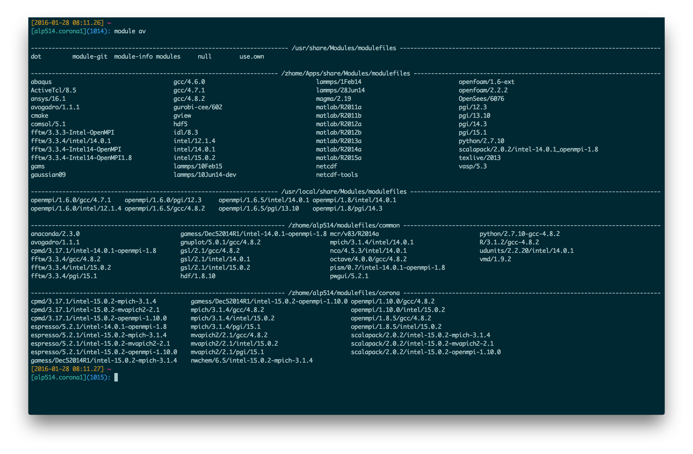
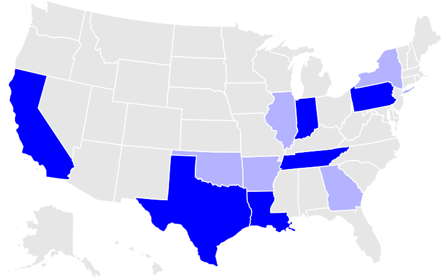

---
title       : Lehigh University Research Computing
subtitle    : Library & Technology Services
author      : https://researchcomputing.lehigh.edu
job         : 
logo        : lu.png
framework   : io2012        # {io2012, html5slides, shower, dzslides, ...}
highlighter : highlight.js      # {highlight.js, prettify, highlight}
hitheme     : tomorrow      # 
widgets     : [mathjax]            # {mathjax, quiz, bootstrap}
mode        : selfcontained # {standalone, draft}
--- .rcr

## About Us?

* Who?
  - Unit of Lehigh's Library & Technology Services within the Center for Innovation in Teaching & Learning

* Our Mission
  - We enable Lehigh Faculty, Researchers and Scholars achieve their goals by providing various computational resources; hardware, software, and storage; consulting and training.
  
* Research Computing Staff
  - __Alex Pacheco, Manager & XSEDE Campus Champion__
  - Steve Anthony, HPC User Support & System Administrator
  - Dan Brashler, Computing Consultant
  - Steve Lidie, System Administrator
  - Mary Jo Schulze, Software Specialist

---.rcr

## What do we do?

* Hardware Support
  - Provide system administration and support for Lehigh's HPC clusters.
     - 5 University owned and 3 Faculty owned 
  - Assist with purchase, installation and administration of servers and clusters.
* Data Storage
  - Provide data management services including storing and sharing data. 
* Software Support
  - Provide technical support for software applications, install software as requested and assist with purchase of software.
* Training & Consulting
  - Provide education and training programs to facilitate use of HPC resources and general scientific computing needs.
  - Provide consultation and support for code development and visualization.

--- .rcr

## Research Computing Resources

* <strong> Maia </strong>
  - Free 32-core Symmetric Multiprocessor (SMP) system available to all Lehigh Faculty, Staff and Students
  - dual 16-core AMD Opteron 6380 2.5GHz CPU
  - 128GB RAM and 4TB HDD
  - Theoretical Performance: 640 GFlops (640 billion floating point operations per second)
  - Access: Batch Scheduled, no interactive access to Maia

  $$latex
  GFLOPs = cores \times clock \times \frac{FLOPs}{cycle}
  $$

--- .rcr

## Research Computing Resources

* <strong> Corona </strong>
  - Lehigh's Flagship High Performance Computing Cluster
  - 40 nodes, dual 8-core AMD Opteron 6128 2GHz CPU
      - 32GB RAM and 1TB HDD
  - 24 nodes, dual 8-core AMD Opteron 6128 2GHz CPU 
      - 64GB RAM and 2TB HDD, 
      - Infiniband QDR (40Gb/s) interconnect fabric.
  - Theoretical Performance: 8.2TFlops (8.2 trillion Flops)
  - Access: Batch scheduled, interactive on login node for compiling, editing only 
       - computer intensive tasks on the login node is strictly forbidden

--- .rcr

## Research Computing Resources

* <strong> Trit </strong>
  - Three SunFire x2270 Servers each with
    -  dual 4-core Intel Xeon X5570, 2.95GHz, 48GB RAM, 500GB HDD
  - Theoretical Performance: 283.2GFlops

* <strong> Capella </strong>
  - One node, quad 4-core AMD Opteron 8384, 2GHz, 64GB RAM, 2x 146GB HDD
  - Theoretical Performance: 128GFlops

* <strong> Cuda0 </strong>
  - One node, 6-core Intel Xeon X5650, 2.66GHz, 24GB RAM, 200GB HDD
  - 4 nVIDIA Fermi Devices (C2050, C2070, 2x M2070)
  - Theoretical Performance: 63.840 GFlops (CPU) + 2.06 TFlops (GPU)

* Access: Interactive (make sure that resources are available for your compute intensive tasks)

--- .rcr

## Faculty Owned Resources 

* Ben Felzer, Earth & Environmental Sciences
  - Eight nodes, dual 8-core Intel Xeon E5-2650v2, 2.6GHz, 64GB RAM
     * Theoretical Performance: 2.662TFlops
* Jonas Baltrusaitis, Chemical Engineering
  - Three nodes, dual 16-core AMD Opteron 6376, 2.3Ghz, 128GB RAM
     * Theoretical Performance: 1.766TFlops
* Keith Moored, Mechanical Engineering and Mechanics
  - Six nodes, dual 10-core Intel Xeon E5-2650v3, 2.3GHz, 64GB RAM, nVIDIA Tesla K80
     * Theoretical Performance: 4.416 TFlops (CPU) + 17.46TFlops (GPU)

--- .rcr

## Apply for an account

* [Apply for an account at the LTS website] (https://idmweb.cc.lehigh.edu/accounts/?page=hpc)
   - Click on Services > Account & Password > Lehigh Computing Account > Request an account
   - Click on the big blue button "Start Special Account Request" > Research Computing Account 
   - For Maia: click on "FREE Linux command-line computing"
   - For other resources: click on "Fee-based research computing"
  
* Annual charge of $50/account paid by Lehigh Faculty or Research Staff.  
* Annual charge of $450 for one node-year of computing access, also know as allocation block 
   - continous computing on one node of Corona for one year
   - 140,160 hours on one cpu
   - paid for by your account sponsor
   - Free access to Corona at low priority after allocation is expended

--- .rcr

## Accessing Research Computing Resources

* All Research Computing resources are accessible using ssh while on Lehigh's network
* Corona: `ssh username@corona.cc.lehigh.edu`
* Capella: `ssh username@capella.cc.lehigh.edu`
* Cuda0: `ssh username@cuda0.cc.lehigh.edu`
* Trits{1,2,3}: `ssh username@trits{1,2,3}.cc.lehigh.edu`
* Maia: No direct access to Maia, instead login to the polaris
* Polaris: `ssh username@polaris.cc.lehigh.edu`
  - Polaris is a gateway that also hosts the batch scheduler for Maia.
  - No computing software including compilers is available on Polaris.
  - Login to Maia to request computing time on Maia including interactive access to Maia.
* If you are not Lehigh's network, login to the ssh gateway to get Research Computing resources.
  - `ssh username@ssh.cc.lehigh.edu`

--- .rcr

## What about Storage resources

* LTS provides various storage options.
* Some of these are in the cloud and subject to Lehigh's Cloud Policy
* For research, LTS provides a 1PB storage system called Ceph
* Ceph is based on the Ceph software
* Research groups can purchase a project space on Ceph @ $200/TB/year that can be shared
* Ceph is in-house, built, operated and administered by LTS Research Computing Staff.
  - located in Data Center in EWFM with a backup cluster in Packard Lab
* HPC users can write job output directly to their Ceph volume
* Ceph volume can be mounted as a network drive on Windows or CIFS on Mac and Linux
  - [See Ceph FAQ] (http://lts.lehigh.edu/services/faq/ceph-faq) for more details
* HPC User home directory quota
  - Maia: 5GB
  - Other Clusters: 150GB shared between Corona, Capella, Cuda and Trits

--- .rcr

## Software available on HPC systems

* Most software is installed in /zhome/Apps
  - may also be accessible from some workstations on campus
  - some software are installed locally. For e.g. CUDA compilers are local to Cuda0
* Software is managed using module environment
  - Why? We may have different versions of same software or software built with different compilers
  - Module environment allows you to dynamically change your *nix environment based on software being used
  - Standard on many University and national High Performance Computing resource since circa 2011

--- .rcr

## Software on Corona



--- .rcr

## How does module work?

* If you have access to HPC resources, try some of these commands
* `module avail`: show list of software available on resource
* `module load abc`: add software `abc` to your environment (modify your `PATH`, `LD_LIBRARY_PATH` etc as needed)
* `module unload abc`: remove `abc` from your envionment
* `module swap abc1 abc2`: swap `abc1` with `abc2` in your environment
* `module purge`: remove all modules from your environment
* `module show abc`: display what variables are added or modified in your environment

--- .rcr &twocol_width

## Installed Software

*** =left width:45%

* Chemistry/Materials Science
  - Gaussian
  - VASP
* Computational Fluid Dynamics
  - Abaqus
  - Ansys
  - Comsol
  - OpenFOAM
* Math
  - Maple
  - Mathematica
  - Matlab

*** =right width:45%

* Molecular Dynamics
  - GROMACS
  - LAMMPS
* Scripting Languages
  - R
  - Python
* Compilers
  - GNU
  - Intel
  - PGI
* Parallel Programming
  - OpenMPI

--- .rcr  &twocol_width

## More Software

*** =left width:30%

* Libraries
  - FFTW
  - Intel MKL
  - Magma
  - Scalapack
  - HDF5
  - NetCDF

* Other Tools
  - CMake
  - Gams
  - GaussView
  - Gurobi 

*** =right width:70%

* You can always install a software in your home directory
* Stay compliant with software licensing
* Modify your .bashrc/.tcshrc to add software to your path, OR
* create a module and dynamically load it so that it doesn't interfere 
 with other software installed on the system
  - e.g. You might want a different version of openmpi installed 
  - the system admin may not want install it system wide for just one user
* Add the directory where you will install the module files to the variable 
  MODULEPATH in .bashrc/.tcshrc
```{sh eval=FALSE}
# My .bashrc file
export MODULEPATH=${MODULEPATH}:/zhome/alp514/modulefiles
```

--- .rcr

## Module File Example


--- .rcr

## Available Queues

* Maia

<table>
<tr><th>Queue Name</th><th>Max Walltime</th><th>Max Simultaneous Core-hours</th></tr>
<tr><td>smp-test</td><td>1 hour</td><td>4 core hours</td></tr>
<tr><td>smp</td><td>96 hours</td><td>384 core hours</td></tr>
</table>

* Corona

<table>
<tr><th>Queue Name</th><th>Max Walltime</th><th>Max Simultaneous Core-hours</th><th>Notes</th></tr>
<tr><td>p-ib</td><td>96/72</td><td>No Limit/288</td><td>Min 2 nodes/job, Max 24 nodes/user</td></tr>
<tr><td>normal</td><td>96/72</td><td>26880/7680</td><td>Max 34 nodes/user</td></tr>
<tr><td>short</td><td>24/12</td><td>384/192</td><td></td></tr>
<tr><td>bf</td><td>96</td><td></td><td>Max 65 nodes/user</td></tr>
</table>

--- .rcr

## How to run jobs on Maia/Corona

* Write a PBS submit script 
  - need to have some background in shell scripting (bash/tcsh)
* Need to specify
   - Resources required (which depends on configuration)
       - number of nodes
       - number of processes per node
       - memory per node
   - How long do you want the resources
       - have an estimate for how long your job will run
   - Which queue to submit jobs

--- .rcr

## Minimal submit script for Serial Jobs on Maia

```{bash eval=FALSE}
#!/bin/bash
#PBS -q smp
#PBS -l walltime=1:00:00
#PBS -l nodes=1:ppn=1
#PBS -l mem=4GB
#PBS -N myjob

cd ${PBS_O_WORKDIR}
./myjob < filename.in > filename.out

exit
```

--- .rcr

## Minimal submit script for MPI Jobs on Corona

```{bash eval=FALSE}
#!/bin/bash
#PBS -q p-ib
#PBS -l walltime=1:00:00
#PBS -l nodes=2:ppn=16
#PBS -N myjob

module load openmpi/1.8/intel/14.0.1
NPROCS=$(wc -l ${PBS_NODEFILE} | awk '{print $1}')
cd ${PBS_O_WORKDIR}
mpirun -np ${NPROCS} -machinefile ${PBS_NODEFILE} ./myjob < filename.in > filename.out

exit
```

--- .rcr

## Minimal submit script for OpenMP Jobs on Corona

```{bash eval=FALSE}
#!/bin/bash
#PBS -q p
# Directive with same flags can be combined on one line
#PBS -l walltime=1:00:00,nodes=1:ppn=16
#PBS -N myjob

cd ${PBS_O_WORKDIR}
# Use either
export OMP_NUM_THREADS=16
./myjob < filename.in > filename.out

# OR
OMP_NUM_THREADS=16 ./myjob < filename.in > filename.out

exit
```


--- .rcr .small

## Useful PBS Directives

<table class="pbs">
<tr>
<td><code>#PBS -q queuename</code></td><td> Submit job to the <em>queuename</em> queue.</td>
</tr>
<tr>
<td><code>#PBS -l walltime=hh:mm:ss</code></td><td> Request resources to run job for <em>hh</em> hours, <em>mm</em> minutes and <em>ss</em> seconds.</td>
</tr>
<tr>
<td><code>#PBS -l nodes=m:ppn=n</code></td><td> Request resources to run job on <em>n</em> processors each on <em>m</em> nodes.</td>
</tr>
<tr>
<td><code>#PBS -l mem=xGB</code></td><td> Request <em>xGB</em> per node requested, applicable on Maia only</td>
</tr>
<tr>
<td><code>#PBS -N jobname</code></td><td> Provide a name, <em>jobname</em> to your job.</td>
</tr>
<tr>
<td><code>#PBS -o filename.out</code></td><td> Write PBS standard output to file filename.out.</td>
</tr>
<tr>
<td><code>#PBS -e filename.err</code></td><td> Write PBS standard error to file filename.err.</td>
</tr>
<tr>
<td><code>#PBS -j oe</code></td><td> Combine PBS standard output and error to the same file.</td>
</tr>
<tr>
<td><code>#PBS -m status</code></td><td> Send an email after job status status is reached. <br />
 status can be a (abort), b (begin) or e (end) <br />
 The arguments can be combined, for e.g. abe will send email when job begins and either aborts or ends</td>
</tr>
<td><code>#PBS -M your email address</code></td><td> Address to send email.</td>
</tr>
</table>

--- .rcr

## Useful PBS environmental variables

<table class="pbs">
<tr>
 <td><code> PBS_O_WORKDIR</code></td><td> Directory where the <code>qsub</code> command was executed</td>
</tr>
<tr>
 <td><code> PBS_NODEFILE</code></td><td> Name of the file that contains a list of the HOSTS provided for the job</td>
</tr>
<tr>
 <td><code> PBS_JOBID</code></td><td> Job ID number given to this job</td>
</tr>
<tr>
 <td><code> PBS_QUEUE</code></td><td> Queue job is running in</td>
</tr>
<tr>
 <td><code> PBS_WALLTIME</code></td><td> Walltime in secs requested</td>
</tr>
<tr>
 <td><code> PBS_JOBNAME</code></td><td> Name of the job. This can be set using the -N option in the PBS script</td>
</tr>
<tr>
 <td><code> PBS_ENVIRONMENT</code></td><td> Indicates job type, PBS_BATCH or PBS_INTERACTIVE</td>
</tr>
<tr>
 <td><code> PBS_O_SHELL</code></td><td>	value of the SHELL variable in the environment in which qsub was executed</td>
</tr>
<tr>
 <td><code> PBS_O_HOME</code></td><td> Home directory of the user running qsub</td>
</tr>
</table>

--- .rcr

## Submitting & Monitoring Jobs

<table>
<tr><th>Command</th><th>Description</th></tr>
<tr>
  <td><code>qsub filename</code></td><td>Submit <em>filename</em> to job scheduler</td>
</tr>
<tr>
  <td><code>qstat</code> </td><td>check job status (all jobs)</td>
</tr>
<tr>
  <td><code>qstat -u username</code></td><td>check job status of user <em>username</em></td>
</tr>
<tr>
  <td><code>qstat -a</code></td><td>More information than that given by <em>qstat</em></td>
</tr>
<tr>
  <td><code>qdel jobid</code></td><td>Cancel your job identified by <em>jobid</em></td>
</tr>
<tr>
  <td><code>showstart jobid</code></td><td>Show <strong>estimated</strong> start time of job identified by <em>jobid</em></td>
</tr>
<tr>
  <td><code>checkjob jobid</code></td><td>Check status of your job identified by <em>jobid</em></td>
</tr>
<tr>
  <td><code>qhold jobid</code></td><td>Put your job identified by <em>jobid</em> on hold</td>
</tr>
<tr>
  <td><code>qrls jobid</code></td><td>Release the hold that <strong>you put</strong> on <em>jobid</em></td>
</tr>
</table>


--- .rcr

## Training

* Provide weekly training on topics that are of interest to HPC users.
* Fall 2015 Training is held in CITL Classroom (EWFM 379) on Tuesdays from 2PM - 4PM.
* Trainings are webcast using Google Hangouts and recorded. See [Research Computing Training](https://researchcomputing.lehigh.edu/training) for slides and recordings
* Fall 2015 Schedule
  - Storage Options at Lehigh (Sep. 1)
  - A Brief Introduction to Linux (Sep. 8)
  - Linux: Basic Commands & Environment (Sep. 15)
  - Research Computing at Lehigh (Sep. 22)
  - Shell Scripting ( Sep. 29 and Oct. 6, two part session)
  - Programming in MATLAB and GNU Octave (Oct. 13)
  - Programming in R (Oct. 20)
 

--- .rcr

## Full Day Workshops

* During the summer we provide full day workshops on programming topics
* Summer 2015 Workshops
  - Modern Fortran Programming
  - C Programming
* We also host full day workshops broadcast from other Supercomputing Centers
  - XSEDE HPC Monthly Workshop: OpenACC (Dec. 2014)
  - XSEDE HPC Summer BootCamp: OpenMP, OpenACC, MPI and Hybrid Programming (Jun. 2015)
  - XSEDE HPC Monthly Workshop: Big Data (Nov. 2015)


--- .rcr &twocol_width

## XSEDE

* The E<b>x</b>treme <b>S</b>cience and <b>E</b>ngineering <b>D</b>iscovery <b>E</b>nvironment (<strong>XSEDE</strong>) is the most advanced, powerful, and robust collection of integrated advanced digital resources and services in the world. 

* It is a single virtual system that scientists can use to interactively share computing resources, data, and expertise.

* Scientists and engineers around the world use these resources and services—things like supercomputers, collections of data, and new tools—to make our lives healthier, safer, and better. 

* XSEDE, and the experts who lead the program, will make these resources easier to use and help more people use them.


*** =left width:60%
* The five-year, $121-million project is supported by the National Science Foundation. 

* It replaces and expands on the NSF TeraGrid project.

*** =right width:40%


--- .rcr &twocol_width

## XSEDE Resources

* XSEDE is composed of multiple partner institutions known as Service Providers or SPs, each of which contributes one or more allocatable services. 

* Resources include High Performance Computing (HPC) machines, High Throughput Computing (HTC) machines, visualization, data storage, testbeds, and services. 

*** =left width:50%

* Texas Advanced Computing Center (TACC) 
   - Stampede: 9.6 PFlops (8<sup>th</sup> fastest supercomputer in the world)
   -  Wrangler for Data Analytics
* Louisiana State University
   -  SuperMIC: 925 TFlops (116<sup>th</sup> fastest)
* National Institute for Computational Sciences (NICS) 
   - Darter: 248.9 TFlops


*** =right width:45%

* San Diego Supercomputing Center (SDSC) 
   - Comet: 2PFlops
   - Gordon: 341 TFlops
   - Gordon Ion

* In Development
   - Indiana University: Jetstream
   - Pittsburgh Supercomputing Center: Bridges 


--- .rcr

## XSEDE Service Providers and Partners




--- .rcr 

## How do I get started on XSEDE?

* Apply for an account at the [XSEDE Portal](https://portal.xsede.org).
* There is no charge to get an XSEDE portal account.  
* You need a portal account to register for XSEDE Tutorials and Workshops
* To use XSEDE's compute and data resources, you need to have an allocation.
* An allocation on a particular resource activates your account on that allocation.
* Researchers and Educators from US universities and federal research labs can 
serve as Principle Investigators on XSEDE allocation.
* A PI can add students to his/her allocations.
* XSEDE also has a Campus Champion Program
* A XSEDE Campus Champion is a local source of knowledge about high-performance 
and high-throughput computing and other digital services, opportunities and resources. 
* A Campus Champion can request start up allocations on all XSEDE resources to help 
 local users with getting started on XSEDE resources.

--- .rcr

## Contact Us

* Issue with running jobs or need help to get started: 
  * Open a help ticket: <http://go.lehigh.edu/rchelp>
* My contact info
  * eMail:  <alp514@lehigh.edu>
  * Tel: (610) 758-6735 
  * Location: Room 296, EWFM Computing Center
  * [My Schedule] (https://www.google.com/calendar/embed?src=alp514%40lehigh.edu&ctz=America/New_York )
* More Information
  * [Research Computing] (https://researchcomputing.lehigh.edu)
  * [Research Computing Training] (https://researchcomputing.lehigh.edu/training)
* Subscribe
     * Research Computing Mailing List: <https://lists.lehigh.edu/mailman/listinfo/hpc-l>
     * HPC Training Google Groups: <mailto:hpctraining-list+subscribe@lehigh.edu>


 
