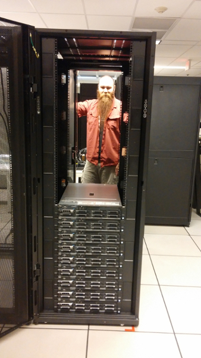
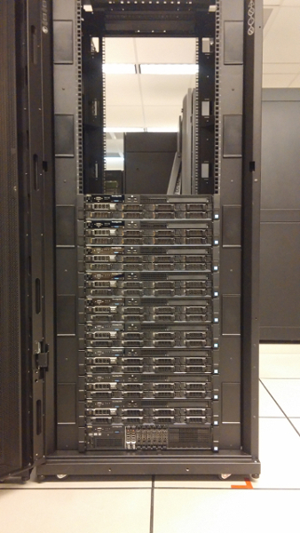
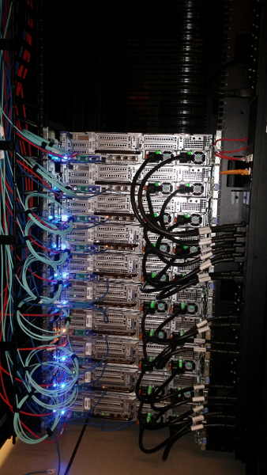
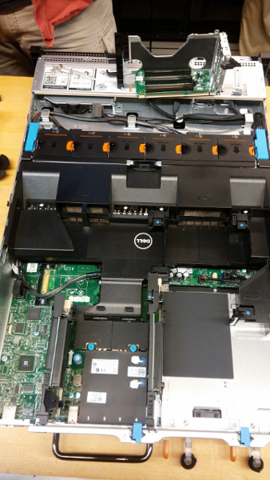
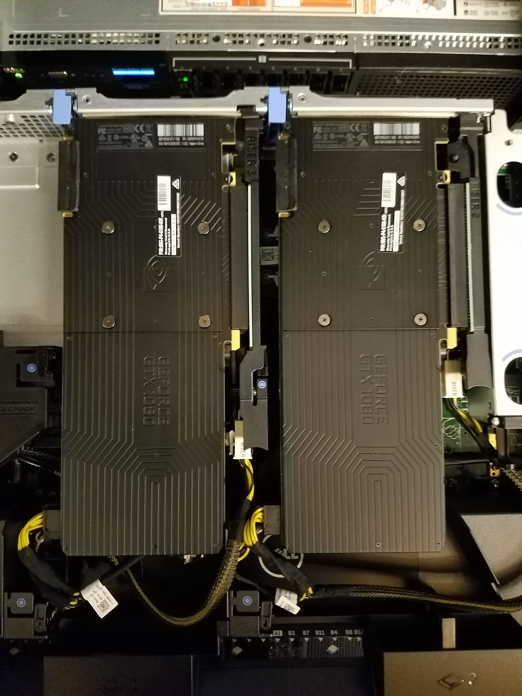
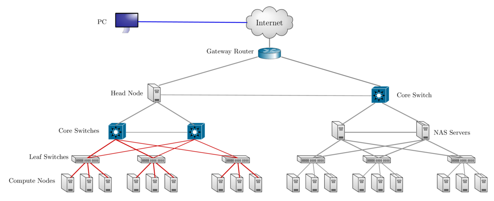

---
title       : Research Computing Resources at Lehigh University
subtitle    : Library & Technology Services
author      : https://researchcomputing.lehigh.edu
job         : 
logo        : lu.png
framework   : io2012        # {io2012, html5slides, shower, dzslides, ...}
highlighter : highlight.js      # {highlight.js, prettify, highlight}
hitheme     : tomorrow      # 
widgets     : [mathjax]            # {mathjax, quiz, bootstrap}
mode        : selfcontained # {standalone, draft}
license     : by-sa
--- .class


## About Us?

* Who?
  - Unit of Lehigh's Library & Technology Services within the Center for Innovation in Teaching & Learning

* Our Mission
  - We enable Lehigh Faculty, Researchers and Scholars achieve their goals by providing various computational resources; hardware, software, and storage; consulting and training.
  
* Research Computing Staff
  - __Alex Pacheco, Manager &#38; XSEDE Campus Champion__
  - Steve Anthony, System Administrator
  - Dan Brashler, CAS Computing Consultant
  - Sachin Joshi, Data Analyst & Visualization Specialist

--- .class

## What do we do?

* Hardware Support
  - Provide system administration and support for Lehigh's HPC clusters.
     - 2 University owned and 4 Faculty owned 
  - Assist with purchase, installation and administration of servers and clusters.
* Data Storage
  - Provide data management services including storing and sharing data. 
* Software Support
  - Provide technical support for software applications, install software as requested and assist with purchase of software.
* Training & Consulting
  - Provide education and training programs to facilitate use of HPC resources and general scientific computing needs.
  - Provide consultation and support for code development and visualization.

--- .class

## Background and Defintions

* Computational Science and Engineering
    - Gain understanding, mainly through the analysis of mathematical models implemented on computers.
    - Construct mathematical models and quantitative analysis techniques, using computers to analyze and solve scientific problems.
    - Typically, these models require large amount of floating-point calculations not possible on desktops and laptops.
    -  The field's growth drove the need for HPC and benefited from it.
* HPC
    - High Performance Computing (HPC) is computation at the forefront of modern technology, often done on a supercomputer. 
* Supercomputer
    -  A supercomputer is a computer at the frontline of current processing capacity, particularly speed of calculation.

--- .class

## Why use HPC?

*  HPC may be the only way to achieve computational goals in a given amount of time
     - Size: Many problems that are interesting to scientists and engineers cannot fit on a PC usually because they need more than a few GB of RAM, or more than a few hundred GB of disk.
     - Speed: Many problems that are interesting to scientists and engineers would take a very long time to run on a PC: months or even years; but a problem that would take a month on a PC might only take a few hours on a supercomputer


--- .class

##  Parallel Computing

* many calculations are carried out simultaneously
*  based on principle that large problems can often be divided into smaller ones, which are then solved in parallel
*  Parallel computers can be roughly classified according to the level at which the hardware supports parallelism.
    - Multicore computing
    -  Symmetric multiprocessing
    -  Distributed computing
    -  Grid computing
    -  General-purpose computing on graphics processing units (GPGPU)


--- .class &twocol_width

## What does HPC do?

*** =left width:45%

* Simulation of Physical Phenomena
     - Storm Surge Prediction
     -  Black Holes Colliding
     -  Molecular Dynamics
* Data analysis and Mining
     -  Bioinformatics
     -  Signal Processing
     -  Fraud detection
* Visualization


*** =right width:45%

* Design
     -  Supersonic ballute
     -  Boeing 787 design
     -  Drug Discovery
     -  Oil Exploration and Production
     -  Automotive Design
     -  Art and Entertainment


--- .class

## HPC by Disciplines

* Traditional Disciplines
    - Science: Physics, Chemistry, Biology, Material Science
    - Engineering: Mechanical, Structural, Civil, Environmental, Chemical
* Non Traditional Disciplines
    - Finance
        - Preditive Analytics
        - Trading
    - Humanities
         - Culturomics or cultural analytics: study human behavior and cultural trends through quantitative analysis of digitized texts, images and videos.

--- .class

## Research Computing Resources

* <strong> Maia </strong>
  - 32-core Symmetric Multiprocessor (SMP) system available to all Lehigh Faculty, Staff and Students
  - dual 16-core AMD Opteron 6380 2.5GHz CPU
  - 128GB RAM and 4TB HDD
  - Theoretical Performance: 640 GFLOPs (640 billion floating point operations per second)
  - Access: Batch Scheduled, no interactive access to Maia

  $$latex
  GFLOPs = cores \times clock \times \frac{FLOPs}{cycle}
  $$

  [FLOPs for various AMD & Intel CPU generation](https://en.wikipedia.org/wiki/FLOPS#FLOPs_per_cycle)

  - `Currently out of warranty`. 
  - `Will be permanently shut down in case of hardware failure`
  - `No plans to replace Maia`

--- .class

## Research Computing Resources

* <strong> Sol </strong>
  - Lehigh's Flagship High Performance Computing Cluster
  - 9 nodes, dual 10-core Intel Xeon E5-2650 v3 2.3GHz CPU, 25MB Cache, 128GB
  RAM
  - 33 nodes, dual 12-core Intel Xeon E5-2670 v3 2.3Ghz CPU, 30 MB Cache,
  128GB RAM
  - 14 nodes, dual 12-core Intel Xeon E5-2650 v4 2.3Ghz CPU, 30 MB Cache, 64GB
  RAM
  - 1 node, dual 8-core Intel Xeon 2630 v3 2.4GHz CPU, 20 MB Cache, 512GB RAM
  - 24 nodes, dual 18-core Intel Xeon Gold 6140 2.3GHz CPU, 24.7 MB Cache, 192GB RAM
  - 72 nVIDIA GTX 1080 GPU cards
  - 48 nVIDIA RTX 2080TI GPU cards
  - 1TB HDD per node
  - 2:1 oversubscribed Infiniband EDR (100Gb/s) interconnect fabric
  - Theoretical Performance: 82.816 TFLOPs (CPU) + 36.1296 TFLOPs (GPU)
  - Access: Batch Scheduled, interactive on login node for compiling, editing
  only

--- .class #id &twocol

## Sol 

*** =left



*** =right



--- .class #id &twocol

## Sol 

*** =left



*** =right



--- .class #id &twocol

## Sol 

*** =left



*** =right


--- .class #id

## Network Layout Sol &amp; Ceph Storage Cluster




--- .class #id

## LTS Managed Faculty Resources 

* __Monocacy__: Ben Felzer, Earth & Environmental Sciences
  - Eight nodes, dual 8-core Intel Xeon E5-2650v2, 2.6GHz, 64GB RAM
     * Theoretical Performance: 2.662TFlops
* __Baltrusaitislab__: Jonas Baltrusaitis, Chemical Engineering
  - Three nodes, dual 16-core AMD Opteron 6376, 2.3Ghz, 128GB RAM
     * Theoretical Performance: 1.766TFlops
* __Pisces__: Keith Moored, Mechanical Engineering and Mechanics
  - Six nodes, dual 10-core Intel Xeon E5-2650v3, 2.3GHz, 64GB RAM, nVIDIA Tesla K80
     * Theoretical Performance: 3.840 TFlops (CPU) + 17.46TFlops (GPU)
* Devel/Testing : decommissioned faculty cluster for prototyping new resources
  - Twenty nodes, dual 8-core Intel Xeon E5-2650v2, 2.6GHz, 64GB RAM
     * Theoretical Performance: 6.656TFlops

--- .class

## Total Computational Resources Supported


|Cluster      | Cores| CPU Memory| CPU TFLOPs| GPUs| CUDA Cores| GPU Memory| GPU TFLOPS|
|:------------|-----:|----------:|----------:|----:|----------:|----------:|----------:|
|Maia         |    32|        128|      0.640|    0|          0|          0|     0.0000|
|Monocacy     |   128|        512|      2.662|    0|          0|          0|     0.0000|
|Devel        |   320|       1280|      6.656|    0|          0|          0|     0.0000|
|Baltrusaitis |    96|        384|      1.766|    0|          0|          0|     0.0000|
|Pisces       |   120|        384|      3.840|   12|      29952|        144|    17.4220|
|Sol          |  2188|      11392|     82.816|  120|     393216|       1104|    36.1296|
|Total        |  2884|      14080|     98.380|  132|     423168|       1248|    53.5516|

--- .class

## Apply for an account

* [Apply for an account at the LTS website] (https://idmweb.cc.lehigh.edu/accounts/?page=hpc)
   - Click on Services > Account & Password > Lehigh Computing Account > Request an account
   - Click on the big blue button "Start Special Account Request" > Research Computing Account 
   - Maia
       - Click on "FREE Linux command-line computing"
   - Sol: PIs should contact Alex Pacheco or Steve Anthony, web request is not functional
       - Annual charge of \$50/account paid by Lehigh Faculty or Research Staff, and
       - Annual charge for computing time

--- .class

## Allocation Charges - Effective Oct. 1, 2016

* Cost per core-hour or service unit (SU) is 1&cent;
* SU is defined as 1 hour of computing on 1 core of the Sol base compute node.
   - One base compute node of Sol consumes 20 SU/hour, 480 SU/day and 175,200 SU/year

* PIs can share allocations with their collaborators
   - Minimum Annual Purchase of 50,000 SU - &#36;500/year
   - Additional Increments of 10,000 SU - &#36;100 per 10K increments
   - Fixed Allocation cycle: Oct 1 - Sep 30
   - Unused allocations do not rollover to next allocation cycle
* Total available computing time for purchase annually: 1.4M SUs or 1 year of continous computing on 8 nodes


--- .class

## Example Allocation Request

- PI requires 100K SUs of computing time per year
<ul class="unilist">
  <li><span class="unibull">&#x2776;</span> One Purchase:
     <ul><li> 100K SU for &#36;1000/year</li></ul>
  </li>
  <li><span class="unibull">&#x2777;</span>Multiple Purchases:
     <ul><li> Initial 50K SUs for &#36;500/year.</li>
     <li> Multiple additional purchases of 10K SUs for &#36;100 each as required.</li></ul>
  </li>
</ul>
* All 100K SUs (<span class="txtbull">&#x2776;</span> and <span class="txtbull">&#x2777;</span>) must be used up by Sep. 30 of next year.
     * If rolling allocation cycle is implemented, then all 100K SUs (<span class="txtbull">&#x2776;</span> and <span class="txtbull">&#x2777;</span>) must be used up within 1 year of initial 50K purchase.

* Need more than 175K SU/year or
* BECOME A CONDO INVESTOR

--- .class

## Condo Investments

* New sustainable model for High Performance Computing at Lehigh
* Faculty (Condo Investor) purchase compute nodes from grants to increase overall capacity of Sol
* LTS will provide for four years or length of hardware warranty purchased.
   - System Administration, Power and Cooling, User Support for Condo Investments
* Condo Investor
   - receives annual allocation equivalent to their investment for the length of
     investment
   - can utilize allocations on all available nodes, including nodes from other Condo Investors
   - allows idle cycles on investment to be used by other Sol users
   - unused allocation will not rollover to the next allocation cycle.
   - can purchase additional SUs in 10K increments (minimum 50K not required)
       -  and must be consumed in current allocation cycle
* Annual Allocation cycle is Oct. 1 - Sep. 30.

--- .class

## Condo Investors

   - Dimitrios Vavylonis, Physics (1 node)
   - Wonpil Im, Biological Sciences (37 nodes, 98 GPUs)
   - Anand Jagota, Chemical Engineering (1 node)
   - Brian Chen, Computer Science & Engineering (1 node)
   - Ed Webb & Alp Oztekin, Mechanical Engineering (6 nodes)
   - Jeetain Mittal & Srinivas Rangarajan, Chemical Engineering (13 nodes, 16 GPUs)
   - Seth Richards-Shubik, Economics (1 node)
   - Ganesh Balasubramanian, Mechanical Engineering (7 nodes)
   - Department of Industrial & Systems Engineering (2 nodes)
   - Paolo Bocchini, Civil and Structural Engineering (1 node)
   - Lisa Fredin, Chemistry (2 nodes)
   - Hannah Dailey, Mechanical Engineering (1 node)

* Total SU on Sol after Condo Investments: 19,166,880


--- .class

## Storage resources

* LTS provides various storage options for research and teaching..
* Some are cloud based and subject to Lehigh's Cloud Policy
* For research, LTS provides a 618TB storage system called Ceph
* Ceph is based on the Ceph software
* Research groups can purchase a sharable project space on Ceph @ &#36;375/TB
  with a 5 year duration
* Ceph is in-house, built, operated and administered by LTS Research Computing Staff.
  - located in Data Center in EWFM with a backup cluster in Packard Lab
* HPC users can write job output directly to their Ceph volume
* Ceph volume can be mounted as a network drive on Windows or CIFS on Mac and Linux
  - [See Ceph FAQ] (http://lts.lehigh.edu/services/faq/ceph-faq) for more details
* Annual HPC User account fees waived for PIs who purchase a 1TB Ceph space for life
  of Ceph i.e. 5 years 

--- .class

## Data Transfer, ScienceDMZ and Globus

* NSF funded Science DMZ to improve campus connectivity to the national research cyberinfrastructure.
* Upto 50TB storage is available on the Data Transfer Node (DTN) on ScienceDMZ.
  * Storage space is only for data transfer. Once transfer is complete, storage needs to be deleted from DTN
* Access to DTN with shell access provided on request
* [Globus](https://www.globus.org) is the preferred method to transfer data to and from NSF and DOE supercomputing centers.
  * hosted service that manages the entire operation, monitoring performance and errors, retrying failed transfers, correcting problems automatically whenever possible, and reporting status to keep you informed while you focus on your research.
  * [How to Use Globus at Lehigh?](https://researchcomputing.lehigh.edu/help/globus)
  * No special access required on DTN to transfer data via Globus

--- .class

## Sol, Maia  &amp; Ceph for Courses

* Research Computing Resources; Sol, Maia & Ceph are available for use in registrar scheduled classes.
* __Maia__: No charge, no special considerations
* __Sol__: Provides  
   * 1TB Ceph space per course (&#36;100 paid by department)
   * An account per student (&#36;15/student) paid by department that provides 500SUs per student
      - Allocations are given for the whole class based on number of students
      - Additional allocations can be purchased in blocks of 1000 SUs @ $10/block upto 10K SU
   * Accounts valid for current semester plus an additional two weeks
* __Ceph__: 
   * &#36;100 per TB per course.
   * Paid for by department.

--- .class

## Accessing Research Computing Resources

* All Research Computing resources are accessible using ssh while on Lehigh's network
* Sol: `ssh username@sol.cc.lehigh.edu`
* Maia: No direct access to Maia, instead login to the polaris
* Polaris: `ssh username@polaris.cc.lehigh.edu`
  - Polaris is a gateway that also hosts the batch scheduler for Maia.
  - No computing software including compilers is available on Polaris.
  - Login to Polaris and request computing time on Maia including interactive access.
* If you are not on Lehigh's network, login to the ssh gateway to get to Research Computing resources.
  - `ssh username@ssh.cc.lehigh.edu`

--- .class

## Available Software

* Commercial, Free and Open source software is installed on
  - [Maia](https://webapps.lehigh.edu/dokuwiki/sites/researchcomputing/doku.php?id=maia#installed_software): /zhome/Apps
  - [Sol](https://webapps.lehigh.edu/dokuwiki/sites/researchcomputing/doku.php?id=sol#installed_software): /share/Apps
* Software is managed using module environment
  - Why? We may have different versions of same software or software built with different compilers
  - Module environment allows you to dynamically change your &#42;nix environment based on software being used
  - Standard on many University and national High Performance Computing resource since circa 2011
* How to use Sol/Maia Software on your [linux](https://webapps.lehigh.edu/dokuwiki/sites/researchcomputing/doku.php?id=linux) workstation
* LTS provides [licensed and open source software](https://software.lehigh.edu) for Windows, Mac and Linux and [Gogs](https://gogs.cc.lehigh.eu), a self hosted Git Service or Github clone


--- .class &twocol_width

## Installed Software

*** =left width:45%

* Chemistry/Materials Science
  - **CPMD**
  - **GAMESS**
  - Gaussian
  - **NWCHEM**
  - **Quantum Espresso**
  - **VASP** (Restricted Access)
* Molecular Dynamics
  - **Desmond**
  - **GROMACS**
  - **LAMMPS**
  - **NAMD**

<span class="tiny strong">__MPI enabled__</span>

*** =right width:45%

* Computational Fluid Dynamics
  - Abaqus
  - Ansys
  - Comsol
  - **OpenFOAM**
  - OpenSees
* Math
  - GNU Octave
  - Magma
  - Maple
  - Mathematica
  - Matlab


--- .class &twocol_width

## More Software

*** =left width:45%

* *Machine &amp; Deep Learning* 
   - TensorFlow
   - Caffe
   - SciKit-Learn
   - SciKit-Image
   - Theano
   - Keras

* *Natural Language Processing (NLP)*
   - Natural Language Toolkit (NLTK)
   - Stanford NLP    


<span class="tiny">_[Python packages](https://go.lehigh.edu/python)_</span>


*** =right width:45%

* Bioinformatics
  - BamTools
  - BayeScan
  - bgc
  - BWA
  - FreeBayes
  - SAMTools
  - tabix
  - trimmomatic
  - *barcode_splitter*
  - *phyluce* 
  - *VelvetOptimiser*

--- .class  &twocol_width

## More Software

*** =left width:35%

* Scripting Languages
  - R
  - Perl
  - Python
* Compilers
  - GNU
  - Intel
  - JAVA
  - PGI
  - CUDA
* Parallel Programming
  - MVAPICH2
  - OpenMPI


*** =right width:65%

* Libraries
  - BLAS/LAPACK/GSL/SCALAPACK
  - Boost
  - FFTW
  - Intel MKL
  - HDF5
  - NetCDF
  - METIS/PARMETIS
  - PetSc
  - QHull/QRupdate
  - SuiteSparse
  - SuperLU

--- .class &twocol_width
 
## More Software

*** =left width:45%

* Visualization Tools
  - Atomic Simulation Environment 
  - Avogadro
  - GaussView
  - GNUPlot
  - PWGui
  - PyMol
  - RDKit
  - VESTA
  - VMD
  - XCrySDen

*** =right width:45%

* Other Tools
  - Artleys Knitro
  - ROOT
  - CMake
  - GNU Parallel
  - Lmod
  - *Numba*
  - Scons
  - SPACK
  - *MD Tools*
     * BioPython
     * CCLib
     * MDAnalysis


--- .class

## Using your own Software?


* You can always install a software in your home directory
   - [SPACK](https://spack.readthedocs.io) is an excellent package manager that can even create module files
* `Stay compliant with software licensing`
* Modify your .bashrc/.tcshrc to add software to your path, OR
* create a module and dynamically load it so that it doesn't interfere 
 with other software installed on the system
  - e.g. You might want to use openmpi instead of mvapich2 
  - the system admin may not want install it system wide for just one user
* Add the directory where you will install the module files to the variable 
  MODULEPATH in .bashrc/.tcshrc

```sh
# My .bashrc file
export MODULEPATH=${MODULEPATH}:/home/alp514/modulefiles
```

--- .class

## Module File Example


--- .class

## How to run jobs

* All compute intensive jobs are batch scheduled
* Write a script to submit jobs to a scheduler
  - need to have some background in shell scripting (bash/tcsh)
* Need to specify
   - Resources required (which depends on configuration)
       - number of nodes
       - number of processes per node
       - memory per node
   - How long do you want the resources
       - have an estimate for how long your job will run
   - Which queue to submit jobs


--- .class

## Batch Queuing System

* A software that manages resources (CPU time, memory, etc) and schedules job execution
   - Sol: Simple Linux Utility for Resource Management (SLURM)
   - Others:  Portable Batch System (PBS)
          - Scheduler: Maui
          - Resource Manager: Torque
          - Allocation Manager: Gold

* More details in upcoming HPC Training on [SLURM](https://webapps.lehigh.edu/hpc/training/lurc/slurm.html)


--- .class &twocol_width

## XSEDE

* The E<b>x</b>treme <b>S</b>cience and <b>E</b>ngineering <b>D</b>iscovery <b>E</b>nvironment (<strong>XSEDE</strong>) is the most advanced, powerful, and robust collection of integrated advanced digital resources and services in the world. 

* It is a single virtual system that scientists can use to interactively share computing resources, data, and expertise.

* Scientists and engineers around the world use these resources and services—things like supercomputers, collections of data, and new tools—to make our lives healthier, safer, and better. 

* XSEDE, and the experts who lead the program, will make these resources easier to use and help more people use them.


*** =left width:60%
* The five-year, &#36;121-million project is supported by the National Science Foundation. 

* It replaces and expands on the NSF TeraGrid project.

*** =right width:40%


--- .class 

## XSEDE Resources

* XSEDE is composed of multiple partner institutions known as Service Providers or SPs, each of which contributes one or more allocatable services. 

* Resources include High Performance Computing (HPC) machines, High Throughput Computing (HTC) machines, visualization, data storage, testbeds, and services. 


* Texas Advanced Computing Center (TACC) 
   - Stampede2: 18 PFlops 
   - Wrangler for Data Analytics: 62 TFLops
       - 0.5PB high speed flash storage
       - 10PB file system at TACC and IU

--- .class 

## XSEDE Resources

* San Diego Supercomputing Center (SDSC) 
   - Comet: 2 PFlops

* Indiana University 
   - Jetstream: Cloud Computing Environment for IaaS, Paas and SaaS
         - 516 TFlops and 2 PB block and object storage

* Pittsburgh Supercomputing Center
   - Bridges: 894 Flops and 144 TiB RAM 

* Open Science Grid: 50 TFLOPs

<!--

-->

--- .class 

## How do I get started on XSEDE?

* Apply for an account at the [XSEDE Portal](https://portal.xsede.org).
* There is no charge to get an XSEDE portal account.  
* You need a portal account to register for XSEDE Tutorials and Workshops
* To use XSEDE's compute and data resources, you need to have an allocation.
* An allocation on a particular resource activates your account on that allocation.
* Researchers and Educators from US universities and federal research labs can 
serve as Principle Investigators on XSEDE allocation.
* A PI can add students to his/her allocations.
* XSEDE also has a Campus Champion Program
* A XSEDE Campus Champion is a local source of knowledge about high-performance 
and high-throughput computing and other digital services, opportunities and resources. 
* A Campus Champion can request start up allocations on all XSEDE resources to help 
 local users with getting started on XSEDE resources.


--- .class

## National Science Foundation (NSF)

* In addition to XSEDE, NSF also provides BlueWaters, a petascale supercomputer at the National Center for Supercomputing Applications (NCSA) at the University of Illinois at Urbana-Champaign
* heterogenous Cray XE6/XK7 
    - 22,000 XE6 compute nodes (each containing two AMD Interlagos processors) 
    - more than 4000 XK7 compute nodes (each containing one AMD Interlagos processor and one NVIDIA GK110 "Kepler" accelerator) 
    - single high-speed Gemini interconnection fabric.
* 150M node-hours allocated every year through the NSF's [Petascale Computing Resource Allocation program](https://www.nsf.gov/funding/pgm_summ.jsp?pims_id=503224&org=OCI&from=home)
* To be replaced with 38PFLOP [Frontera](https://www.tacc.utexas.edu/systems/frontera) cluster located at Texas Advanced
 Computing Center.
     - It's unknown how this cluster will be allocated since it's life exceeds
       the life of XSEDE 2.0 
     - NSF rules prohibit a project to exceed 10 years, so next iteration of
       XSEDE needs to have a different project name.  

--- .class

## Department of Energy (DOE)

* Innovative and Novel Computational Impact on Theory and Experiment ([INCITE](https://proposals.doeleadershipcomputing.org)) program open to researchers from academia, government labs, and industry
   - proposals are accepted between mid-April and the end of June for up to three years
   - Argonne Leadership Computing Facility 
       - 13.5M node hours on Theta, 11PFLOPs Cray XC40 system
   - Oak Ridge Leadership Computing Facility
       - 16M node hours on Summit, 187 PFLOPs IBM Power9 system
* National Energy Research Scientific Computing (NERSC) Center at Lawrence Berkeley National Lab.
   - Mostly for DOE sponsored research
   - [Get Started](http://www.nersc.gov/users/accounts/allocations/first-allocation/)
   - Allocations will be reduced if not used within an allocation cycle. 


--- .class

## National Center for Atmospheric Research (NCAR)

* The Computational and Information Systems Laboratory (CISL) provides large computing resources for university researchers and NCAR scientists in atmospheric and related sciences.
* Cheyenne, a 5.34 PFlops HPC system, provides more than 1.2 billion core-hours for allocation each year
* Access granted through a variety of programs
- University Allocations
   - Large requests >400K SUs: Requests accepted every six months, in March
     and September. 160M SUs awarded in total each allocation cycle
   - Small requests <400K SUs: U.S. university researchers who are supported by NSF awards can request a small allocation for each NSF award. Requests accepted throughout the year and reviewed/awarded within a few business days.


--- .class

## NCAR - CISL (contd)

- Unsponsored Graduate Students and Postdocs: Small allocations are also available to graduate students and post-docs at U.S. universities; no NSF award or panel review is required.
   * The graduate student, postdoc, or faculty member must work in the atmospheric or related sciences;
   * Their work does not lie within the scope of an associated NSF grant; and
   * They do not have funding to pay for computer time.
- Classroom Allocation
   * CISL offers opportunities to undergraduate and graduate faculty to use high-performance computers in their college courses. 
   * Accounts are provided to individual students and the professor for assignments in numerical simulations, modeling, and studies of recently introduced computing architectures. 
   * CISL can provide consulting assistance to the professor or teaching assistant.


--- .class

## NCAR - CSL

  - Climate Simulation Laboratory 
      - Researchers must have funding from NSF awards to address the climate-related questions
      - submission deadline is March 26, 2018
      - minimum request is 20M SUs

--- .class &twocol

## HPC Seminars

* RC staff also guest lecture for various courses and provide various training
 seminars in collaboration with other LTS groups

*** =left

  - Research Computing at Lehigh 
  - Linux: Basic Commands & Environment 
  - Using SLURM scheduler on Sol
  - Shell Scripting 
  - Python Programming
  - Data Visualization
  - RefWorks
  - Document Creation with LaTeX 
  - Using Virtualized Software at Lehigh 

*** =right

  - A Brief Introduction to Linux 
  - Storage Options at Lehigh 
  - Research Data Management
  - Version Control with GIT
  - Programming in MATLAB and GNU Octave
  - Programming in R
  - Enhancing Research Impact
  - Parallel Programming Concepts 
  - Saltstack Config Management

--- .class

## Workshops

* During the summer we provide full day workshops on programming topics
* Summer 2015 Workshops
  - Modern Fortran Programming
  - C Programming
* HPC Parallel Programming Workshop (Summer 2017, 2018)
  - Programming in MPI, OpenMP and OpenACC
* We also host full day workshops broadcast from other Supercomputing Centers
  - XSEDE HPC Monthly Workshop: OpenACC (Dec. 2014)
  - XSEDE HPC Summer BootCamp: OpenMP, OpenACC, MPI and Hybrid Programming (Jun.
    2015 - 2019)
  - XSEDE HPC Monthly Workshop: Big Data (Nov. 2015, May 2017)


--- .class

## Upcoming HPC Seminars

* EWFM 292 on Tuesday from 2:10PM - 4:00PM.
  - Linux: Basic Commands & Environment (Sep. 17)
  - Using SLURM scheduler on Sol (Sep. 24)
  - Basic Shell Scipting (Oct. 1)
  - Document Creation with LaTeX (Oct. 15)
  - Version Control with GIT (Oct. 22)


* Subscribe
     * Research Computing Mailing List: <https://lists.lehigh.edu/mailman/listinfo/hpc-l>
     * HPC Training Google Groups: <mailto:hpctraining-list+subscribe@lehigh.edu>


--- .class

## Getting Help

* Issue with running jobs or need help to get started: 
  * Open a help ticket: <http://lts.lehigh.edu/help>
* Investing in Sol
  * Contact Alex Pacheco or Steve Anthony
* More Information
  * [Condo Program and Available Equipment] (http://researchcomputing.lehigh.edu/services/condo)
  * [Proposal Assistance] (http://researchcomputing.lehigh.edu/services/proposalassist)
  * [Data Management Plans] (http://libraryguides.lehigh.edu/researchdatamanagement)
  * [Research Computing] (https://researchcomputing.lehigh.edu)
  * [Research Computing Wiki] (https://go.lehigh.edu/rcwiki)
  * [Research Computing Training] (https://researchcomputing.lehigh.edu/training)


 
