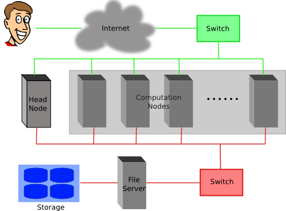

---
title       : Using SLURM scheduler on Sol
subtitle    : Lehigh Research Computing
author      : https://researchcomputing.lehigh.edu
job         : 
logo        : lu.png
framework   : io2012        # {io2012, html5slides, shower, dzslides, ...}
highlighter : highlight.js      # {highlight.js, prettify, highlight}
hitheme     : tomorrow      # 
widgets     : [mathjax]            # {mathjax, quiz, bootstrap}
mode        : selfcontained # {standalone, draft}
license     : by-sa
--- .lehigh

## Research Computing Resources

* <strong> Maia </strong>
  - 32-core Symmetric Multiprocessor (SMP) system available to all Lehigh Faculty, Staff and Students
  - dual 16-core AMD Opteron 6380 2.5GHz CPU
  - 128GB RAM and 4TB HDD
  - Theoretical Performance: 640 GFLOPs (640 billion floating point operations per second)
  - Access: Batch Scheduled, no interactive access to Maia

  $$latex
  GFLOPs = cores \times clock \times \frac{FLOPs}{cycle}
  $$

  [FLOPs for various AMD & Intel CPU generation](https://en.wikipedia.org/wiki/FLOPS#FLOPs_per_cycle)


--- .lehigh

## Research Computing Resources

* <strong> Sol </strong> 
  - Lehigh's Flagship High Performance Computing Cluster
  - 8 nodes, dual 10-core Intel Xeon E5-2650 v3 2.3GHz CPU, 25MB Cache
     - Each Intel Xeon E5-26xx v3 (Haswell) CPU is capable of 16 FLOPs
  - Condo Investors
     - Dimitrios Vavylonis, Physics
          - 1 node, dual 10-core Intel Xeon E5-2650 v3 2.3GHz CPU, 25MB Cache
     - Wonpil Im, Biological Sciences
          - 25 nodes, dual 12-core Intel Xeon E5-2670 v3 2.5Ghz CPU, 30 MB Cache
  - 128 GB RAM and 1TB HDD per node
  - 2:1 oversubscribed Infiniband EDR (100Gb/s) interconnect fabric
  - Theoretical Performance: 28.7 TFLOPs
  - Access: Batch Scheduled, interactive on login node for compiling, editing only

--- .lehigh

## LTS Managed Faculty Resources 

* <strong>Monocacy</strong>: Ben Felzer, Earth & Environmental Sciences
  - Eight nodes, dual 8-core Intel Xeon E5-2650v2, 2.6GHz, 64GB RAM
     * Theoretical Performance: 2.662TFlops
* <strong>Eigen</strong>: Heather Jaeger, Chemistry
  - Twenty nodes, dual 8-core Intel Xeon E5-2650v2, 2.6GHz, 64GB RAM
     * Theoretical Performance: 6.656TFlops
* <strong>Baltrusaitislab</strong>: Jonas Baltrusaitis, Chemical Engineering
  - Three nodes, dual 16-core AMD Opteron 6376, 2.3Ghz, 128GB RAM
     * Theoretical Performance: 1.766TFlops
* <strong>Pisces</strong>: Keith Moored, Mechanical Engineering and Mechanics
  - Six nodes, dual 10-core Intel Xeon E5-2650v3, 2.3GHz, 64GB RAM, nVIDIA Tesla K80
     * Theoretical Performance: 4.416 TFlops (CPU) + 17.46TFlops (GPU)


--- .lehigh

## Account Management

* [Apply for an account at the LTS website] (https://idmweb.cc.lehigh.edu/accounts/?page=hpc)
   - Click on Services > Account & Password > Lehigh Computing Account > Request an account
   - Click on the big blue button "Start Special Account Request" > Research Computing Account 
   - Maia
       - Click on "FREE Linux command-line computing"
   - Sol
       - Click on "Fee-based research computing"
       - Annual charge of \$50/account paid by Lehigh Faculty or Research Staff, and
       - Annual charge for computing time
* Sharing of accounts is explicitly forbidden
* Users need to be associated with an allocation to run jobs on Sol 

--- .lehigh

## Allocation Charges

* Allocation: Amount of computing time that your research group is allowed to
  use in one year.
* Service Unit (SU): 1 hour of computing on 1 core of Sol 
* SU Charge: 1&cent; 
* Annual minimum purchase of 50,000 SUs and increments of 10,000 SUs.
   - paid for by your account sponsor
   - Total available computing time for purchase annually: 1,401,600 SUs or 1 year of continous computing on 8 nodes
* Condo Investors (Faculty who have increased Sol's capacity by purchasing 26 nodes)
   - Provided with annual computing time equivalent to investment at no charge
   - DV purchased 1 20-core node is provided with 175,000 SUs annually
   - WI purchased 25 24-core nodes is provided with 5,256,000 SUs annually
   - Can purchase additional SUs in increments of 10,000 SUs if required
* __No 'free' computing time provided once allocation has been expended__

--- .lehigh

## Accessing Research Computing Resources

* Sol &amp; Faculty Clusters: accessible using ssh while on Lehigh's network
   * `ssh username@clustername.cc.lehigh.edu`
* Maia: No direct access to Maia, instead login to Polaris
  - `ssh username@polaris.cc.lehigh.edu`
  - Polaris is a gateway that also hosts the batch scheduler for Maia
  - No computing software including compilers is available on Polaris
  - Login to Polaris and request computing time on Maia including interactive access
* If you are not on Lehigh's network, login to the ssh gateway to get to Research Computing resources
  - `ssh username@ssh.cc.lehigh.edu`

--- .lehigh

## Software available on HPC systems

* Software on Sol is compiled for modern cpus and is available at /share/Apps
* Software is managed using module environment
  - Why? We may have different versions of same software or software built with different compilers
  - Module environment allows you to dynamically change your *nix environment based on software being used
  - Standard on many University and national High Performance Computing resource since circa 2011


--- .lehigh

## Software on Sol


--- .lehigh

## Module Command

<table>
<tr><th width="300px">Command</th><th>Description</th></tr>
<tr><td><code>module avail</code></td><td> show list of software available on resource</td></tr>
<tr><td><code>module load abc</code></td><td> add software <code>abc</code> to your environment (modify your <code>PATH</code>, <code>LD_LIBRARY_PATH</code> etc as needed)</td></tr>
<tr><td><code>module unload abc</code></td><td> remove <code>abc</code> from your envionment</td></tr>
<tr><td><code>module swap abc1 abc2</code></td><td> swap <code>abc1</code> with <code>abc2</code> in your environment</td></tr>
<tr><td><code>module purge</code></td><td> remove all modules from your environment</td></tr>
<tr><td><code>module show abc</code></td><td> display what variables are added or modified in your environment</td></tr>
<tr><td><code>module help abc</code></td><td> display help message for the module <code>abc</code></td></tr>
</table>

* Users who prefer not to use the module environment will need to modify their
  .bashrc or .tcshrc files. Run `module show` for list variables that need
  modified, appended or prepended

--- .lehigh &twocol_width

## Installed Software

*** =left width:45%

* Chemistry/Materials Science
  - CPMD
  - GAMESS
  - Gaussian
  - NWCHEM
  - Quantum Espresso
  - *VASP*
* Molecular Dynamics
  - *Desmond*
  - GROMACS
  - LAMMPS
  - NAMD

*** =right width:45%

* Computational Fluid Dynamics
  - *Abaqus*
  - Ansys
  - Comsol
  - OpenFOAM
  - OpenSees
* Math
  - GNU Octave
  - *Magma*
  - Maple
  - Mathematica
  - Matlab

--- .lehigh  &twocol_width

## More Software

*** =left width:35%

* Scripting Languages
  - R
  - Perl
  - Python
* Compilers
  - GNU
  - Intel
  - PGI
* Parallel Programming
  - MVAPICH2

*** =right width:65%

* Libraries
  - BLAS/LAPACK/GSL/SCALAPACK
  - Boost
  - FFTW
  - Intel MKL
  - HDF5
  - NetCDF
  - METIS/PARMETIS
  - PetSc
  - QHull/QRupdate
  - SuiteSparse
  - SuperLU

--- .lehigh &twocol_width
 
## More Software

*** =left width:30%

* Visualization Tools
  - Avogadro 
  - GaussView
  - GNUPlot
  - VMD
* Other Tools
  - CMake
  - Gams
  - Gurobi 
  - Scons

*** =right width:70%

* You can always install a software in your home directory
* Stay compliant with software licensing
* Modify your .bashrc/.tcshrc to add software to your path, OR
* create a module and dynamically load it so that it doesn't interfere 
 with other software installed on the system
  - e.g. You might want to use openmpi instead of mvapich2 
  - the system admin may not want install it system wide for just one user
* Add the directory where you will install the module files to the variable 
  MODULEPATH in .bashrc/.tcshrc

```sh
# My .bashrc file
export MODULEPATH=${MODULEPATH}:/home/alp514/modulefiles
```

--- .lehigh

## Module File Example


--- .lehigh &twocol_width

## Cluster Environment

* A cluster is a group of computers (nodes) that works together closely

*** =left width:30%

* Two types of nodes
   - Head/Login Node
   - Compute Node

* Multi-user environment

* Each user may have multiple jobs running simultaneously

*** =right width:65%




--- .lehigh

## How to run jobs

* All compute intensive jobs are batch scheduled
* Write a script to submit jobs to a scheduler
  - need to have some background in shell scripting (bash/tcsh)
* Need to specify
   - Resources required (which depends on configuration)
       - number of nodes
       - number of processes per node
       - memory per node
   - How long do you want the resources
       - have an estimate for how long your job will run
   - Which queue to submit jobs


--- .lehigh

## Batch Queuing System

* A software that manages resources (CPU time, memory, etc) and schedules job execution
   - Sol: Simple Linux Utility for Resource Management (SLURM)
   - Others:  Portable Batch System (PBS)
          - Scheduler: Maui
          - Resource Manager: Torque
          - Allocation Manager: Gold

* A job can be considered as a user’s request to use a certain amount of resources for a certain amount of time

* The batch queuing system determines
    - The order jobs are executed
    - On which node(s) jobs are executed


--- .lehigh &twocol_width
 
## Job Scheduling

*** =left width:50%

* Map jobs onto the node-time space
    - Assuming CPU time is the only resource

* Need to find a balance between
    - Honoring the order in which jobs are received
    - Maximizing resource utilization


*** =right width:45%


--- .lehigh &twocol_width
 
## Backfilling

*** =left width:50%
* A strategy to improve utilization
   - Allow a job to jump ahead of others when there are enough idle nodes
   - Must not affect the estimated start time of the job with the highest priority

*** =right width:45%


--- .lehigh &twocol_width
 
## How much time must I request

* Ask for an amount of time that is
    - Long enough for your job to complete
    - As short as possible to increase the chance of backfilling

*** =left width:45%


*** =right width:45%


--- .lehigh

## Available Queues

* Sol

<table>
<tr><th>Queue Name</th><th>Max Runtime</th><th>Total Nodes</th><th>Max nodes per job</th><th>SU consumed per hour</th></tr>
<tr><td>lts</td><td>72 hours</td><td>9</td><td>4</td><td>20</td></tr>
<tr><td>bio</td><td>48 hours</td><td>25</td><td>4</td><td>24</td></tr>
</table>


* Maia

<table>
<tr><th>Queue Name</th><th>Max Runtime</th><th>Max Simultaneous Core-hours</th></tr>
<tr><td>smp-test</td><td>1 hour</td><td>4 core hours</td></tr>
<tr><td>smp</td><td>96 hours</td><td>384 core hours</td></tr>
</table>


--- .lehigh

## Queues on Faculty Clusters

| Cluster | Queue  | Max Runtime |
|:-------:|:------:|:-----------:|
|Pisces   | normal |4 days|
|Monocacy | normal |4 days|
|Eigen    | adf    |14 days|
|         | normal |14 days|
|         | long   |28 days|

--- .lehigh

## How much memory can I use?

* The amount of installed memory less the amount that is used by the operating system and other utilities

* A general rule of thumb on most HPC resources: leave 1-2GB for the OS to run. 

* Sol: Max memory used per node should not exceed 126GB.
   - 20-core nodes have ~6.4GB/core
       * max memory 6.3GB/core
   - 24-core nodes have ~5.3GB/core
       * max memory 5.25GB/core

* Maia: Users need to specify memory required in their submit script. Max
memory that should be requested is 126GB.


--- .lehigh &twocol_width

## Minimal submit script for Serial Jobs

*** =left width:48%


```bash
#!/bin/bash
#PBS -q smp
#PBS -l walltime=1:00:00
#PBS -l nodes=1:ppn=1
#PBS -l mem=4GB
#PBS -N myjob

cd ${PBS_O_WORKDIR}
./myjob < filename.in > filename.out

```

*** =right width:48%

```bash
#!/bin/bash
#SBATCH --partition=lts
#SBATCH --time=1:00:00
#SBATCH --nodes=1
#SBATCH --ntasks-per-node=1
#SBATCH --job-name myjob

cd ${SLURM_SUBMIT_DIR}
./myjob < filename.in > filename.out

```

--- .lehigh

## Minimal submit script for MPI Jobs on Sol


```bash
#!/bin/bash
#SBATCH --partition=lts
#SBATCH --time=1:00:00
#SBATCH --nodes=2
#SBATCH --ntasks-per-node=20
## For --partition=bio, use --ntasks-per-node=24
#SBATCH --job-name myjob

module load mvapich2

cd ${SLURM_SUBMIT_DIR}
srun ./myjob < filename.in > filename.out

exit
```

--- .lehigh

## Minimal submit script for OpenMP Jobs on Corona


```bash
#!/bin/tcsh
#SBATCH --partition=bio
# Directives can be combined on one line
#SBATCH --time=1:00:00 --nodes=1 --ntasks-per-node=24
#SBATCH --job-name myjob

cd ${SLURM_SUBMIT_DIR}
# Use either
setenv OMP_NUM_THREADS 24
./myjob < filename.in > filename.out

# OR
OMP_NUM_THREADS=24 ./myjob < filename.in > filename.out

exit
```


--- .lehigh .small

## Useful PBS Directives

<table class="pbs">
<tr><th>PBS Directive</th><th>Description</th></tr>
<tr>
<td><code>#PBS -q queuename</code></td><td> Submit job to the <em>queuename</em> queue.</td>
</tr>
<tr>
<td><code>#PBS -l walltime=hh:mm:ss</code></td><td> Request resources to run job for <em>hh</em> hours, <em>mm</em> minutes and <em>ss</em> seconds.</td>
</tr>
<tr>
<td><code>#PBS -l nodes=m:ppn=n</code></td><td> Request resources to run job on <em>n</em> processors each on <em>m</em> nodes.</td>
</tr>
<tr>
<td><code>#PBS -l mem=xGB</code></td><td> Request <em>xGB</em> per node requested, applicable on Maia only</td>
</tr>
<tr>
<td><code>#PBS -N jobname</code></td><td> Provide a name, <em>jobname</em> to your job.</td>
</tr>
<tr>
<td><code>#PBS -o filename.out</code></td><td> Write PBS standard output to file filename.out.</td>
</tr>
<tr>
<td><code>#PBS -e filename.err</code></td><td> Write PBS standard error to file filename.err.</td>
</tr>
<tr>
<td><code>#PBS -j oe</code></td><td> Combine PBS standard output and error to the same file.</td>
</tr>
<tr>
<td><code>#PBS -m status</code></td><td> Send an email after job status status is reached. <br />
 status can be a (abort), b (begin) or e (end) <br />
 The arguments can be combined, for e.g. abe will send email when job begins and either aborts or ends</td>
</tr>
<td><code>#PBS -M your email address</code></td><td> Address to send email.</td>
</tr>
</table>

--- .lehigh .small

## Useful SLURM Directives

<table class="pbs">
<tr><th>SLURM Directive</th><th>Description</th></tr>
<tr>
<td><code>#SBATCH --partition=queuename</code></td><td> Submit job to the <em>queuename</em> queue.</td></td>
</tr>
<tr>
<td><code>#SBATCH --time=hh:mm:ss</code></td><td> Request resources to run job for <em>hh</em> hours, <em>mm</em> minutes and <em>ss</em> seconds.</td>
</tr>
<tr>
<td><code>#SBATCH --nodes=m</code></td><td> Request resources to run job on <em>m</em> nodes.</td>
</tr>
<tr>
<td><code>#SBATCH --ntasks-per-node=n</code></td><td> Request resources to run job on <em>n</em> processors on each node requested.</td>
</tr>
<tr>
<td><code>#SBATCH --ntasks=n</code></td><td> Request resources to run job on a total of <em>n</em> processors.</td>
</tr>
<tr>
<td><code>#SBATCH --mem=x[M|G|T]</code></td><td> Request <em>x[M,G or T]B</em> per node requested</td>
</tr>
<tr>
<td><code>#SBATCH --job-name=jobname</code></td><td> Provide a name, <em>jobname</em> to your job.</td>
</tr>
<tr>
<td><code>#SBATCH --output=filename.out</code></td><td> Write SLURM standard output to file filename.out.</td>
</tr>
<tr>
<td><code>#SBATCH --error=filename.err</code></td><td> Write SLURM standard error to file filename.err.</td>
</tr>
<tr>
<td><code>#SBATCH --mail-type=events</code></td><td> Send an email after job status events is reached. <br />
 status can be NONE, BEGIN, END, FAIL, REQUEUE, ALL, TIME_LIMIT(_90,80)
</td>
</tr>
<td><code>#SBATCH --mail-user=address</code></td><td> Address to send email.</td>
</tr>
</table>


--- .lehigh

## Useful PBS/SLURM environmental variables

<table class="pbs">
<tr>
 <td><code> PBS_O_WORKDIR</code></td><td> Directory where the <code>qsub</code> command was executed</td><td><code>SLURM_SUBMIT_DIR</code></td>
</tr>
<tr>
 <td><code> PBS_NODEFILE</code></td><td> Name of the file that contains a list of the HOSTS provided for the job</td><td><code>SLURM_JOB_NODELIST</code></td>
</tr>
<tr>
 <td><code> PBS_NP</code></td><td> Total number of cores for job</td><td><code>SLURM_NTASKS</code></td>
</tr>
<tr>
 <td><code> PBS_JOBID</code></td><td> Job ID number given to this job</td><td><code>SLURM_JOBID</code></td>
</tr>
<tr>
 <td><code> PBS_QUEUE</code></td><td> Queue job is running in</td><td><code>SLURM_JOB_PARTITION</code></td>
</tr>
<tr>
 <td><code> PBS_WALLTIME</code></td><td> Walltime in secs requested</td><td><code></code></td>
</tr>
<tr>
 <td><code> PBS_JOBNAME</code></td><td> Name of the job. This can be set using the -N option in the PBS script</td><td><code></code></td>
</tr>
<tr>
 <td><code> PBS_ENVIRONMENT</code></td><td> Indicates job type, PBS_BATCH or PBS_INTERACTIVE</td><td><code></code></td>
</tr>
<tr>
 <td><code> PBS_O_SHELL</code></td><td>	value of the SHELL variable in the environment in which qsub was executed</td><td><code></code></td>
</tr>
<tr>
 <td><code> PBS_O_HOME</code></td><td> Home directory of the user running qsub</td><td><code></code></td>
</tr>
</table>


--- .lehigh

## Basic Job Manager Commands

* Submission
* Monitoring
* Manipulating
* Reporting

--- .lehigh

## Job Types

* Interactive Jobs
   - Set up an interactive environment on compute nodes for users
   - Purpose: testing and debugging code. __Do not run jobs on head node!!!__

   - PBS: `qsub -I -V walltime=<hh:mm:ss>,nodes=<# of nodes>:ppn=<# of core/node> -q <queue
   name>`

   - SLURM: `srun --time=<hh:mm:ss> --nodes=<# of nodes> --ntasks-per-node=<#
   of core/node> -p <queue name> --pty /bin/bash --login`


* Batch Jobs
   - Executed using a batch script without user intervention
       - Advantage: system takes care of running the job
       - Disadvantage: cannot change sequence of commands after submission
   - Useful for Production runs


--- .lehigh

## Submitting Batch Jobs

* PBS: `qsub filename`
* SLURM: `sbatch filename`

* `qsub` and `sbatch` can take the options for `#PBS` and `#SBATCH` as command line arguments
   * `qsub -l walltime=1:00:00,nodes=1:ppn=16 -q normal filename`
   * `sbatch --time=1:00:00 --nodes=1 --ntasks-per-node=20 -p lts filename` 
* SLURM can also take short hand notation for the directives

| Long Form | Short Form |
|:---------:|:----------:|
|--partition=queuename|-p queuename|
|--time=hh:mm:ss|-t hh:mm:ss|
|--nodes=m|-N m|
|--ntasks-per-node=n|-n n|
|--ntasks=n|-n n|


--- .lehigh

## Monitoring &amp; Manipulating Jobs


<table>
<tr><th>PBS Command</th><th>Description</th><th>SLURM Command</th></tr>
<tr>
  <td><code>qstat</code> </td><td>check job status (all jobs)</td><td><code>squeue</code></td>
</tr>
<tr>
  <td><code>qstat -u username</code></td><td>check job status of user <em>username</em></td><td><code>squeue -u username</code></td>
</tr>
<tr>
  <td><code>qstat -a</code></td><td>More information than that given by <em>qstat</em></td><td><code>squeue -l</code></td>
</tr>
<tr>
  <td><code>showstart jobid</code></td><td>Show <strong>estimated</strong> start time of job identified by <em>jobid</em></td><td><code>squeue --start</code></td>
</tr>
<tr>
  <td><code>checkjob jobid</code></td><td>Check status of your job identified by <em>jobid</em></td><td><code>scontrol show job jobid</code></td>
</tr>
<tr>
  <td><code>qdel jobid</code></td><td>Cancel your job identified by <em>jobid</em></td><td><code>scancel jobid</code></td>
</tr>
<tr>
  <td><code>qhold jobid</code></td><td>Put your job identified by <em>jobid</em> on hold</td><td><code>scontrol hold jobid</code></td>
</tr>
<tr>
  <td><code>qrls jobid</code></td><td>Release the hold that <strong>you put</strong> on <em>jobid</em></td><td><code>scontrol release jobid</code></td>
</tr>
</table>


--- .lehigh

## Usage Reporting

* [sacct](http://slurm.schedmd.com/sacct.html): displays accounting data for all jobs and job steps in the SLURM job accounting log or Slurm database
* [sshare](http://slurm.schedmd.com/sshare.html): Tool for listing the shares of associations to a cluster. 

* We have created scripts based on these to provide usage reporting
    -  `alloc_summary.sh`
        - included in your .bash_profile
        - prints allocation usage on your login shell
    -  `balance`
        - prints allocation usage summary
    -  `solreport`
        - obtain your monthly usage report
        - PIs can obtain usage report for all or specific users on their
	allocation
        - use `--help` for usage information

--- .lehigh

## Usage Reporting

 

--- .lehigh

## Not for the faint hearted

* You have multiple jobs that need to be run in sequence
* Option 1: Submit jobs as soon as previous jobs complete
* Option 2: Submit jobs with a dependency
    * [SLURM](https://webapps.lehigh.edu/dokuwiki/sites/researchcomputing/doku.php?id=slurm#submitting_dependency_jobs):
  `sbatch --dependency=afterok:<JobID> <Submit Script>`
    * [PBS](https://webapps.lehigh.edu/dokuwiki/sites/researchcomputing/doku.php?id=corona#submitting_dependency_jobs):
  `qsub -W depend=afterok:<JobID> <Submit Script>`

* You want to run several serial processor jobs on
    * one node: your submit script should be able to run several serial
    jobs in background and then use the `wait` command for all jobs to finish
    * more than one node: this requires some background in scripting but the
    idea is the same as above


--- .lehigh

## Additional Help &amp; Information

* Issue with running jobs or need help to get started: 
  * Open a help ticket: <http://go.lehigh.edu/rchelp>
* More Information
  * [Research Computing] (https://researchcomputing.lehigh.edu)
  * [Research Computing Training](https://researchcomputing.lehigh.edu/training)
  * [Research Computing Wiki](https://webapps.lehigh.edu/dokuwiki/sites/researchcomputing/doku.php)
* Subscribe
     * Research Computing Mailing List: <https://lists.lehigh.edu/mailman/listinfo/hpc-l>
     * HPC Training Google Groups: <mailto:hpctraining-list+subscribe@lehigh.edu>


 
